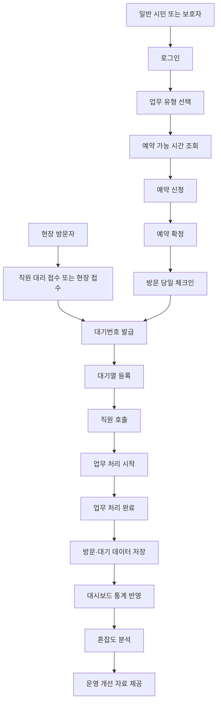
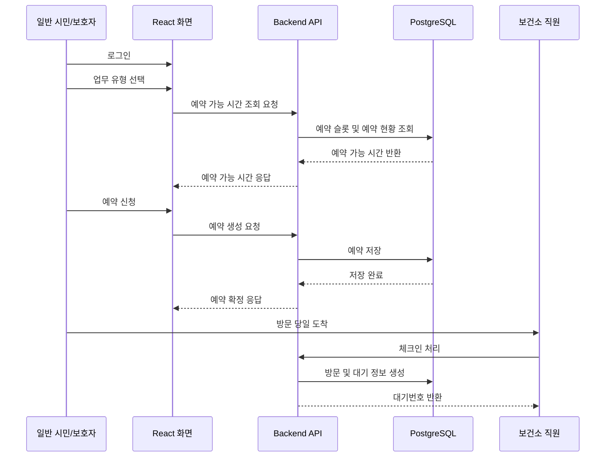
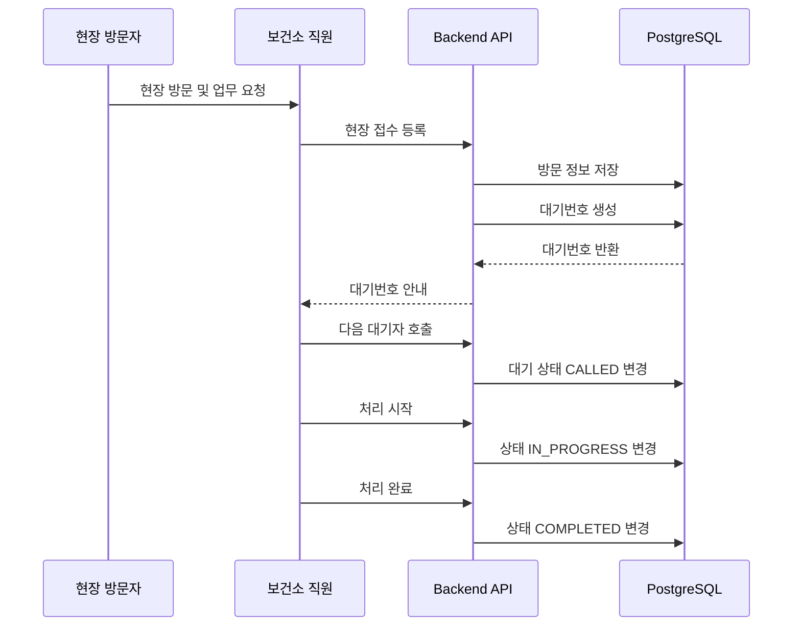
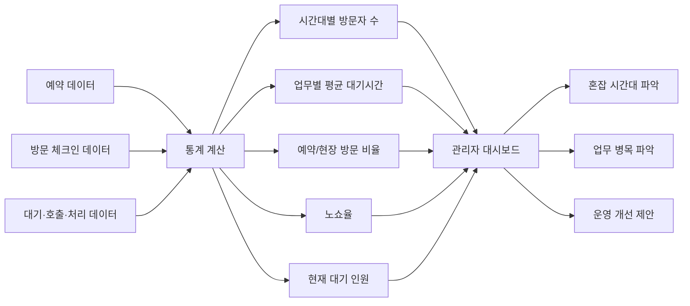
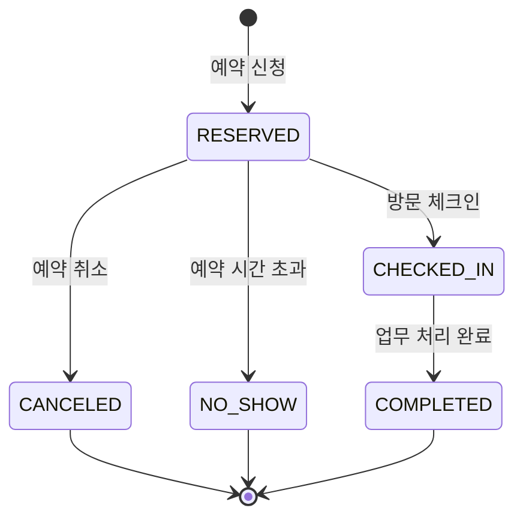
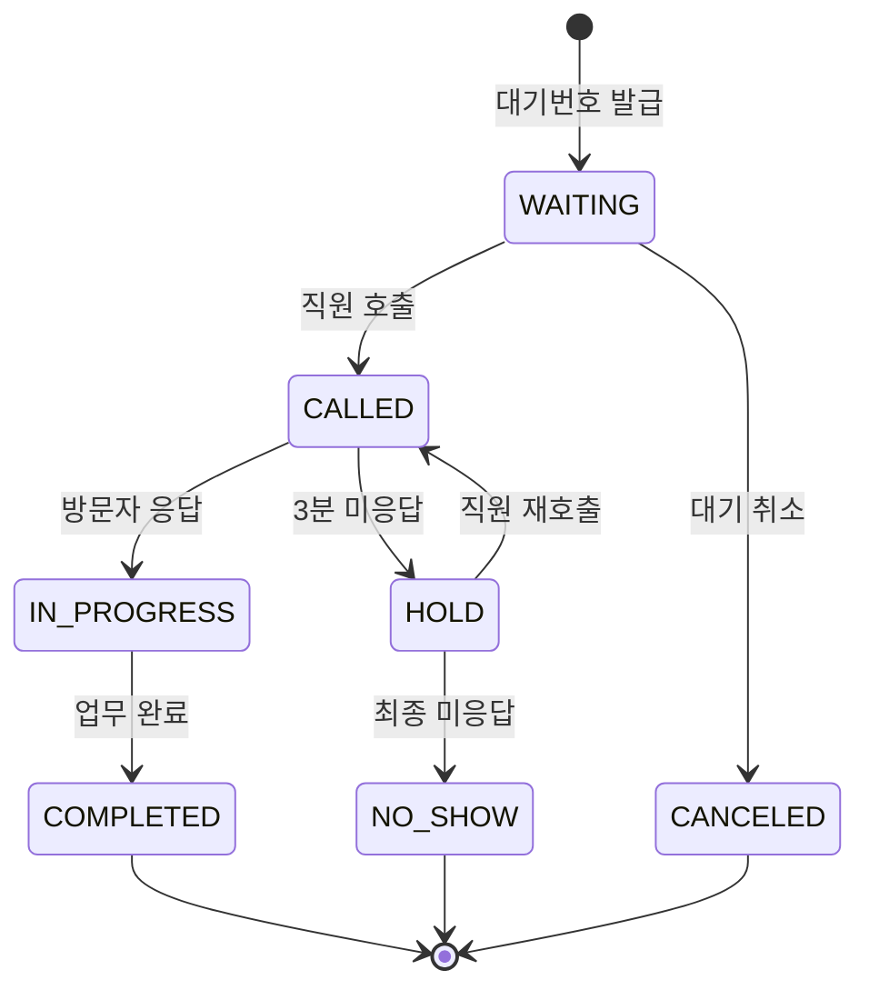
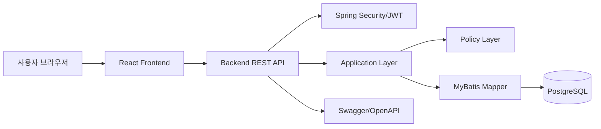
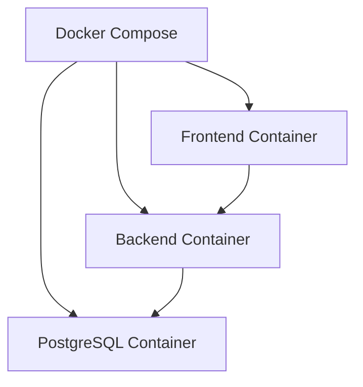
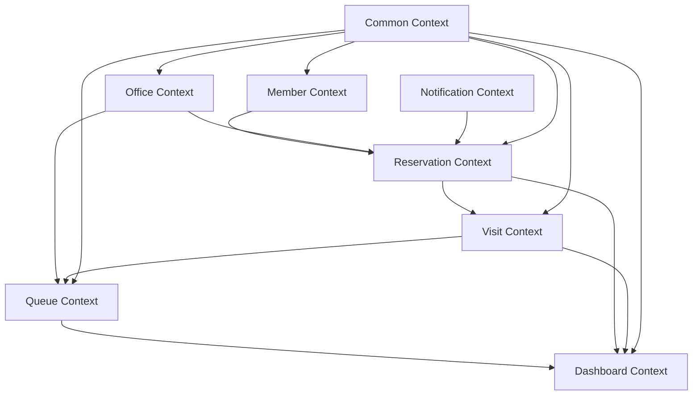
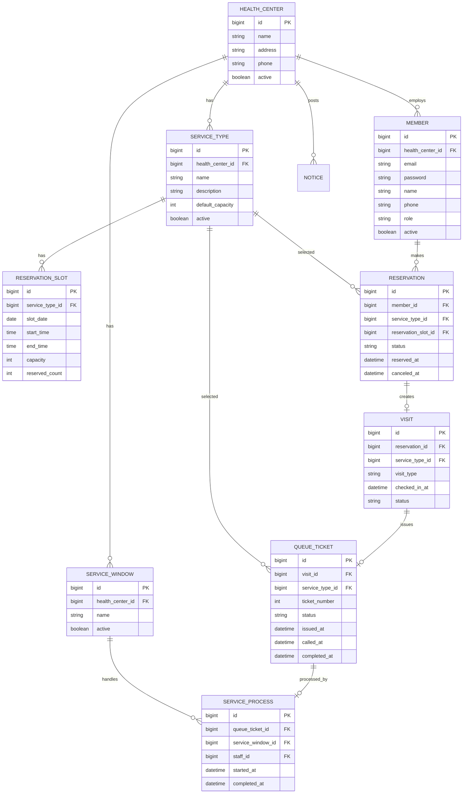

# 보건소 스마트 예약·대기 및 혼잡도 분석 시스템 기획서

| 문서 정보 | 내용 |
|---|---|
| 문서명 | 보건소 스마트 예약·대기 및 혼잡도 분석 시스템 기획서 |
| 문서 버전 | v0.1 |
| 작성 목적 | 개인 프로젝트 초기 기획 및 코드 에이전트 개발 지시 기준 수립 |
| 대상 독자 | 개발자, 코드 에이전트, 포트폴리오 검토자, 면접관 |
| 프로젝트 유형 | 공공보건 방문 예약·대기 관리 및 혼잡도 분석 시스템 |
| 개발 방향 | 전자정부프레임워크 기반 REST API + React 프론트엔드 |
| 작성 기준 | MVP는 단일 보건소 기준, DB 구조는 다중 보건소 확장 가능하도록 설계 |

---

## 1. 프로젝트 개요

### 1.1 프로젝트명

**보건소 스마트 예약·대기 및 혼잡도 분석 시스템**

### 1.2 한 줄 소개

보건소의 예방접종, 건강검진/검사, 건강상담 업무를 대상으로 예약, 현장 접수, 대기번호 발급, 직원 호출, 처리 완료, 혼잡도 분석을 통합 제공하는 공공보건 운영 지원 시스템입니다.

### 1.3 핵심 목표

본 프로젝트의 핵심 목표는 다음과 같습니다.

| 목표 | 설명 |
|---|---|
| 대기시간 감소 | 보건소 방문자의 불필요한 대기시간을 줄입니다. |
| 예약·현장 방문 통합 관리 | 온라인 예약자와 현장 방문자를 하나의 업무 흐름으로 관리합니다. |
| 업무 운영 개선 | 시간대별 방문자 수와 업무별 평균 대기시간을 분석하여 운영 개선 근거를 제공합니다. |
| 직원 업무 효율화 | 보건소 직원이 예약자, 현장 접수자, 대기자를 한 화면에서 관리할 수 있도록 합니다. |
| 민원 불만 감소 | 사용자에게 현재 혼잡도와 예상 대기시간을 제공하여 방문 불편을 줄입니다. |

---

## 2. 추진 배경

### 2.1 문제 인식

보건소는 예방접종, 건강검진/검사, 건강상담 등 방문 기반 업무가 많습니다. 특히 특정 기간이나 특정 시간대에는 방문자가 몰려 대기시간이 길어질 수 있습니다.

기존 공공 보건 서비스는 온라인 신청, 증명서 발급, 검사 결과 조회 등 개별 서비스는 제공하지만, 실제 방문 과정에서 발생하는 예약, 체크인, 대기, 호출, 처리 완료, 혼잡도 분석이 하나의 흐름으로 연결되지 않는 경우가 많습니다.

### 2.2 현장의 주요 불편

| 사용자 | 불편 사항 |
|---|---|
| 일반 시민 | 방문 전에 얼마나 기다려야 하는지 알기 어렵습니다. |
| 고령층 | 모바일 예약만으로는 접근성이 부족할 수 있습니다. |
| 보호자 | 가족을 대신해 예약하거나 방문 정보를 확인하는 흐름이 필요합니다. |
| 보건소 직원 | 예약자와 현장 방문자를 따로 관리하면 업무 흐름이 복잡해집니다. |
| 관리자 | 언제, 어떤 업무에 사람이 몰리는지 데이터로 파악하기 어렵습니다. |

### 2.3 개선 필요성

본 시스템은 단순 예약 시스템이 아니라, 보건소 현장 운영 데이터를 수집하고 분석하여 운영 개선에 활용하는 시스템입니다.

핵심은 다음과 같습니다.

> 예약을 받는 것에서 끝나는 것이 아니라, 방문 이후의 대기·호출·처리·통계까지 연결합니다.

---

## 3. 기존 서비스 및 한계 분석

### 3.1 기존 서비스 유형

| 유형 | 설명 | 한계 |
|---|---|---|
| 보건소 온라인 민원 서비스 | 증명서 발급, 검사 결과 조회, 일부 신청 업무 제공 | 방문 이후 대기·호출 관리와 약하게 연결됩니다. |
| 지자체 통합 예약 시스템 | 검사, 상담, 교육 등을 온라인으로 예약 | 예약 이후 현장 대기 흐름과 통계 분석이 부족할 수 있습니다. |
| 진료 대기 시스템 | 현장 순번표, 대기 인원, 호출 화면 제공 | 사전 예약자와 현장 접수자를 통합 관리하기 어렵습니다. |
| 민간 병원 예약 앱 | 병원 예약, 접수, 대기 순번 확인 제공 | 보건소 업무 특성, 고령층, 직원 대리 접수, 공공 운영 분석과 차이가 있습니다. |
| 순번 대기 키오스크 | 번호표 발급, 호출, 대기 화면 제공 | 데이터 기반 혼잡도 분석과 운영 개선 제안은 제한적입니다. |

### 3.2 본 프로젝트의 개선 방향

| 기존 한계 | 개선 방향 |
|---|---|
| 예약과 대기 관리가 분리됨 | 예약자와 현장 방문자를 통합 대기열로 관리 |
| 방문 전 혼잡도 파악이 어려움 | 사용자에게 현재 혼잡도와 예상 대기시간 제공 |
| 직원이 현장 접수자를 수기로 관리함 | 직원 대리 접수 및 현장 접수 기능 제공 |
| 관리자 통계가 부족함 | 시간대별 방문자 수, 업무별 대기시간, 노쇼율 대시보드 제공 |
| 고령층 접근성이 낮음 | 보호자 예약, 직원 대리 접수, 향후 비회원 조회 기능으로 보완 |

---

## 4. 서비스 범위

### 4.1 대상 기관

MVP에서는 **단일 보건소**를 기준으로 구현합니다.

다만 DB 구조는 향후 여러 보건소를 관리할 수 있도록 확장 가능하게 설계합니다.

| 구분 | 범위 |
|---|---|
| MVP | 단일 보건소 운영 |
| 확장 | 여러 보건소, 보건지소, 공공보건기관으로 확장 가능 |

### 4.2 대상 업무

MVP 대상 업무는 다음 3가지입니다.

| 업무 | 설명 |
|---|---|
| 예방접종 | 독감, 계절성 접종 등 방문 예약과 대기 관리가 필요한 업무 |
| 건강검진/검사 | 검진 또는 검사 접수를 위한 방문 업무 |
| 건강상담 | 금연상담, 생활건강상담, 만성질환 상담 등 상담성 업무 |

### 4.3 제외 범위

본 프로젝트는 의료정보 시스템이 아닙니다.  
따라서 다음 정보는 MVP 범위에 포함하지 않습니다.

| 제외 항목 | 제외 이유 |
|---|---|
| 검사 결과 | 민감 정보이며 별도 보안·인증 정책이 필요합니다. |
| 진료 기록 | 의료 시스템 범위로 확장되어 프로젝트 규모가 커집니다. |
| 처방 정보 | 보건소 예약·대기 관리 목적과 다릅니다. |
| 질병 상세 정보 | 개인정보 및 민감정보 관리 부담이 큽니다. |

MVP에서는 다음 정보만 관리합니다.

| 포함 정보 | 설명 |
|---|---|
| 예약 정보 | 업무 유형, 예약일, 예약 시간, 예약 상태 |
| 방문 정보 | 체크인 시간, 방문 상태 |
| 대기 정보 | 대기번호, 호출 상태, 처리 상태 |
| 통계 정보 | 시간대별 방문자 수, 업무별 대기시간 |
| 혼잡도 정보 | 여유, 보통, 혼잡 |

---

## 5. 주요 사용자 정의

### 5.1 사용자 역할

| 역할 | 설명 | 주요 기능 |
|---|---|---|
| 일반 시민 | 보건소 서비스를 예약하고 방문하는 사용자 | 예약 신청, 예약 조회, 예약 취소, 혼잡도 확인 |
| 보호자 | 가족 또는 고령층을 대신해 예약하는 사용자 | 보호 대상자 예약, 예약 내역 확인 |
| 직원 | 보건소 현장 업무를 처리하는 사용자 | 현장 접수, 체크인, 대기 호출, 처리 완료 |
| 관리자 | 보건소 운영을 관리하는 사용자 | 업무 유형, 창구, 직원, 예약 슬롯, 대시보드 관리 |

### 5.2 사용자 우선순위

| 우선순위 | 사용자 | 이유 |
|---|---|---|
| 1 | 보건소 직원 | 예약자와 현장 방문자를 실제로 처리하는 핵심 사용자입니다. |
| 2 | 보건소 관리자 | 혼잡도 분석을 통해 운영 개선 의사결정을 수행합니다. |
| 3 | 일반 시민 | 예약과 혼잡도 확인을 통해 대기 불편을 줄입니다. |
| 4 | 보호자 및 고령층 | 접근성 보완이 필요한 보조 사용자입니다. |

---

## 6. 전체 서비스 흐름

### 6.1 전체 흐름도



### 6.2 예약 방문 흐름



### 6.3 현장 방문 흐름



### 6.4 관리자 대시보드 흐름



---

## 7. 핵심 기능 정의

### 7.1 MVP 기능 목록

| 구분 | 기능 | 설명 | 우선순위 |
|---|---|---|---|
| 인증 | 로그인 | Access Token, Refresh Token 기반 로그인 | 상 |
| 인증 | 권한 분리 | 시민, 보호자, 직원, 관리자 역할 구분 | 상 |
| 예약 | 예약 신청 | 업무 유형, 날짜, 시간대를 선택해 예약 | 상 |
| 예약 | 예약 조회 | 본인의 예약 내역 조회 | 상 |
| 예약 | 예약 취소 | 방문 1시간 전까지 예약 취소 | 상 |
| 현장 | 현장 접수 | 직원이 현장 방문자를 등록 | 상 |
| 방문 | 체크인 | 예약자가 방문 시 체크인 | 상 |
| 대기 | 대기번호 발급 | 예약자 또는 현장 방문자에게 대기번호 발급 | 상 |
| 대기 | 대기열 조회 | 직원이 현재 대기열 조회 | 상 |
| 대기 | 다음 대기자 호출 | 직원이 다음 대기자를 호출 | 상 |
| 대기 | 처리 시작 | 호출된 사용자를 처리중 상태로 변경 | 상 |
| 대기 | 처리 완료 | 업무 처리 완료 상태로 변경 | 상 |
| 관리자 | 업무 유형 관리 | 예방접종, 검사, 상담 업무 관리 | 상 |
| 관리자 | 창구 관리 | 업무별 창구 정보 관리 | 중 |
| 관리자 | 직원 관리 | 직원 계정 및 담당 업무 관리 | 중 |
| 관리자 | 예약 슬롯 관리 | 업무별 예약 가능 인원 관리 | 상 |
| 대시보드 | 관리자 대시보드 | 방문자 수, 평균 대기시간, 노쇼율 등 조회 | 상 |
| 사용자 | 혼잡도 조회 | 현재 업무별 혼잡도 확인 | 중 |

### 7.2 2차 기능 목록

| 구분 | 기능 | 설명 |
|---|---|---|
| 비회원 | 예약번호 조회 | 예약번호와 휴대폰 번호로 예약 조회 |
| 알림 | 예약 완료 알림 | 예약 완료 시 알림 발송 |
| 알림 | 예약 전날 알림 | 방문 전날 안내 알림 |
| 알림 | 호출 임박 알림 | 대기 순번이 가까워졌을 때 알림 |
| 추천 | 추천 방문 시간 | 혼잡도가 낮은 시간대 추천 |
| 키오스크 | 현장 접수 화면 | 키오스크용 간단 접수 화면 |
| 통계 | 배치 통계 | 일별·시간대별 통계를 배치로 집계 |
| 운영 | 노쇼 자동 처리 | 예약 시간 초과 시 자동 노쇼 처리 |

### 7.3 향후 확장 기능

| 구분 | 기능 | 설명 |
|---|---|---|
| AI | 유사 문의 검색 | pgvector 기반 유사 FAQ 검색 |
| AI | 혼잡 원인 요약 | 최근 방문 데이터를 기반으로 혼잡 원인 요약 |
| AI | 추천 방문 시간 고도화 | 과거 데이터를 활용한 방문 시간 추천 |
| MSA | 서비스 분리 | Reservation, Queue, Dashboard Context 분리 |
| 운영 | 다중 보건소 지원 | 여러 보건소를 하나의 시스템에서 관리 |

---

## 8. 예약 정책

### 8.1 기본 예약 정책

| 항목 | 정책 |
|---|---|
| 예약 단위 | 30분 |
| 예약 가능 기간 | 오늘부터 14일 이내 |
| 당일 예약 | 허용 |
| 예약 취소 | 방문 1시간 전까지 가능 |
| 예약 가능 인원 | 업무별 기본 5명 |
| 예약 가능 인원 변경 | 관리자가 업무별로 변경 가능 |
| 예약 대상 업무 | 예방접종, 건강검진/검사, 건강상담 |

### 8.2 예약 상태

| 상태 코드 | 상태명 | 설명 |
|---|---|---|
| RESERVED | 예약 완료 | 사용자가 예약을 완료한 상태 |
| CANCELED | 예약 취소 | 사용자가 예약을 취소한 상태 |
| CHECKED_IN | 체크인 완료 | 예약자가 방문하여 체크인한 상태 |
| NO_SHOW | 미방문 | 예약자가 정해진 시간 내 방문하지 않은 상태 |
| COMPLETED | 처리 완료 | 예약 기반 방문 업무가 완료된 상태 |

### 8.3 예약 정책 흐름



---

## 9. 대기 정책

### 9.1 기본 대기 정책

| 항목 | 정책 |
|---|---|
| 대기번호 발급 대상 | 체크인한 예약자, 현장 접수자 |
| 예약자 우선순위 | 예약 시간대 안에서는 예약자를 우선 호출 |
| 지각 처리 | 예약 시간 10분 초과 시 일반 대기열로 이동 |
| 호출 후 미응답 | 3분 후 보류 처리 |
| 보류자 처리 | 직원이 수동으로 재호출 가능 |
| 현장 방문자 | 일반 대기열에 등록 |

### 9.2 대기 상태

| 상태 코드 | 상태명 | 설명 |
|---|---|---|
| WAITING | 대기중 | 대기열에 등록된 상태 |
| CALLED | 호출됨 | 직원이 호출한 상태 |
| IN_PROGRESS | 처리중 | 창구에서 업무 처리 중인 상태 |
| COMPLETED | 완료 | 업무 처리가 완료된 상태 |
| CANCELED | 취소 | 대기 등록이 취소된 상태 |
| NO_SHOW | 미방문 | 호출 또는 예약 후 나타나지 않은 상태 |
| HOLD | 보류 | 호출 후 응답하지 않아 보류된 상태 |

### 9.3 대기 상태 흐름



---

## 10. 대시보드 기획

### 10.1 대시보드 제공 대상

| 사용자 | 제공 범위 |
|---|---|
| 관리자 | 전체 대시보드 조회 |
| 직원 | 당일 대기 현황, 업무별 대기자 수 일부 조회 |
| 일반 사용자 | 현재 혼잡도와 예상 대기시간만 조회 |

### 10.2 핵심 지표

| 지표 | 설명 | 활용 목적 |
|---|---|---|
| 시간대별 방문자 수 | 시간대별 체크인 또는 현장 접수 수 | 혼잡 시간대 파악 |
| 업무별 평균 대기시간 | 업무별 체크인부터 호출까지 평균 시간 | 업무 병목 파악 |
| 현재 대기 인원 | 현재 WAITING 상태 인원 | 실시간 혼잡도 표시 |
| 예약자/현장 방문자 비율 | 전체 방문 중 예약자와 현장 방문자 비율 | 예약제 활용도 확인 |
| 노쇼율 | 예약 후 방문하지 않은 비율 | 예약 정책 개선 |
| 업무별 처리 건수 | 업무 유형별 완료 건수 | 업무량 파악 |
| 창구별 처리 건수 | 창구별 처리 완료 건수 | 창구 운영 개선 |

### 10.3 혼잡도 기준

혼잡도는 대기 인원과 평균 대기시간을 함께 사용합니다.

| 혼잡도 | 기준 예시 | 사용자 표시 |
|---|---|---|
| 여유 | 대기 인원 5명 이하 또는 예상 대기시간 10분 이하 | 여유 |
| 보통 | 대기 인원 6~15명 또는 예상 대기시간 11~30분 | 보통 |
| 혼잡 | 대기 인원 16명 이상 또는 예상 대기시간 31분 이상 | 혼잡 |

실제 기준값은 관리자 설정 또는 운영 데이터 분석을 통해 조정할 수 있습니다.

### 10.4 관리자 대시보드 화면 구성안

```text
┌─────────────────────────────────────────────────────────────┐
│ 관리자 대시보드                                               │
├─────────────────────────────────────────────────────────────┤
│ 오늘 방문자 수 | 현재 대기 인원 | 평균 대기시간 | 노쇼율        │
├─────────────────────────────────────────────────────────────┤
│ [차트] 시간대별 방문자 수                                     │
├──────────────────────────────┬──────────────────────────────┤
│ [차트] 업무별 평균 대기시간   │ [차트] 예약/현장 방문 비율      │
├──────────────────────────────┴──────────────────────────────┤
│ 혼잡 시간대 분석 및 운영 개선 제안                            │
│ - 월요일 오전 10시 예방접종 업무 혼잡                         │
│ - 평균 대기시간이 기준값을 초과하는 업무 표시                  │
└─────────────────────────────────────────────────────────────┘
```

### 10.5 사용자 혼잡도 화면 구성안

```text
┌───────────────────────────────────────┐
│ 현재 보건소 혼잡도                     │
├───────────────────────────────────────┤
│ 예방접종: 혼잡 / 예상 대기 35분        │
│ 건강검진/검사: 보통 / 예상 대기 20분   │
│ 건강상담: 여유 / 예상 대기 8분         │
├───────────────────────────────────────┤
│ 안내: 예방접종은 오후 시간대 방문을    │
│ 권장합니다.                            │
└───────────────────────────────────────┘
```

---

## 11. 화면 구성

### 11.1 화면 목록

| 사용자 | 화면 | 설명 |
|---|---|---|
| 공통 | 로그인 | 사용자 로그인 |
| 공통 | 회원가입 | 일반 사용자 가입 |
| 일반 사용자 | 예약 신청 | 업무 유형, 날짜, 시간 선택 |
| 일반 사용자 | 예약 내역 | 본인 예약 목록 조회 |
| 일반 사용자 | 예약 상세 | 예약 상태 및 방문 안내 |
| 일반 사용자 | 혼잡도 조회 | 현재 업무별 혼잡도 확인 |
| 직원 | 직원 메인 | 오늘 예약, 현장 접수, 대기 현황 요약 |
| 직원 | 현장 접수 | 현장 방문자 또는 전화 접수자 등록 |
| 직원 | 대기열 관리 | 대기번호 조회, 호출, 처리 완료 |
| 관리자 | 관리자 대시보드 | 통계와 혼잡도 분석 조회 |
| 관리자 | 업무 유형 관리 | 예약 가능한 업무 관리 |
| 관리자 | 창구 관리 | 창구 등록 및 업무 연결 |
| 관리자 | 직원 관리 | 직원 계정과 담당 업무 관리 |
| 관리자 | 예약 슬롯 관리 | 업무별 예약 가능 시간과 인원 관리 |
| 관리자 | 공지사항 관리 | 사용자 안내 공지 관리 |
| 관리자 | 공통코드 관리 | 예약 상태, 대기 상태 등 코드 관리 |

### 11.2 v0 프롬프트 작성 방향

프론트엔드는 React + v0를 활용하여 화면 초안을 생성합니다.

v0 프롬프트 작성 시 다음 원칙을 적용합니다.

| 원칙 | 설명 |
|---|---|
| 공공 서비스 톤 | 신뢰감 있고 단순한 화면 |
| 접근성 고려 | 큰 버튼, 명확한 상태 표시, 충분한 여백 |
| 직원 업무 효율 | 직원 화면은 클릭 수를 최소화 |
| 대시보드 가독성 | 통계 카드, 차트, 분석 문구 중심 |
| 모바일 대응 | 일반 사용자 예약 화면은 모바일 우선 고려 |

### 11.3 v0 프롬프트 예시

#### 사용자 예약 화면

```text
보건소 스마트 예약 시스템의 사용자 예약 신청 화면을 만들어주세요.
React, Tailwind CSS, shadcn/ui 스타일로 구성해주세요.
공공기관 서비스처럼 신뢰감 있고 깔끔한 UI가 필요합니다.

화면 구성:
- 상단 제목: 보건소 방문 예약
- 업무 유형 선택 카드: 예방접종, 건강검진/검사, 건강상담
- 날짜 선택 영역
- 예약 가능한 시간대 버튼 목록
- 현재 선택한 예약 정보 요약 카드
- 예약 신청 버튼
- 하단 안내 문구: 방문 전 신분증 지참, 예약 1시간 전까지 취소 가능

접근성을 고려하여 버튼은 크고 명확하게 만들어주세요.
```

#### 직원 대기열 관리 화면

```text
보건소 직원용 대기열 관리 화면을 만들어주세요.
React, Tailwind CSS, shadcn/ui 스타일로 구성해주세요.

화면 구성:
- 상단 요약 카드: 오늘 예약자 수, 현재 대기 인원, 처리 완료 수
- 업무 유형 필터: 전체, 예방접종, 건강검진/검사, 건강상담
- 대기자 테이블: 대기번호, 이름, 업무 유형, 접수 유형, 상태, 대기시간
- 각 행에 호출, 처리 시작, 완료 버튼
- 오른쪽에는 현재 호출 중인 대기번호를 크게 표시
- 현장 접수 등록 버튼

직원이 빠르게 상태를 변경할 수 있도록 업무용 화면 느낌으로 만들어주세요.
```

#### 관리자 대시보드 화면

```text
보건소 관리자용 혼잡도 분석 대시보드를 만들어주세요.
React, Tailwind CSS, shadcn/ui, Recharts를 사용한 대시보드 스타일로 구성해주세요.

화면 구성:
- 상단 제목: 보건소 혼잡도 분석 대시보드
- KPI 카드: 오늘 방문자 수, 현재 대기 인원, 평균 대기시간, 노쇼율
- 시간대별 방문자 수 라인 차트
- 업무별 평균 대기시간 막대 차트
- 예약자/현장 방문자 비율 도넛 차트
- 혼잡 시간대 분석 카드
- 운영 개선 제안 카드

공공기관 관리자 화면처럼 신뢰감 있고 정보가 명확하게 보이도록 만들어주세요.
```

---

## 12. 기술 스택

### 12.1 전체 기술 스택

| 영역 | 기술 |
|---|---|
| Frontend | React |
| UI 생성 | v0 |
| Backend | 전자정부프레임워크 공식 Simple Backend Template 기반 |
| Build Tool | Maven |
| API 방식 | REST API |
| 인증 | Spring Security + Access Token / Refresh Token |
| DB | PostgreSQL 18 + pgvector Docker 이미지 |
| DB Access | MyBatis |
| 배포 | Docker Compose |
| 문서화 | Swagger/OpenAPI |
| 차트 | Recharts 또는 Chart.js |
| 향후 AI 확장 | pgvector 기반 벡터 검색 |

### 12.2 기술 선택 이유

| 기술 | 선택 이유 |
|---|---|
| React + v0 | 화면 초안을 빠르게 만들고 대시보드 UI를 구성하기 좋습니다. |
| eGovFrame Simple Backend Template | 공공 SI 포트폴리오 주제와 잘 맞고, 전자정부프레임워크 기반 백엔드 구성을 빠르게 시작할 수 있습니다. |
| Maven | eGovFrame Simple Backend Template의 기본 빌드 구조를 유지하여 템플릿 설정과 충돌을 줄입니다. |
| Spring Boot REST API | 프론트엔드와 백엔드를 분리하여 개발하기 좋습니다. |
| PostgreSQL 18 + pgvector 이미지 | 안정적인 관계형 DB를 사용하면서 향후 벡터 검색 확장 기반을 마련할 수 있습니다. |
| MyBatis | 전자정부프레임워크 템플릿 구조와 잘 맞고, 대시보드 통계와 공통코드 SQL을 명확하게 제어하기 좋습니다. |
| JWT 인증 | React 기반 프론트엔드와 분리된 인증 구조에 적합합니다. |
| Docker Compose | 로컬 개발 및 포트폴리오 실행 환경을 표준화하기 좋습니다. |

### 12.3 백엔드 생성 기준

백엔드는 Spring Initializr로 새로 생성하지 않고, 전자정부프레임워크 공식 GitHub의 Simple Backend Template을 `backend` 폴더에 배치하여 시작한다.

기준:

- eGovFrame Simple Backend Template의 Maven 구조를 유지한다.
- 템플릿은 먼저 HSQL 기준으로 실행 확인한 뒤 PostgreSQL로 전환한다.
- Maven과 Gradle을 혼용하지 않는다.
- 전자정부프레임워크 관련 핵심 설정은 임의로 제거하지 않는다.
- 템플릿 샘플 코드는 먼저 목록을 확인하고, 제거 대상 목록을 제안한 뒤 정리한다.
- MVP에서는 JPA를 사용하지 않고 MyBatis를 기본 DB 접근 방식으로 사용한다.
- 신규 보건소 도메인은 `egovframework.healthcenter` 하위 패키지에 작성한다.
- Mapper XML은 `src/main/resources/egovframework/mapper/healthcenter` 하위에 둔다.
- 신규 보건소 API는 `success + data + error` 공통 응답 형식을 사용한다.
- Request/Response/Command DTO는 `record`를 우선 사용한다.
- Mapper 조회 결과용 VO는 MyBatis 매핑 편의를 위해 Setter를 제한적으로 허용하되, 비즈니스 상태 변경에는 사용하지 않는다.
- 프론트엔드는 React 기반으로 별도 구성하며, 백엔드와 프론트엔드를 분리한 REST API 구조로 개발한다.
- MVP에서는 pgvector 기능을 직접 사용하지 않고, AI 기능과 vector 컬럼은 향후 확장 기능으로 둔다.

---

## 13. 아키텍처 방향

### 13.1 기본 아키텍처



### 13.2 배포 구조



### 13.3 아키텍처 원칙

| 원칙 | 설명 |
|---|---|
| 모듈형 단일 애플리케이션 | 실제 구현은 하나의 백엔드 애플리케이션으로 구성합니다. |
| Bounded Context 기준 분리 | 패키지와 책임을 업무 경계 기준으로 나눕니다. |
| MSA 확장 가능성 고려 | 향후 Reservation, Queue, Dashboard 서비스를 분리할 수 있게 설계합니다. |
| REST API 중심 | 프론트엔드와 백엔드를 분리합니다. |
| 상태 변경 책임 분리 | 예약 취소, 대기 호출, 처리 완료 같은 상태 변경은 Service와 Policy 클래스로 분리합니다. |
| SQL 명시성 우선 | 대시보드 통계와 공통코드는 MyBatis SQL Mapper 중심으로 구현합니다. |

---

## 14. Bounded Context 설계

### 14.1 Context 목록

| Bounded Context | 책임 |
|---|---|
| Member Context | 회원, 보호자, 직원, 관리자, 권한 관리 |
| Office Context | 보건소, 창구, 업무 유형 관리 |
| Reservation Context | 예약 신청, 예약 조회, 예약 취소, 예약 슬롯 관리 |
| Visit Context | 체크인, 현장 접수, 방문 이력 관리 |
| Queue Context | 대기번호 발급, 호출, 보류, 처리 완료 관리 |
| Dashboard Context | 혼잡도, 방문 통계, 대기시간 통계 관리 |
| Notification Context | 예약 알림, 호출 알림 등 2차 기능 관리 |
| Common Context | 공통코드, 예외 응답, 감사 로그, 공통 유틸 |

### 14.2 Context 관계



### 14.3 패키지 구조 예시

```text
egovframework.healthcenter
 ├─ member
 │   ├─ api
 │   ├─ application
 │   ├─ mapper
 │   ├─ policy
 │   └─ dto
 ├─ office
 ├─ reservation
 ├─ visit
 ├─ queue
 ├─ dashboard
 ├─ notification
 └─ common
```

---

## 15. 데이터 설계 초안

### 15.1 주요 엔티티

| 엔티티 | 설명 |
|---|---|
| Member | 일반 시민, 보호자, 직원, 관리자 |
| HealthCenter | 보건소 |
| ServiceType | 예방접종, 검사, 상담 등 업무 유형 |
| ServiceWindow | 창구 |
| ReservationSlot | 업무별 예약 가능 시간과 인원 |
| Reservation | 예약 정보 |
| Visit | 방문 및 체크인 정보 |
| QueueTicket | 대기번호 정보 |
| ServiceProcess | 업무 처리 이력 |
| DashboardStat | 집계 통계 |
| CommonCode | 공통 코드 |
| Notice | 공지사항 |

### 15.2 ERD 초안



### 15.3 다중 보건소 확장 고려

MVP는 단일 보건소 기준이지만, 다음 테이블은 `health_center_id`를 포함하여 확장 가능하게 설계합니다.

| 테이블 | 확장 이유 |
|---|---|
| members | 보건소별 직원과 관리자 구분 |
| service_types | 보건소별 제공 업무가 다를 수 있음 |
| service_windows | 보건소별 창구 구성이 다름 |
| reservation_slots | 보건소별 예약 가능 시간이 다름 |
| notices | 보건소별 공지사항이 다름 |
| dashboard_stats | 보건소별 통계 분리 필요 |

---

## 16. API 설계 방향

### 16.1 API 그룹

| API 그룹 | 설명 |
|---|---|
| Auth API | 로그인, 토큰 재발급, 로그아웃 |
| Member API | 회원 정보, 보호자 정보, 직원 정보 |
| Office API | 보건소, 업무 유형, 창구 관리 |
| Reservation API | 예약 가능 시간 조회, 예약 신청, 예약 조회, 예약 취소 |
| Visit API | 체크인, 현장 접수, 방문 이력 관리 |
| Queue API | 대기번호 발급, 대기열 조회, 호출, 보류, 완료 |
| Dashboard API | 통계 조회, 혼잡도 조회 |
| Notice API | 공지사항 조회 및 관리 |
| Common API | 공통코드 조회 |

### 16.2 API 응답 형식

```json
{
  "success": true,
  "data": {},
  "error": null
}
```

### 16.3 API 예외 응답 형식

```json
{
  "success": false,
  "data": null,
  "error": {
    "code": "RESERVATION_SLOT_FULL",
    "message": "선택한 시간대의 예약이 마감되었습니다."
  }
}
```

### 16.4 주요 API 예시

| Method | URL | 설명 | 권한 |
|---|---|---|---|
| POST | /api/auth/login | 로그인 | 전체 |
| POST | /api/auth/reissue | 토큰 재발급 | 전체 |
| GET | /api/service-types | 업무 유형 조회 | 전체 |
| GET | /api/reservation-slots | 예약 가능 시간 조회 | 사용자 |
| POST | /api/reservations | 예약 신청 | 사용자 |
| GET | /api/reservations/me | 내 예약 조회 | 사용자 |
| DELETE | /api/reservations/{id} | 예약 취소 | 사용자 |
| POST | /api/visits/check-in | 예약자 체크인 | 직원 |
| POST | /api/visits/walk-in | 현장 접수 | 직원 |
| GET | /api/queues | 대기열 조회 | 직원 |
| POST | /api/queues/{id}/call | 대기자 호출 | 직원 |
| POST | /api/queues/{id}/start | 처리 시작 | 직원 |
| POST | /api/queues/{id}/complete | 처리 완료 | 직원 |
| GET | /api/dashboard/summary | 대시보드 요약 | 관리자 |
| GET | /api/dashboard/hourly-visits | 시간대별 방문자 수 | 관리자 |
| GET | /api/dashboard/service-wait-times | 업무별 평균 대기시간 | 관리자 |
| GET | /api/congestion/current | 현재 혼잡도 조회 | 전체 |

---

## 17. 권한 정책

### 17.1 권한 목록

| 권한 | 설명 |
|---|---|
| CITIZEN | 일반 시민 |
| GUARDIAN | 보호자 |
| STAFF | 보건소 직원 |
| ADMIN | 보건소 관리자 |

### 17.2 권한별 기능

| 기능 | CITIZEN | GUARDIAN | STAFF | ADMIN |
|---|---:|---:|---:|---:|
| 예약 신청 | 가능 | 가능 | 가능 | 가능 |
| 내 예약 조회 | 가능 | 가능 | 가능 | 가능 |
| 예약 취소 | 가능 | 가능 | 제한 | 가능 |
| 현장 접수 | 불가 | 불가 | 가능 | 가능 |
| 체크인 처리 | 불가 | 불가 | 가능 | 가능 |
| 대기열 조회 | 불가 | 불가 | 가능 | 가능 |
| 대기자 호출 | 불가 | 불가 | 가능 | 가능 |
| 대시보드 전체 조회 | 불가 | 불가 | 일부 | 가능 |
| 업무 유형 관리 | 불가 | 불가 | 불가 | 가능 |
| 직원 관리 | 불가 | 불가 | 불가 | 가능 |
| 공통코드 관리 | 불가 | 불가 | 불가 | 가능 |

---

## 18. 비기능 요구사항

| 구분 | 요구사항 |
|---|---|
| 보안 | JWT 기반 인증과 권한 검증을 적용합니다. |
| 개인정보 | 의료정보, 검사결과, 처방정보는 저장하지 않습니다. |
| 성능 | 예약 가능 시간 조회와 대시보드 조회는 자주 호출될 수 있으므로 조회 최적화를 고려합니다. |
| 확장성 | 단일 보건소에서 여러 보건소로 확장 가능한 DB 구조를 사용합니다. |
| 유지보수성 | Bounded Context 기준으로 패키지를 분리합니다. |
| 접근성 | 일반 사용자 화면은 큰 버튼, 명확한 문구, 단순한 흐름을 지향합니다. |
| 운영성 | Docker Compose로 실행 환경을 구성합니다. |
| 문서화 | Swagger/OpenAPI로 API 문서를 제공합니다. |

---

## 19. 주요 예외 상황

| 상황 | 처리 방식 |
|---|---|
| 예약 가능 인원 초과 | 예약 마감 오류 반환 |
| 이미 지난 시간 예약 | 예약 불가 오류 반환 |
| 예약 취소 가능 시간 초과 | 취소 불가 오류 반환 |
| 중복 예약 시도 | 동일 시간대 중복 예약 제한 |
| 체크인 대상 예약 없음 | 체크인 불가 오류 반환 |
| 예약자 지각 | 10분 초과 시 일반 대기열 이동 |
| 호출 후 미응답 | 3분 후 HOLD 상태 처리 |
| 권한 없는 접근 | 403 Forbidden 반환 |
| 토큰 만료 | Refresh Token으로 재발급 유도 |

---

## 20. 성공 지표

### 20.1 시스템 관점

| 지표 | 목표 |
|---|---|
| 예약 기능 정상 동작 | 업무별 예약 신청, 조회, 취소 가능 |
| 대기 기능 정상 동작 | 대기번호 발급, 호출, 완료 흐름 가능 |
| 대시보드 제공 | 핵심 지표 5개 이상 조회 가능 |
| 권한 분리 | 사용자, 직원, 관리자 권한 분리 |
| Docker 실행 | Frontend, Backend, DB를 Docker Compose로 실행 |

### 20.2 기획 관점

| 지표 | 목표 |
|---|---|
| 문제 정의 명확성 | 보건소 방문 대기 문제와 운영 개선 목적이 명확해야 함 |
| 차별화 | 기존 예약 시스템과 달리 대기·호출·혼잡도 분석까지 연결 |
| SI 적합성 | 공공기관 업무 시스템으로 설명 가능 |
| 확장성 | 여러 보건소, 알림, AI, MSA로 확장 가능 |
| 포트폴리오 설명력 | 면접에서 업무 흐름, 도메인 경계, 기술 선택 이유 설명 가능 |

---

## 21. 개발 단계

### 21.1 1단계: 기획 및 설계

| 산출물 | 설명 |
|---|---|
| 기획서 | 본 문서 |
| 요구사항 정의서 | 기능 요구사항과 비기능 요구사항 정리 |
| 업무 흐름도 | 예약, 현장 접수, 대기, 대시보드 흐름 |
| Bounded Context 명세서 | 도메인 경계 정의 |
| ERD | 주요 테이블 설계 |
| API 명세서 | REST API 목록과 요청/응답 정의 |

### 21.2 2단계: MVP 구현

| 단계 | 작업 |
|---|---|
| 1 | 프로젝트 초기 세팅 |
| 2 | 인증/권한 구현 |
| 3 | 업무 유형 및 예약 슬롯 구현 |
| 4 | 예약 신청/조회/취소 구현 |
| 5 | 현장 접수 및 체크인 구현 |
| 6 | 대기번호 발급 및 호출 구현 |
| 7 | 관리자 대시보드 구현 |
| 8 | Docker Compose 구성 |
| 9 | 테스트 및 문서 정리 |

### 21.3 3단계: 고도화

| 기능 | 설명 |
|---|---|
| 비회원 예약번호 조회 | 예약번호와 휴대폰 번호로 예약 확인 |
| 알림 기능 | 예약 완료, 예약 전날, 호출 임박 알림 |
| 추천 방문 시간 | 혼잡도가 낮은 시간대 추천 |
| 키오스크 화면 | 현장 접수 전용 화면 |
| 통계 배치 | 대시보드 성능 개선을 위한 집계 처리 |
| pgvector | AI 기능 확장을 위한 벡터 검색 기반 마련 |

---

## 22. 리스크 및 대응 방안

| 리스크 | 설명 | 대응 방안 |
|---|---|---|
| 범위 과다 | 예약, 대기, 대시보드, 알림, AI까지 모두 구현하면 과도함 | MVP와 2차 기능을 명확히 분리 |
| 의료정보 이슈 | 검사결과나 진료기록을 다루면 민감정보 문제가 커짐 | 의료정보는 제외하고 예약·대기 정보만 관리 |
| 프론트 복잡도 | 관리자, 직원, 사용자 화면이 모두 필요함 | v0로 UI 초안 생성 후 핵심 화면부터 구현 |
| 대시보드 성능 | 통계 조회가 무거울 수 있음 | 초기에는 실시간 집계, 이후 배치 집계 도입 |
| 인증 복잡도 | Access/Refresh Token 구현이 필요함 | 기본 로그인, 토큰 재발급, 권한 검증부터 구현 |
| MSA 과설계 | 처음부터 MSA로 구현하면 개발량이 커짐 | 모듈형 단일 애플리케이션으로 구현 후 문서상 확장 설계 |

---

## 23. 향후 확장 방향

### 23.1 기능 확장

| 확장 기능 | 설명 |
|---|---|
| 비회원 예약 조회 | 예약번호와 휴대폰 번호로 조회 |
| 보호자 예약 고도화 | 가족 구성원 관리 |
| 알림톡 연동 | 카카오 알림톡 또는 문자 알림 |
| 키오스크 연동 | 현장 번호표 발급기와 연동 |
| 추천 방문 시간 | 혼잡도가 낮은 시간대 안내 |
| 다중 보건소 관리 | 여러 보건소의 업무, 창구, 통계 관리 |

### 23.2 AI 확장

| AI 기능 | 설명 |
|---|---|
| 유사 문의 검색 | pgvector 기반 FAQ 검색 |
| 혼잡 원인 요약 | 특정 시간대 혼잡 원인을 문장으로 요약 |
| 방문 시간 추천 | 과거 방문 데이터를 기반으로 추천 |
| 관리자 리포트 자동 생성 | 주간 혼잡 현황 자동 요약 |

### 23.3 아키텍처 확장

| 확장 방향 | 설명 |
|---|---|
| Reservation Service 분리 | 예약 기능 독립 서비스화 |
| Queue Service 분리 | 대기열 및 호출 기능 독립 서비스화 |
| Dashboard Service 분리 | 통계 조회와 배치 처리 분리 |
| Notification Service 분리 | 알림 기능 비동기 처리 |
| Kafka 도입 | 예약, 체크인, 처리 완료 이벤트 발행 |
| Redis 도입 | 현재 대기열과 혼잡도 캐싱 |
| Kubernetes 배포 | 공공기관 운영환경 확장 대비 |

---

## 24. 최종 정리

본 프로젝트는 보건소 방문 업무에서 발생하는 예약, 현장 접수, 대기, 호출, 처리, 통계 분석을 하나의 흐름으로 연결하는 시스템입니다.

MVP에서는 단일 보건소를 기준으로 예약·대기·대시보드를 구현하고, DB 구조는 여러 보건소로 확장할 수 있도록 설계합니다.

핵심 차별점은 다음과 같습니다.

| 차별점 | 설명 |
|---|---|
| 예약 이후 흐름까지 관리 | 예약 신청에서 끝나지 않고 체크인, 대기, 호출, 완료까지 연결 |
| 현장 방문자 포함 | 온라인 예약자와 현장 방문자를 함께 관리 |
| 직원 중심 업무 개선 | 직원이 대기열과 호출 상태를 한 화면에서 관리 |
| 관리자 대시보드 | 혼잡도와 대기시간을 데이터로 분석 |
| 확장 가능성 | 비회원 조회, 알림, 키오스크, AI, MSA로 확장 가능 |

따라서 본 시스템은 단순 예약 시스템이 아니라, 보건소의 공공서비스 운영 효율을 높이고 방문자의 대기 불만을 줄이기 위한 **공공보건 운영 지원 플랫폼**입니다.

---

## 25. 다음 산출물 추천

본 기획서 이후 작성할 문서는 다음 순서를 권장합니다.

| 순서 | 문서 | 목적 |
|---|---|---|
| 1 | 요구사항 정의서 | 기능·비기능 요구사항을 상세화 |
| 2 | Bounded Context 명세서 | 도메인 경계와 책임 명확화 |
| 3 | ERD 및 테이블 명세서 | DB 설계 구체화 |
| 4 | API 명세서 | 백엔드 개발 기준 수립 |
| 5 | 화면 설계서 | v0 프롬프트 기반 화면 구체화 |
| 6 | 테스트 시나리오 | 기능 검증 기준 수립 |
| 7 | 개발 일정표 | 단계별 구현 계획 수립 |
