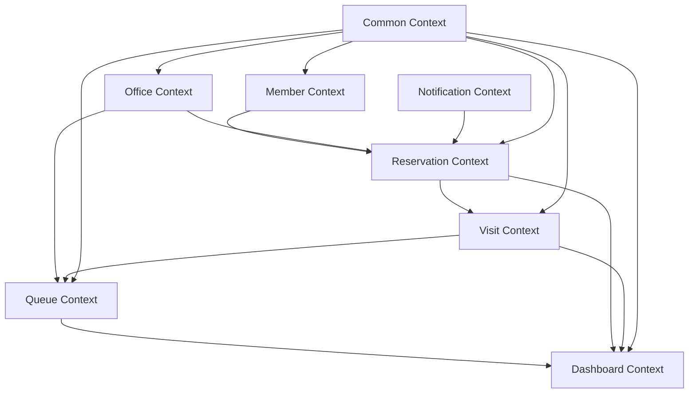

# Bounded Context 명세서

## 1. 목적

실제 구현은 모듈형 단일 애플리케이션으로 진행하되, 향후 MSA 분리가 가능하도록 Bounded Context 기준으로 책임을 나눕니다.

## 2. Context 목록

| Context | 책임 | MVP 여부 |
|---|---|---|
| Member Context | 회원, 보호자, 직원, 관리자, 권한 관리 | 포함 |
| Office Context | 보건소, 업무 유형, 창구 관리 | 포함 |
| Reservation Context | 예약 신청, 조회, 취소, 예약 슬롯 관리 | 포함 |
| Visit Context | 체크인, 현장 접수, 방문 이력 관리 | 포함 |
| Queue Context | 대기번호 발급, 호출, 보류, 완료 처리 | 포함 |
| Dashboard Context | 혼잡도, 방문 통계, 대기시간 통계 | 포함 |
| Notification Context | 예약 알림, 호출 알림 | 2차 |
| Common Context | 공통코드, 예외, 응답, 감사 로그 | 포함 |

## 3. Context 관계도



## 4. Context 상세

### 4.1 Member Context

| 항목 | 내용 |
|---|---|
| 책임 | 회원 계정, 보호자 계정, 직원 계정, 관리자 계정, 인증 정보 관리 |
| 주요 엔티티 | Member, GuardianRelation, RefreshToken |
| 주요 기능 | 로그인, 회원가입, 토큰 재발급, 회원 정보 조회, 권한 확인 |
| 제공 API | Auth API, Member API |

주요 규칙:

- 회원은 하나의 역할을 가질 수 있습니다.
- 직원과 관리자는 소속 보건소를 가집니다.
- 일반 시민과 보호자는 예약을 신청할 수 있습니다.
- MVP에서는 모든 사용자가 로그인 기반으로 기능을 사용합니다.

### 4.2 Office Context

| 항목 | 내용 |
|---|---|
| 책임 | 보건소, 업무 유형, 창구, 직원 담당 업무 관리 |
| 주요 엔티티 | HealthCenter, ServiceType, ServiceWindow, StaffServiceAssignment |
| 주요 기능 | 업무 유형 관리, 창구 관리, 보건소 정보 관리 |
| 제공 API | Office API, Admin Office API |

### 4.3 Reservation Context

| 항목 | 내용 |
|---|---|
| 책임 | 예약 가능 시간 조회, 예약 신청, 예약 조회, 예약 취소 |
| 주요 엔티티 | ReservationSlot, Reservation |
| 주요 기능 | 예약 생성, 예약 취소, 예약 슬롯 정원 관리 |
| 제공 API | Reservation API |

주요 규칙:

- 예약 단위는 30분입니다.
- 예약 가능 기간은 오늘부터 14일입니다.
- 당일 예약은 허용합니다.
- 방문 1시간 전까지 예약 취소가 가능합니다.
- 업무별 기본 예약 가능 인원은 5명이며 관리자가 변경할 수 있습니다.
- 예약 정원을 초과할 수 없습니다.

### 4.4 Visit Context

| 항목 | 내용 |
|---|---|
| 책임 | 예약자 체크인, 현장 접수, 직원 대리 접수, 방문 이력 관리 |
| 주요 엔티티 | Visit |
| 주요 기능 | 체크인, 현장 접수, 방문 상태 관리 |
| 제공 API | Visit API |

### 4.5 Queue Context

| 항목 | 내용 |
|---|---|
| 책임 | 대기번호 발급, 대기열 조회, 호출, 보류, 처리 시작, 처리 완료 |
| 주요 엔티티 | QueueTicket, ServiceProcess |
| 주요 기능 | 대기번호 발급, 대기 호출, 업무 처리 상태 관리 |
| 제공 API | Queue API |

### 4.6 Dashboard Context

| 항목 | 내용 |
|---|---|
| 책임 | 방문자 수, 대기시간, 노쇼율, 혼잡도 지표 계산 |
| 주요 엔티티 | DashboardStat, CongestionMetric |
| 주요 기능 | 관리자 대시보드, 직원용 당일 현황, 사용자 혼잡도 조회 |
| 제공 API | Dashboard API, Congestion API |

## 5. 패키지 구조 제안

신규 보건소 도메인은 eGovFrame Simple Backend Template의 기본 패키지 아래에 둔다. 기존 템플릿 패키지는 유지하고, 신규 기능은 `egovframework.healthcenter` 하위 패키지에 작성한다.

```text
egovframework.healthcenter
 ├─ member
 │   ├─ api
 │   ├─ application
 │   ├─ mapper
 │   ├─ policy
 │   └─ dto
 ├─ office
 ├─ reservation
 ├─ visit
 ├─ queue
 ├─ dashboard
 ├─ notification
 └─ common
     ├─ code
     ├─ exception
     ├─ response
     ├─ security
     └─ audit
```

Mapper XML은 다음 경로 아래에 둔다.

```text
src/main/resources/egovframework/mapper/healthcenter
```

MVP에서는 JPA를 사용하지 않고 MyBatis를 기본 DB 접근 방식으로 사용한다. Request/Response/Command DTO는 `record`를 우선 사용하고, Mapper 조회 결과용 VO는 MyBatis 매핑 편의를 위해 Setter를 제한적으로 허용한다. 단, VO의 Setter를 비즈니스 상태 변경에 사용하지 않는다.

## 6. 향후 MSA 분리 기준

| 서비스 후보 | 분리 이유 |
|---|---|
| Auth/Member Service | 인증과 사용자 관리 독립성 확보 |
| Office Service | 보건소, 업무, 창구 기준정보 관리 |
| Reservation Service | 예약 정원과 중복 예약 처리의 독립성 |
| Queue Service | 실시간 대기열과 호출 처리 독립성 |
| Dashboard Service | 통계 조회와 배치 처리 부하 분리 |
| Notification Service | 알림 발송 비동기 처리 |
