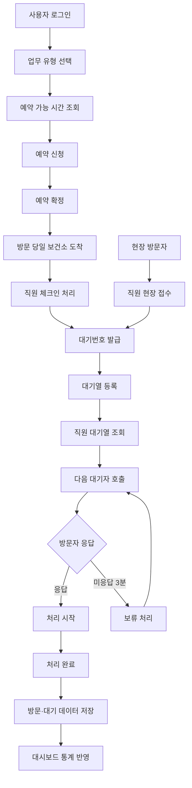
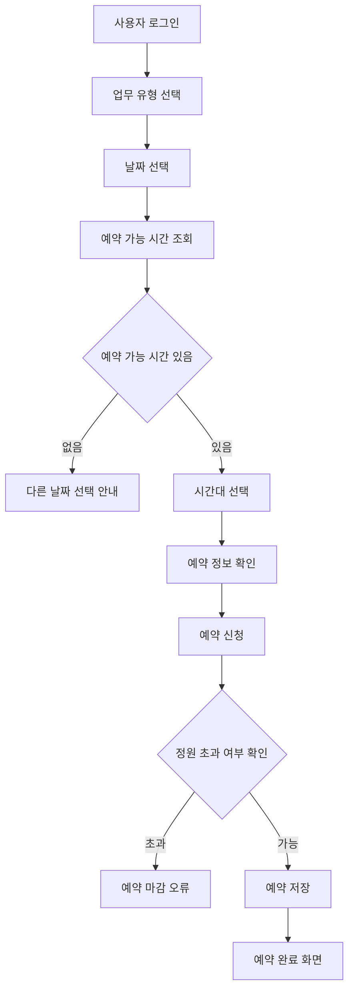
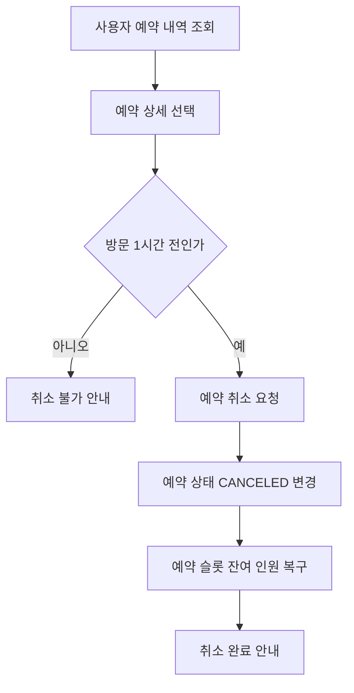
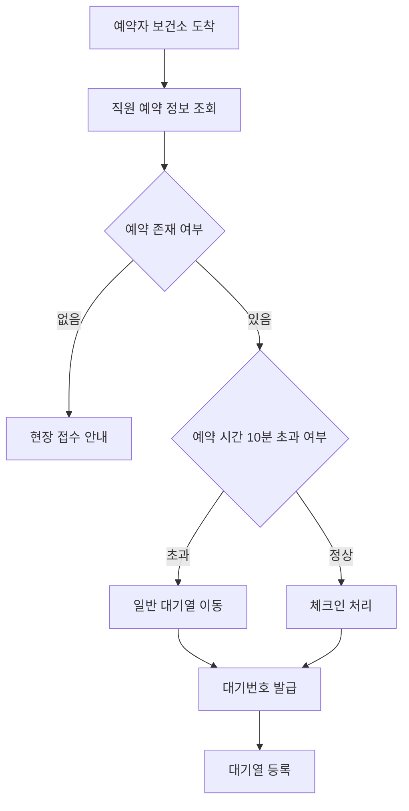
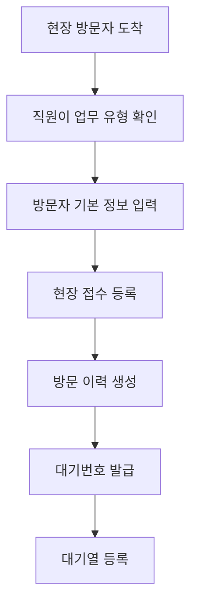
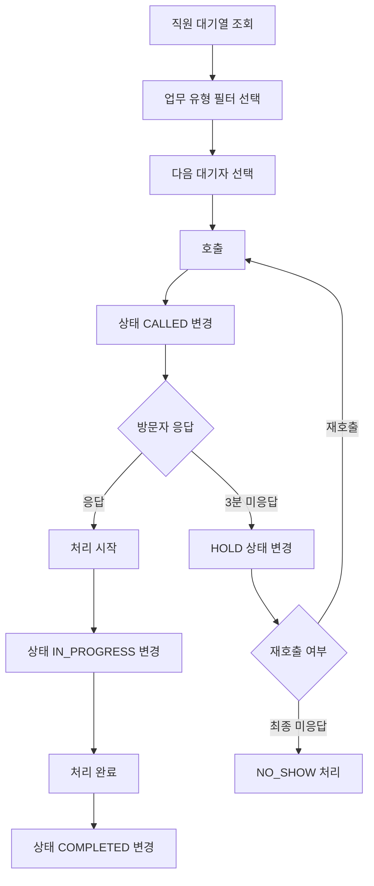
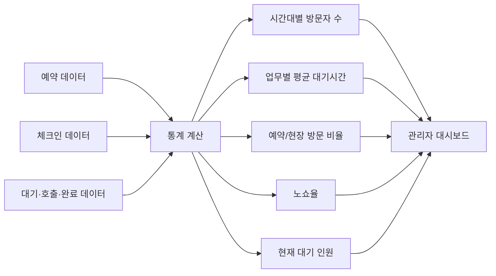
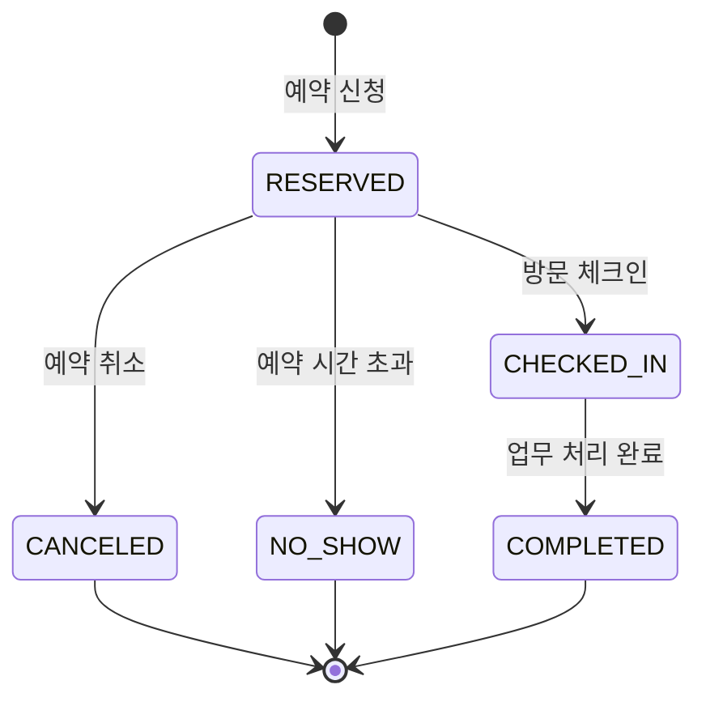
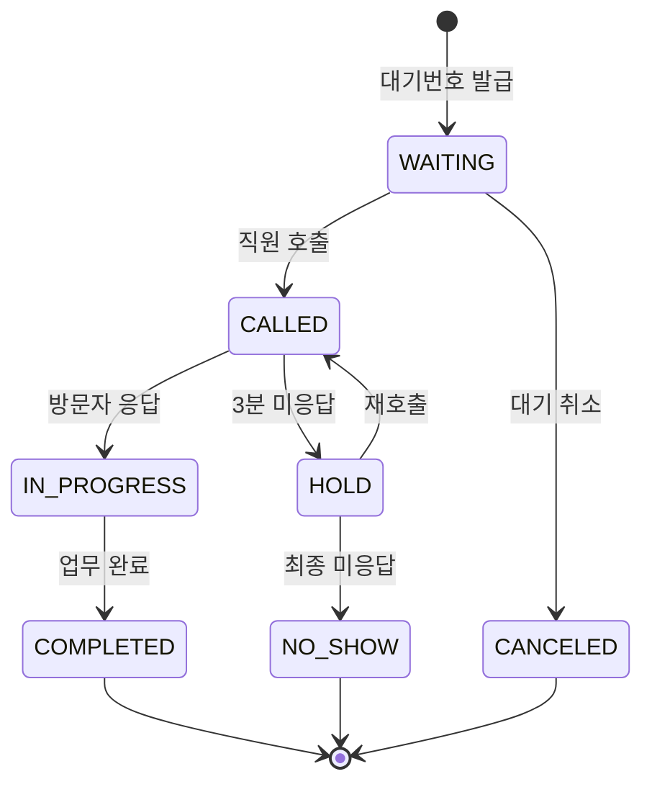

# 업무 흐름도

## 1. 전체 업무 흐름

```mermaid
flowchart TD
    A[사용자 로그인] --> B[업무 유형 선택]
    B --> C[예약 가능 시간 조회]
    C --> D[예약 신청]
    D --> E[예약 확정]

    E --> F[방문 당일 보건소 도착]
    F --> G[직원 체크인 처리]
    G --> H[대기번호 발급]

    I[현장 방문자] --> J[직원 현장 접수]
    J --> H

    H --> K[대기열 등록]
    K --> L[직원 대기열 조회]
    L --> M[다음 대기자 호출]
    M --> N{방문자 응답}
    N -->|응답| O[처리 시작]
    N -->|미응답 3분| P[보류 처리]
    P --> M
    O --> Q[처리 완료]
    Q --> R[방문·대기 데이터 저장]
    R --> S[대시보드 통계 반영]
```

## 2. 예약 신청 흐름

```mermaid
flowchart TD
    A[사용자 로그인] --> B[업무 유형 선택]
    B --> C[날짜 선택]
    C --> D[예약 가능 시간 조회]
    D --> E{예약 가능 시간 있음}
    E -->|없음| F[다른 날짜 선택 안내]
    E -->|있음| G[시간대 선택]
    G --> H[예약 정보 확인]
    H --> I[예약 신청]
    I --> J{정원 초과 여부 확인}
    J -->|초과| K[예약 마감 오류]
    J -->|가능| L[예약 저장]
    L --> M[예약 완료 화면]
```

## 3. 예약 취소 흐름

```mermaid
flowchart TD
    A[사용자 예약 내역 조회] --> B[예약 상세 선택]
    B --> C{방문 1시간 전인가}
    C -->|아니오| D[취소 불가 안내]
    C -->|예| E[예약 취소 요청]
    E --> F[예약 상태 CANCELED 변경]
    F --> G[예약 슬롯 잔여 인원 복구]
    G --> H[취소 완료 안내]
```

## 4. 예약자 체크인 흐름

```mermaid
flowchart TD
    A[예약자 보건소 도착] --> B[직원 예약 정보 조회]
    B --> C{예약 존재 여부}
    C -->|없음| D[현장 접수 안내]
    C -->|있음| E{예약 시간 10분 초과 여부}
    E -->|초과| F[일반 대기열 이동]
    E -->|정상| G[체크인 처리]
    F --> H[대기번호 발급]
    G --> H
    H --> I[대기열 등록]
```

## 5. 현장 접수 흐름

```mermaid
flowchart TD
    A[현장 방문자 도착] --> B[직원이 업무 유형 확인]
    B --> C[방문자 기본 정보 입력]
    C --> D[현장 접수 등록]
    D --> E[방문 이력 생성]
    E --> F[대기번호 발급]
    F --> G[대기열 등록]
```

## 6. 대기 호출 흐름

```mermaid
flowchart TD
    A[직원 대기열 조회] --> B[업무 유형 필터 선택]
    B --> C[다음 대기자 선택]
    C --> D[호출]
    D --> E[상태 CALLED 변경]
    E --> F{방문자 응답}
    F -->|응답| G[처리 시작]
    F -->|3분 미응답| H[HOLD 상태 변경]
    H --> I{재호출 여부}
    I -->|재호출| D
    I -->|최종 미응답| J[NO_SHOW 처리]
    G --> K[상태 IN_PROGRESS 변경]
    K --> L[처리 완료]
    L --> M[상태 COMPLETED 변경]
```

## 7. 대시보드 데이터 흐름

```mermaid
flowchart LR
    A[예약 데이터] --> D[통계 계산]
    B[체크인 데이터] --> D
    C[대기·호출·완료 데이터] --> D

    D --> E[시간대별 방문자 수]
    D --> F[업무별 평균 대기시간]
    D --> G[예약/현장 방문 비율]
    D --> H[노쇼율]
    D --> I[현재 대기 인원]

    E --> J[관리자 대시보드]
    F --> J
    G --> J
    H --> J
    I --> J
```

## 8. 예약 상태 흐름

```mermaid
stateDiagram-v2
    [*] --> RESERVED: 예약 신청
    RESERVED --> CANCELED: 예약 취소
    RESERVED --> CHECKED_IN: 방문 체크인
    RESERVED --> NO_SHOW: 예약 시간 초과
    CHECKED_IN --> COMPLETED: 업무 처리 완료
    CANCELED --> [*]
    NO_SHOW --> [*]
    COMPLETED --> [*]
```

## 9. 대기 상태 흐름

```mermaid
stateDiagram-v2
    [*] --> WAITING: 대기번호 발급
    WAITING --> CALLED: 직원 호출
    CALLED --> IN_PROGRESS: 방문자 응답
    CALLED --> HOLD: 3분 미응답
    HOLD --> CALLED: 재호출
    HOLD --> NO_SHOW: 최종 미응답
    IN_PROGRESS --> COMPLETED: 업무 완료
    WAITING --> CANCELED: 대기 취소
    COMPLETED --> [*]
    CANCELED --> [*]
    NO_SHOW --> [*]
```
