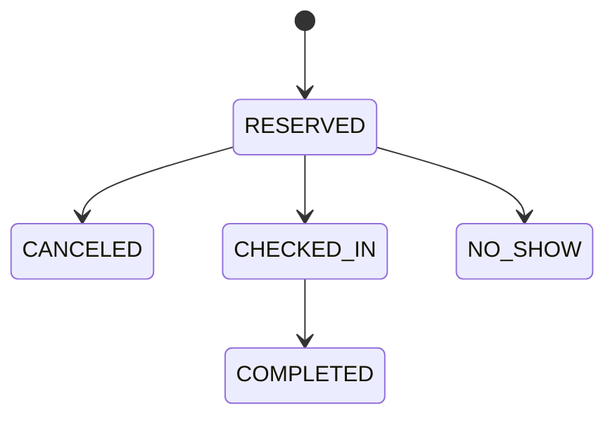

# 공통코드 정의서

## 1. 공통코드 그룹 목록

| 그룹 코드 | 그룹명 | 설명 |
|---|---|---|
| USER_ROLE | 사용자 역할 | 일반 시민, 보호자, 직원, 관리자 |
| SERVICE_TYPE | 업무 유형 | 예방접종, 건강검진/검사, 건강상담 |
| RESERVATION_STATUS | 예약 상태 | 예약 완료, 취소, 체크인, 미방문, 완료 |
| VISIT_TYPE | 방문 유형 | 예약 방문, 현장 방문, 직원 대리 접수 |
| VISIT_STATUS | 방문 상태 | 접수, 대기, 처리중, 완료, 취소 |
| QUEUE_STATUS | 대기 상태 | 대기중, 호출됨, 처리중, 완료, 취소, 미방문, 보류 |
| CONGESTION_LEVEL | 혼잡도 | 여유, 보통, 혼잡 |
| WINDOW_STATUS | 창구 상태 | 운영중, 중지, 비활성 |
| NOTICE_TYPE | 공지 유형 | 일반, 긴급, 점검 |
| NOTIFICATION_TYPE | 알림 유형 | 예약 완료, 예약 전날, 호출 임박 |

## 2. 사용자 역할 코드

| 코드 | 코드명 | 설명 |
|---|---|---|
| CITIZEN | 일반 시민 | 본인 예약 사용자 |
| GUARDIAN | 보호자 | 가족 또는 고령층 대리 예약 사용자 |
| STAFF | 직원 | 보건소 현장 업무 처리자 |
| ADMIN | 관리자 | 보건소 운영 관리자 |

## 3. 업무 유형 코드

| 코드 | 코드명 | 설명 | MVP |
|---|---|---|---|
| VACCINATION | 예방접종 | 계절성 접종 등 예방접종 업무 | 예 |
| HEALTH_CHECK | 건강검진/검사 | 건강검진 또는 검사 접수 업무 | 예 |
| HEALTH_CONSULT | 건강상담 | 금연, 생활건강, 만성질환 상담 등 | 예 |
| DEMENTIA_CONSULT | 치매상담 | 치매 관련 상담 업무 | 아니오 |
| MOTHER_CHILD | 모자보건 | 임산부, 영유아 관련 상담 | 아니오 |
| INFECTIOUS_TEST | 감염병 검사 | 감염병 관련 검사 접수 | 아니오 |

## 4. 예약 상태 코드

| 코드 | 코드명 | 설명 |
|---|---|---|
| RESERVED | 예약 완료 | 사용자가 예약을 완료한 상태 |
| CANCELED | 예약 취소 | 예약이 취소된 상태 |
| CHECKED_IN | 체크인 완료 | 방문 당일 체크인이 완료된 상태 |
| NO_SHOW | 미방문 | 예약자가 방문하지 않은 상태 |
| COMPLETED | 처리 완료 | 예약 기반 업무가 완료된 상태 |

## 5. 방문 유형 코드

| 코드 | 코드명 | 설명 |
|---|---|---|
| RESERVED | 예약 방문 | 사전 예약 후 방문 |
| WALK_IN | 현장 방문 | 예약 없이 현장 접수 |
| STAFF_PROXY | 직원 대리 접수 | 전화 또는 현장 요청을 직원이 대신 접수 |

## 6. 방문 상태 코드

| 코드 | 코드명 | 설명 |
|---|---|---|
| REGISTERED | 접수 완료 | 방문 접수가 완료된 상태 |
| WAITING | 대기중 | 대기번호가 발급되어 대기 중인 상태 |
| IN_PROGRESS | 처리중 | 창구에서 처리 중인 상태 |
| COMPLETED | 완료 | 방문 업무가 완료된 상태 |
| CANCELED | 취소 | 방문 접수가 취소된 상태 |

## 7. 대기 상태 코드

| 코드 | 코드명 | 설명 |
|---|---|---|
| WAITING | 대기중 | 대기열에 등록된 상태 |
| CALLED | 호출됨 | 직원이 호출한 상태 |
| IN_PROGRESS | 처리중 | 업무 처리 중인 상태 |
| COMPLETED | 완료 | 업무 처리가 완료된 상태 |
| CANCELED | 취소 | 대기가 취소된 상태 |
| NO_SHOW | 미방문 | 호출 또는 예약 후 나타나지 않은 상태 |
| HOLD | 보류 | 호출 후 응답하지 않아 보류된 상태 |

## 8. 혼잡도 코드

| 코드 | 코드명 | 기준 예시 |
|---|---|---|
| LOW | 여유 | 대기 인원 5명 이하 또는 예상 대기시간 10분 이하 |
| NORMAL | 보통 | 대기 인원 6~15명 또는 예상 대기시간 11~30분 |
| HIGH | 혼잡 | 대기 인원 16명 이상 또는 예상 대기시간 31분 이상 |
