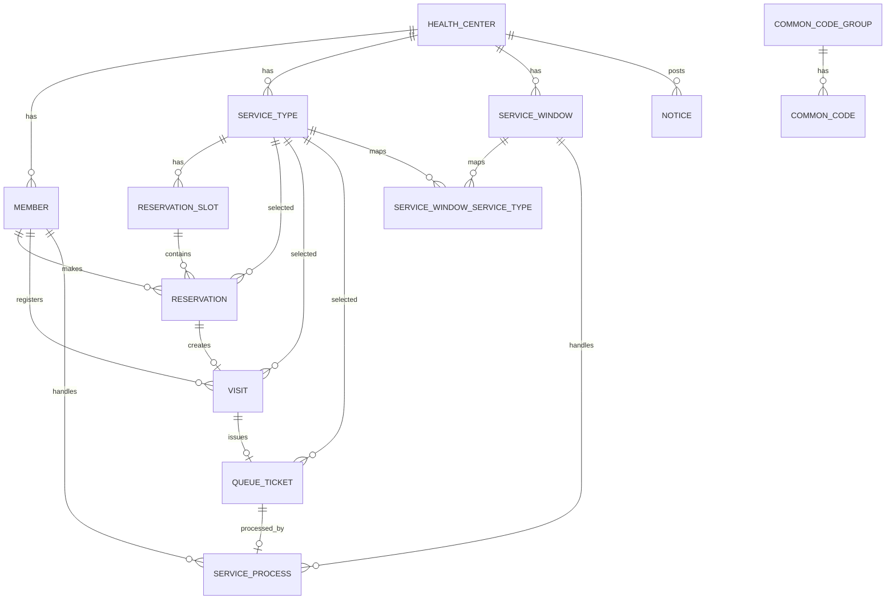

# ERD 및 테이블 명세서

## 1. 설계 원칙

1. MVP는 단일 보건소 기준으로 구현합니다.
2. 주요 테이블에는 `health_center_id`를 포함하여 다중 보건소 확장을 고려합니다.
3. 의료정보, 검사결과, 처방정보는 저장하지 않습니다.
4. 예약, 방문, 대기, 호출, 처리, 통계에 필요한 정보만 저장합니다.
5. MVP DB는 PostgreSQL 18을 사용합니다.
6. Docker 이미지는 `pgvector/pgvector:0.8.2-pg18` 사용을 기준으로 합니다.
7. AI 기능은 MVP에서 제외하지만, 향후 pgvector 확장을 고려합니다.

## 2. ERD 초안



## 3. 테이블 목록

| 테이블 | 설명 | MVP |
|---|---|---|
| health_centers | 보건소 정보 | 포함 |
| members | 사용자, 직원, 관리자 정보 | 포함 |
| guardian_relations | 보호자와 보호 대상자 관계 | 2차 |
| service_types | 업무 유형 | 포함 |
| service_windows | 창구 | 포함 |
| service_window_service_types | 창구별 담당 업무 매핑 | 포함 |
| staff_service_assignments | 직원 담당 업무 | 2차 |
| reservation_slots | 예약 가능 시간대 | 포함 |
| reservations | 예약 정보 | 포함 |
| visits | 방문 및 체크인 정보 | 포함 |
| queue_tickets | 대기번호 정보 | 포함 |
| service_processes | 업무 처리 이력 | 포함 |
| notices | 공지사항 | 포함 |
| common_code_groups | 공통코드 그룹 | 포함 |
| common_codes | 공통코드 | 포함 |
| dashboard_daily_stats | 일별 통계 집계 | 2차 |
| dashboard_hourly_stats | 시간대별 통계 집계 | 2차 |
| notifications | 알림 이력 | 2차 |
| refresh_tokens | Refresh Token 저장 | 포함 |

## 4. 주요 테이블 상세

### 4.1 health_centers

| 컬럼 | 타입 | 제약 | 설명 |
|---|---|---|---|
| id | BIGSERIAL | PK | 보건소 ID |
| name | VARCHAR(100) | NOT NULL | 보건소명 |
| address | VARCHAR(255) | NULL | 주소 |
| phone | VARCHAR(30) | NULL | 대표 전화번호 |
| active | BOOLEAN | NOT NULL | 사용 여부 |
| created_at | TIMESTAMP | NOT NULL | 생성일 |
| updated_at | TIMESTAMP | NULL | 수정일 |

### 4.2 members

| 컬럼 | 타입 | 제약 | 설명 |
|---|---|---|---|
| id | BIGSERIAL | PK | 회원 ID |
| health_center_id | BIGINT | FK, NULL | 소속 보건소 ID. 시민은 NULL 가능 |
| email | VARCHAR(100) | UNIQUE, NOT NULL | 로그인 이메일 |
| password | VARCHAR(255) | NOT NULL | 암호화된 비밀번호 |
| name | VARCHAR(50) | NOT NULL | 이름 |
| phone | VARCHAR(30) | NOT NULL | 휴대폰 번호 |
| role | VARCHAR(30) | NOT NULL | CITIZEN, GUARDIAN, STAFF, ADMIN |
| active | BOOLEAN | NOT NULL | 사용 여부 |
| created_at | TIMESTAMP | NOT NULL | 생성일 |
| updated_at | TIMESTAMP | NULL | 수정일 |

### 4.3 service_types

| 컬럼 | 타입 | 제약 | 설명 |
|---|---|---|---|
| id | BIGSERIAL | PK | 업무 유형 ID |
| health_center_id | BIGINT | FK, NOT NULL | 보건소 ID |
| code | VARCHAR(50) | NOT NULL | 업무 코드 |
| name | VARCHAR(100) | NOT NULL | 업무명 |
| description | TEXT | NULL | 설명 |
| default_capacity | INT | NOT NULL | 기본 예약 가능 인원 |
| active | BOOLEAN | NOT NULL | 사용 여부 |
| created_at | TIMESTAMP | NOT NULL | 생성일 |
| updated_at | TIMESTAMP | NULL | 수정일 |

추천 제약:

```sql
UNIQUE (health_center_id, code)
```

### 4.3.1 service_windows

| 컬럼 | 타입 | 제약 | 설명 |
|---|---|---|---|
| id | BIGSERIAL | PK | 창구 ID |
| health_center_id | BIGINT | FK, NOT NULL | 보건소 ID |
| window_number | INT | NOT NULL | 창구 번호 |
| name | VARCHAR(100) | NOT NULL | 창구명 |
| status | VARCHAR(30) | NOT NULL | OPEN, PAUSED, CLOSED |
| active | BOOLEAN | NOT NULL | 사용 여부 |
| created_at | TIMESTAMP | NOT NULL | 생성일 |
| updated_at | TIMESTAMP | NULL | 수정일 |

추천 제약:

```sql
UNIQUE (health_center_id, window_number)
```

### 4.3.2 service_window_service_types

| 컬럼 | 타입 | 제약 | 설명 |
|---|---|---|---|
| id | BIGSERIAL | PK | 창구 업무 매핑 ID |
| service_window_id | BIGINT | FK, NOT NULL | 창구 ID |
| service_type_id | BIGINT | FK, NOT NULL | 업무 유형 ID |
| active | BOOLEAN | NOT NULL | 사용 여부 |
| created_at | TIMESTAMP | NOT NULL | 생성일 |
| updated_at | TIMESTAMP | NULL | 수정일 |

추천 제약:

```sql
UNIQUE (service_window_id, service_type_id)
```

### 4.4 reservation_slots

| 컬럼 | 타입 | 제약 | 설명 |
|---|---|---|---|
| id | BIGSERIAL | PK | 예약 슬롯 ID |
| health_center_id | BIGINT | FK, NOT NULL | 보건소 ID |
| service_type_id | BIGINT | FK, NOT NULL | 업무 유형 ID |
| slot_date | DATE | NOT NULL | 예약 날짜 |
| start_time | TIME | NOT NULL | 시작 시간 |
| end_time | TIME | NOT NULL | 종료 시간 |
| capacity | INT | NOT NULL | 예약 가능 인원 |
| reserved_count | INT | NOT NULL | 현재 예약 인원 |
| active | BOOLEAN | NOT NULL | 사용 여부 |
| created_at | TIMESTAMP | NOT NULL | 생성일 |
| updated_at | TIMESTAMP | NULL | 수정일 |

추천 제약:

```sql
UNIQUE (service_type_id, slot_date, start_time, end_time)
```

### 4.5 reservations

| 컬럼 | 타입 | 제약 | 설명 |
|---|---|---|---|
| id | BIGSERIAL | PK | 예약 ID |
| reservation_no | VARCHAR(50) | UNIQUE, NOT NULL | 예약번호 |
| health_center_id | BIGINT | FK, NOT NULL | 보건소 ID |
| member_id | BIGINT | FK, NOT NULL | 예약자 ID |
| service_type_id | BIGINT | FK, NOT NULL | 업무 유형 ID |
| reservation_slot_id | BIGINT | FK, NOT NULL | 예약 슬롯 ID |
| visitor_name | VARCHAR(50) | NOT NULL | 방문자 이름 |
| visitor_phone | VARCHAR(30) | NOT NULL | 방문자 연락처 |
| status | VARCHAR(30) | NOT NULL | 예약 상태 |
| reserved_at | TIMESTAMP | NOT NULL | 예약 생성일 |
| canceled_at | TIMESTAMP | NULL | 취소일 |
| checked_in_at | TIMESTAMP | NULL | 체크인 시간 |
| created_at | TIMESTAMP | NOT NULL | 생성일 |
| updated_at | TIMESTAMP | NULL | 수정일 |

### 4.6 visits

| 컬럼 | 타입 | 제약 | 설명 |
|---|---|---|---|
| id | BIGSERIAL | PK | 방문 ID |
| health_center_id | BIGINT | FK, NOT NULL | 보건소 ID |
| reservation_id | BIGINT | FK, NULL | 예약 ID. 현장 접수는 NULL |
| service_type_id | BIGINT | FK, NOT NULL | 업무 유형 ID |
| member_id | BIGINT | FK, NULL | 방문자 회원 ID |
| registered_by | BIGINT | FK, NULL | 직원 대리 접수자 ID |
| visitor_name | VARCHAR(50) | NULL | 현장 방문자 이름 |
| visitor_phone | VARCHAR(30) | NULL | 현장 방문자 연락처 |
| visit_type | VARCHAR(30) | NOT NULL | RESERVED, WALK_IN, STAFF_PROXY |
| status | VARCHAR(30) | NOT NULL | 방문 상태 |
| checked_in_at | TIMESTAMP | NOT NULL | 체크인/접수 시간 |
| created_at | TIMESTAMP | NOT NULL | 생성일 |
| updated_at | TIMESTAMP | NULL | 수정일 |

### 4.7 queue_tickets

| 컬럼 | 타입 | 제약 | 설명 |
|---|---|---|---|
| id | BIGSERIAL | PK | 대기표 ID |
| health_center_id | BIGINT | FK, NOT NULL | 보건소 ID |
| visit_id | BIGINT | FK, NOT NULL | 방문 ID |
| service_type_id | BIGINT | FK, NOT NULL | 업무 유형 ID |
| ticket_number | INT | NOT NULL | 대기번호 |
| status | VARCHAR(30) | NOT NULL | 대기 상태 |
| issued_at | TIMESTAMP | NOT NULL | 발급 시간 |
| called_at | TIMESTAMP | NULL | 호출 시간 |
| started_at | TIMESTAMP | NULL | 처리 시작 시간 |
| completed_at | TIMESTAMP | NULL | 완료 시간 |
| hold_at | TIMESTAMP | NULL | 보류 시간 |
| created_at | TIMESTAMP | NOT NULL | 생성일 |
| updated_at | TIMESTAMP | NULL | 수정일 |

### 4.8 service_processes

| 컬럼 | 타입 | 제약 | 설명 |
|---|---|---|---|
| id | BIGSERIAL | PK | 처리 ID |
| queue_ticket_id | BIGINT | FK, NOT NULL | 대기표 ID |
| service_window_id | BIGINT | FK, NOT NULL | 창구 ID |
| staff_id | BIGINT | FK, NOT NULL | 처리 직원 ID |
| started_at | TIMESTAMP | NOT NULL | 처리 시작 시간 |
| completed_at | TIMESTAMP | NULL | 처리 완료 시간 |
| memo | TEXT | NULL | 내부 메모 |
| created_at | TIMESTAMP | NOT NULL | 생성일 |
| updated_at | TIMESTAMP | NULL | 수정일 |

## 5. 인덱스 후보

| 테이블 | 인덱스 | 목적 |
|---|---|---|
| reservations | member_id, status | 내 예약 조회 |
| reservations | reservation_slot_id | 슬롯별 예약 조회 |
| reservation_slots | service_type_id, slot_date | 예약 가능 시간 조회 |
| visits | health_center_id, checked_in_at | 일자별 방문 조회 |
| queue_tickets | health_center_id, service_type_id, status | 대기열 조회 |
| queue_tickets | issued_at | 시간대별 대기 통계 |
| service_processes | staff_id, started_at | 직원별 처리 이력 |
| service_processes | service_window_id, started_at | 창구별 처리 이력 |

## 6. 향후 pgvector 확장 후보

MVP에서는 아래 테이블과 vector 컬럼을 생성하지 않는다. FAQ 검색, 유사 문의 검색, 혼잡 원인 분석 같은 AI 확장이 확정되면 `CREATE EXTENSION IF NOT EXISTS vector;` 실행 후 별도 마이그레이션으로 추가한다.

| 테이블 | 설명 |
|---|---|
| faq_items | 자주 묻는 질문 |
| faq_embeddings | FAQ 임베딩 벡터 |
| congestion_reports | 혼잡 원인 분석 리포트 |
| report_embeddings | 리포트 임베딩 벡터 |

예시:

```sql
CREATE EXTENSION IF NOT EXISTS vector;
```
