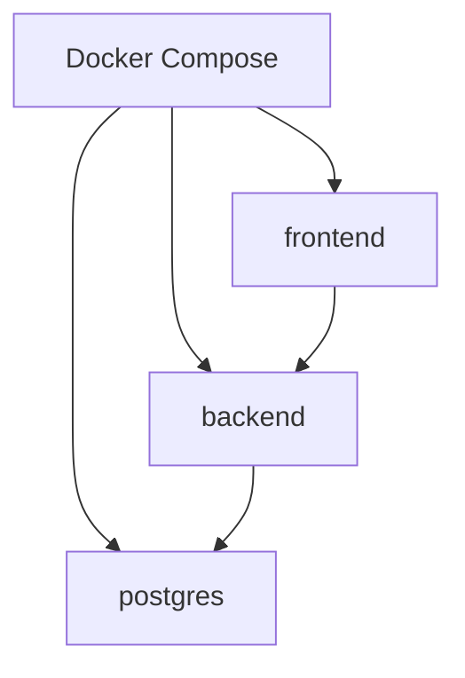

# 배포 설계서

## 1. 배포 범위

| 구분 | 내용 |
|---|---|
| MVP 배포 | Docker Compose |
| 포함 서비스 | Frontend, Backend, PostgreSQL |
| 제외 서비스 | Redis, Kafka, Kubernetes, 실제 알림 서버 |
| DB 이미지 | pgvector/pgvector:0.8.2-pg18 |
| 향후 확장 | Redis, Kafka, Kubernetes, pgvector 기반 AI 검색 |

## 2. 컨테이너 구성



| 서비스 | 설명 | 포트 |
|---|---|---|
| frontend | React 앱 | 3000 또는 5173 |
| backend | eGovFrame Simple Backend Template 기반 REST API | 8080 |
| postgres | PostgreSQL 18 + pgvector 확장 준비 이미지 | 5432 |

## 3. 환경 변수

### Backend

| 변수 | 설명 | 예시 |
|---|---|---|
| SPRING_PROFILES_ACTIVE | 실행 프로필 | local |
| DB_HOST | DB 호스트 | postgres |
| DB_PORT | DB 포트 | 5432 |
| DB_NAME | DB 이름 | health_center |
| DB_USERNAME | DB 사용자 | health |
| DB_PASSWORD | DB 비밀번호 | health1234 |
| JWT_SECRET | JWT 서명 키 | local-secret-key |
| JWT_ACCESS_EXPIRE | Access Token 만료 | 3600 |
| JWT_REFRESH_EXPIRE | Refresh Token 만료 | 1209600 |

### Frontend

| 변수 | 설명 | 예시 |
|---|---|---|
| VITE_API_BASE_URL | 백엔드 API 주소 | http://localhost:8080/api |

## 4. docker-compose.yml 초안

```yaml
services:
  postgres:
    image: pgvector/pgvector:0.8.2-pg18
    container_name: health-center-postgres
    environment:
      POSTGRES_DB: health_center
      POSTGRES_USER: health
      POSTGRES_PASSWORD: health1234
    ports:
      - "5432:5432"
    volumes:
      - health-center-postgres-data:/var/lib/postgresql
    networks:
      - health-center-network

  backend:
    build:
      context: ./backend
    container_name: health-center-backend
    environment:
      SPRING_PROFILES_ACTIVE: local
      DB_HOST: postgres
      DB_PORT: 5432
      DB_NAME: health_center
      DB_USERNAME: health
      DB_PASSWORD: health1234
      JWT_SECRET: local-secret-key-for-development
      JWT_ACCESS_EXPIRE: 3600
      JWT_REFRESH_EXPIRE: 1209600
    ports:
      - "8080:8080"
    depends_on:
      - postgres
    networks:
      - health-center-network

  frontend:
    build:
      context: ./frontend
    container_name: health-center-frontend
    environment:
      VITE_API_BASE_URL: http://localhost:8080/api
    ports:
      - "3000:3000"
    depends_on:
      - backend
    networks:
      - health-center-network

volumes:
  health-center-postgres-data:

networks:
  health-center-network:
    driver: bridge
```

주의:

- PostgreSQL 18 계열 Docker 이미지는 볼륨을 `/var/lib/postgresql`에 마운트한다.
- pgvector는 PostgreSQL 확장이므로 실제 사용 시 DB에서 `CREATE EXTENSION IF NOT EXISTS vector;`를 실행해야 한다.
- MVP에서는 AI 기능과 vector 컬럼을 사용하지 않고, 향후 확장 시점에 활성화한다.

## 5. Backend Dockerfile 초안

```dockerfile
FROM eclipse-temurin:17-jdk AS builder
WORKDIR /app
COPY . .
RUN ./mvnw clean package -DskipTests

FROM eclipse-temurin:17-jre
WORKDIR /app
COPY --from=builder /app/target/*.jar app.jar
EXPOSE 8080
ENTRYPOINT ["java", "-jar", "app.jar"]
```

주의:

- backend는 eGovFrame Simple Backend Template 기반이므로 Maven 구조를 유지한다.
- 템플릿에 `mvnw`가 없으면 `mvn clean package -DskipTests` 기준으로 조정한다.
- Maven과 Gradle을 혼용하지 않는다.

## 6. Frontend Dockerfile 초안

```dockerfile
FROM node:20-alpine AS builder
WORKDIR /app
COPY package*.json ./
RUN npm install
COPY . .
RUN npm run build

FROM node:20-alpine
WORKDIR /app
RUN npm install -g serve
COPY --from=builder /app/dist ./dist
EXPOSE 3000
CMD ["serve", "-s", "dist", "-l", "3000"]
```

## 7. 실행 명령

```bash
docker compose up -d --build
```

로그 확인:

```bash
docker compose logs -f backend
docker compose logs -f frontend
docker compose logs -f postgres
```

종료:

```bash
docker compose down
```

볼륨까지 삭제:

```bash
docker compose down -v
```

## 8. DB 초기화 전략

| 방식 | 설명 | 추천 |
|---|---|---|
| JPA ddl-auto create/update | 개발 초기에 빠르게 테이블 생성 | 초기 개발용 |
| Flyway | SQL 마이그레이션 관리 | 포트폴리오 완성 단계 추천 |
| Liquibase | 변경 이력 관리 | 선택 |

추천:

```text
초기 개발: spring.jpa.hibernate.ddl-auto=update
문서화/완성 단계: Flyway 도입
```

## 9. 향후 확장

| 확장 | 설명 |
|---|---|
| pgvector | FAQ 검색, 유사 문의 검색 등을 위해 향후 `CREATE EXTENSION IF NOT EXISTS vector;`로 활성화 |
| Redis | Refresh Token, 대기열 캐시, 현재 혼잡도 캐시 |
| Kafka | 예약, 체크인, 처리 완료 이벤트 발행 |
| Batch | 일별/시간대별 통계 집계 |
| Kubernetes | 실제 운영환경 배포 확장 |
