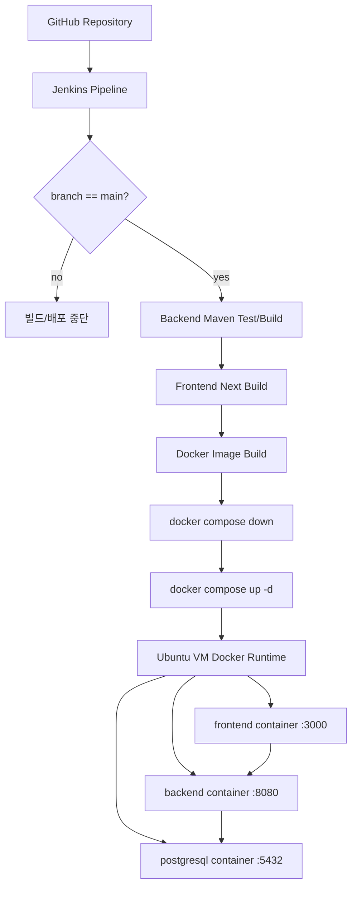

# Ubuntu VM Jenkins Docker Compose 배포 계획서

## 1. 문서 목적

이 문서는 MVP 개발이 완료된 보건소 스마트 예약·대기 및 혼잡도 분석 시스템을 개인 Windows 노트북의 Ubuntu VM에 배포하기 위한 실행 계획서이다.

목표는 단순 실행이 아니라, 취업 포트폴리오와 Notion 정리에 사용할 수 있도록 아래 흐름을 직접 구성하고 설명 가능한 상태로 만드는 것이다.

```text
feature/* 브랜치
  -> dev 브랜치 PR
  -> dev 통합 테스트
  -> main 브랜치 PR
  -> main merge
  -> Jenkins Pipeline 실행
  -> backend/frontend Docker image build
  -> PostgreSQL 포함 docker compose up -d
  -> Ubuntu VM에서 서비스 실행
```

이번 범위에서는 AWS, Kubernetes, HTTPS 자동화, Nginx Proxy Manager는 제외한다.  
먼저 로컬 Ubuntu VM에서 Jenkins + Docker Compose 기반 배포 흐름을 완성한다.

---

## 2. 현재 프로젝트 기준

| 구분 | 현재 상태 | 배포 계획 반영 |
|---|---|---|
| Backend | eGovFrame Simple Backend Template 기반 Spring Boot, Maven, Java 17 | `backend/Dockerfile` 작성 |
| Frontend | Next.js 16, React 19, `NEXT_PUBLIC_API_BASE_URL` 사용 | `frontend/Dockerfile` 작성 |
| Database | PostgreSQL 기준 schema/data SQL 존재 | 공식 PostgreSQL 계열 이미지 사용 |
| 현재 Compose | 루트 `docker-compose.yml`에 postgres만 있음 | backend/frontend/postgresql 전체 compose로 확장 |
| 환경변수 | backend DB/JWT 값 일부가 properties에 고정 | `.env`와 Spring placeholder로 분리 필요 |
| CI/CD | 아직 없음 | Jenkinsfile 추가 |

주의:

- 기존 `docs/08_deploy/01_배포_설계서.md`에는 Frontend 변수 예시가 `VITE_API_BASE_URL`로 되어 있으나, 현재 프론트엔드는 Next.js이므로 `NEXT_PUBLIC_API_BASE_URL`을 사용한다.
- PostgreSQL은 직접 Dockerfile을 만들지 않고 공식 이미지를 사용한다. 이 프로젝트는 pgvector 확장 가능성을 고려하므로 `pgvector/pgvector:0.8.2-pg18`을 우선 사용해도 되고, 순수 PostgreSQL만 필요하면 `postgres:18` 계열 공식 이미지를 사용할 수 있다.
- `NEXT_PUBLIC_API_BASE_URL`은 Docker 내부 주소가 아니라 브라우저 기준 주소다. Windows 브라우저에서 접속한다면 `http://<ubuntu-vm-ip>:8080`처럼 VM IP를 기준으로 잡는다.
- Jenkins 컨테이너에서 `docker compose`를 실행하려면 Docker CLI뿐 아니라 Docker Compose v2 플러그인이 필요하다. Jenkins용 커스텀 이미지를 만드는 것을 기본 방향으로 둔다.
- Jenkins workspace에는 Git에 올리지 않는 `.env`가 없으므로, `.env` 주입 방식은 반드시 먼저 결정한다.

---

## 2.1 구현 전 보완 체크

아래 항목은 배포 파일을 만들기 전에 먼저 결정하거나 체크한다.

| 항목 | 결정/보완 내용 | 이유 |
|---|---|---|
| Jenkins Docker Compose 실행 | Jenkins용 커스텀 이미지에 `docker-cli`, `docker-compose-plugin` 설치 | `/usr/bin/docker`만 마운트하면 `docker compose`가 실패할 수 있음 |
| `.env` 주입 방식 | 1순위 Jenkins Credentials 파일 주입, 2순위 VM 로컬 배포 디렉터리 `.env` | Git checkout workspace에는 `.env`가 없음 |
| 프론트 API URL | `NEXT_PUBLIC_API_BASE_URL=http://<ubuntu-vm-ip>:8080` | 브라우저에서 `localhost`는 Ubuntu VM이 아니라 접속한 PC 자신을 의미할 수 있음 |
| CORS | backend 허용 Origin에 `http://<ubuntu-vm-ip>:3000`, 개발용 `http://localhost:3000` 포함 검토 | frontend 3000과 backend 8080은 서로 다른 Origin |
| PostgreSQL 초기화 SQL | `/docker-entrypoint-initdb.d` 사용 여부와 volume 초기화 방법 문서화 | init SQL은 DB volume 최초 생성 시에만 실행 |
| 테스트 명령 | 현재는 `mvn test-compile`, 테스트 안정화 후 `mvn test`로 전환 | test-compile은 테스트 실행이 아니라 컴파일 검증 |

---

## 3. 최종 목표 산출물

이번 배포 준비가 끝나면 아래 파일과 문서가 있어야 한다.

| 산출물 | 위치 | 목적 |
|---|---|---|
| Backend Dockerfile | `backend/Dockerfile` | Maven 빌드 후 Spring Boot jar 실행 |
| Frontend Dockerfile | `frontend/Dockerfile` | Next.js 빌드 후 `next start` 실행 |
| Docker Compose | `docker-compose.yml` | backend, frontend, postgresql 실행 |
| 환경변수 예시 | `.env.example` | 운영자가 복사해 `.env` 생성 |
| 실제 환경변수 | `.env` | Git에 올리지 않는 로컬 배포 설정 |
| Jenkins Pipeline | `Jenkinsfile` | main merge 후 빌드/배포 자동화 |
| README 배포 섹션 | `README.md` | 로컬 Ubuntu VM 배포 요약 |
| Notion 정리 문서 | `docs/08_deploy/03_Notion_배포_정리_초안.md` 후보 | 포트폴리오 설명용 |

이번 문서는 계획서이므로 위 파일을 바로 만들지는 않는다.  
다음 브랜치부터 작은 단위로 하나씩 추가한다.

---

## 4. 추천 배포 구조



추천 실행 위치:

| 항목 | 위치 |
|---|---|
| Git clone | Ubuntu VM 내부 |
| Docker Engine | Ubuntu VM 내부 |
| Jenkins | Ubuntu VM 내부 Docker 컨테이너 |
| Docker Compose 실행 | Jenkins Pipeline 또는 수동 터미널 |
| 서비스 접근 | Windows 브라우저에서 Ubuntu VM IP로 접근 |

예시 접속:

```text
Frontend: http://<ubuntu-vm-ip>:3000
Backend:  http://<ubuntu-vm-ip>:8080
Swagger:  http://<ubuntu-vm-ip>:8080/swagger-ui/index.html
Jenkins:  http://<ubuntu-vm-ip>:8081
```

Jenkins와 backend가 둘 다 8080을 쓰면 충돌하므로 Jenkins는 호스트 포트를 `8081:8080`으로 매핑한다.

---

## 5. Jenkins 설치 방식 비교와 추천

| 방식 | 장점 | 단점 | 추천 여부 |
|---|---|---|---|
| Ubuntu에 직접 설치 | 전통적인 서버 운영 방식과 유사, 서비스 등록 구조 학습 가능 | Java/Jenkins 패키지/권한/Docker CLI 설정이 호스트에 흩어짐 | 보류 |
| Docker 컨테이너로 실행 | 설치/삭제가 쉽고 Compose로 문서화하기 좋음, 포트폴리오 설명이 간단 | Docker socket 권한 설정을 이해해야 함 | 추천 |

추천:

```text
Jenkins는 Docker 컨테이너로 실행한다.
```

이유:

- 개인 노트북 VM에서 반복 설치/삭제가 쉽다.
- Jenkins 자체도 인프라 구성 요소로 컨테이너화해 설명하기 좋다.
- Docker Compose 기반 배포와 같은 운영 방식을 유지할 수 있다.
- 나중에 Jenkins 설정 백업과 재구성이 쉽다.

주의:

- Jenkins 컨테이너에서 Docker 명령을 실행하려면 `/var/run/docker.sock` 마운트 또는 Docker CLI 포함 Jenkins 이미지를 사용해야 한다.
- Docker socket 마운트는 강한 권한을 주는 방식이므로 개인 로컬 VM 학습 환경에서만 사용한다.

---

## 6. Ubuntu VM 준비 순서

### 6.1 Windows 노트북에서 VM 준비

권장 선택:

| 항목 | 추천 |
|---|---|
| 가상화 도구 | VirtualBox 또는 VMware Workstation Player |
| OS | Ubuntu Server 24.04 LTS 또는 Ubuntu Desktop 24.04 LTS |
| CPU | 4 core 이상 |
| RAM | 8GB 이상 |
| Disk | 50GB 이상 |
| Network | Bridged Adapter 권장 |

Bridged Adapter를 쓰면 Windows 브라우저에서 Ubuntu VM IP로 접속하기 쉽다.  
NAT를 쓸 경우 포트 포워딩을 별도로 잡아야 한다.

### 6.2 Ubuntu 기본 패키지 설치

```bash
sudo apt update
sudo apt upgrade -y
sudo apt install -y git curl ca-certificates gnupg unzip
```

### 6.3 Docker 설치

```bash
sudo install -m 0755 -d /etc/apt/keyrings
curl -fsSL https://download.docker.com/linux/ubuntu/gpg \
  | sudo gpg --dearmor -o /etc/apt/keyrings/docker.gpg
sudo chmod a+r /etc/apt/keyrings/docker.gpg

echo \
  "deb [arch=$(dpkg --print-architecture) signed-by=/etc/apt/keyrings/docker.gpg] https://download.docker.com/linux/ubuntu \
  $(. /etc/os-release && echo "$VERSION_CODENAME") stable" \
  | sudo tee /etc/apt/sources.list.d/docker.list > /dev/null

sudo apt update
sudo apt install -y docker-ce docker-ce-cli containerd.io docker-buildx-plugin docker-compose-plugin
```

현재 사용자에게 Docker 권한 부여:

```bash
sudo usermod -aG docker $USER
```

적용을 위해 로그아웃 후 재로그인한다.

확인:

```bash
docker version
docker compose version
docker run hello-world
```

---

## 7. Jenkins 실행 계획

### 7.1 Jenkins용 Docker Compose 별도 운영

Jenkins는 애플리케이션 Compose와 분리하는 것을 추천한다.
또한 Jenkins 컨테이너 안에서 `docker compose`를 실행해야 하므로 기본 `jenkins/jenkins:lts-jdk17` 이미지를 그대로 쓰기보다 Jenkins용 커스텀 이미지를 만든다.

추천 파일:

```text
infra/jenkins/docker-compose.jenkins.yml
```

추천 파일:

```text
infra/jenkins/Dockerfile
```

예상 Jenkins 커스텀 이미지:

```dockerfile
FROM jenkins/jenkins:lts-jdk17

USER root

RUN apt-get update \
    && apt-get install -y ca-certificates curl gnupg lsb-release \
    && install -m 0755 -d /etc/apt/keyrings \
    && curl -fsSL https://download.docker.com/linux/debian/gpg \
      | gpg --dearmor -o /etc/apt/keyrings/docker.gpg \
    && chmod a+r /etc/apt/keyrings/docker.gpg \
    && echo "deb [arch=$(dpkg --print-architecture) signed-by=/etc/apt/keyrings/docker.gpg] https://download.docker.com/linux/debian $(. /etc/os-release && echo "$VERSION_CODENAME") stable" \
      > /etc/apt/sources.list.d/docker.list \
    && apt-get update \
    && apt-get install -y docker-ce-cli docker-compose-plugin \
    && apt-get clean \
    && rm -rf /var/lib/apt/lists/*

USER jenkins
```

예상 Compose 구성:

```yaml
services:
  jenkins:
    build:
      context: .
      dockerfile: Dockerfile
    image: health-center-jenkins:lts-jdk17-docker
    container_name: health-center-jenkins
    user: root
    ports:
      - "8081:8080"
      - "50000:50000"
    volumes:
      - jenkins-home:/var/jenkins_home
      - /var/run/docker.sock:/var/run/docker.sock
    restart: unless-stopped

volumes:
  jenkins-home:
```

주의:

- 위 구성은 로컬 VM 학습 환경용이다.
- 운영 서버에서는 Jenkins에 Docker socket을 직접 마운트하는 방식을 신중히 검토해야 한다.
- Jenkins 컨테이너에서 아래 명령이 모두 성공해야 Pipeline에서 배포할 수 있다.

```bash
docker exec -it health-center-jenkins docker version
docker exec -it health-center-jenkins docker compose version
```

### 7.2 Jenkins 최초 설정

1. Jenkins 실행

```bash
docker compose -f infra/jenkins/docker-compose.jenkins.yml up -d
```

2. 초기 비밀번호 확인

```bash
docker logs health-center-jenkins
```

3. 브라우저 접속

```text
http://<ubuntu-vm-ip>:8081
```

4. 추천 플러그인 설치

| 플러그인 | 목적 |
|---|---|
| Git | GitHub checkout |
| Pipeline | Jenkinsfile 실행 |
| GitHub | GitHub 연동 |
| Credentials Binding | secret 주입 |
| Docker Pipeline | Docker build/push 보조 |

---

## 8. 애플리케이션 Docker Compose 설계

최종 `docker-compose.yml`에는 아래 서비스가 필요하다.

| 서비스 | 이미지/빌드 | 포트 | 역할 |
|---|---|---|---|
| postgresql | `pgvector/pgvector:0.8.2-pg18` 또는 `postgres:18` | 5432 | DB |
| backend | `./backend` Dockerfile build | 8080 | REST API |
| frontend | `./frontend` Dockerfile build | 3000 | Next.js UI |

권장 구성 요소:

- `env_file: .env`
- `restart: unless-stopped`
- `health-center-network`
- `health-center-postgres-data` volume
- backend는 postgres healthcheck 이후 시작
- frontend는 backend URL을 `NEXT_PUBLIC_API_BASE_URL`로 주입
- backend CORS 허용 Origin에 frontend 주소를 포함
- PostgreSQL init SQL을 사용할 경우 `/docker-entrypoint-initdb.d` 마운트 전략 문서화

예상 `.env.example`:

```env
POSTGRES_DB=health_center
POSTGRES_USER=health
POSTGRES_PASSWORD=change-me

SPRING_PROFILES_ACTIVE=prod
DB_HOST=postgresql
DB_PORT=5432
DB_NAME=health_center
DB_USERNAME=health
DB_PASSWORD=change-me
JWT_SECRET=change-this-to-long-random-secret
JWT_ACCESS_EXPIRE=3600
JWT_REFRESH_EXPIRE=1209600

NEXT_PUBLIC_API_BASE_URL=http://<ubuntu-vm-ip>:8080
BACKEND_INTERNAL_URL=http://backend:8080
CORS_ALLOWED_ORIGINS=http://<ubuntu-vm-ip>:3000,http://localhost:3000
```

실제 `.env`는 Git에 올리지 않는다.
`NEXT_PUBLIC_API_BASE_URL`은 브라우저가 호출할 주소이므로 VM 외부에서 접속하는 Windows 기준 URL을 적는다.
`BACKEND_INTERNAL_URL`은 향후 Next.js 서버 측 fetch가 필요할 때 컨테이너 내부 통신 주소로 사용한다.

### 8.1 `.env` 주입 방식

Jenkins 배포에서는 아래 두 방식 중 하나를 선택한다.

| 방식 | 설명 | 추천 상황 |
|---|---|---|
| Jenkins Credentials 파일 주입 | Jenkins에 secret file로 `.env`를 등록하고 Pipeline에서 workspace에 복사 | 포트폴리오 설명과 보안 분리 강조 |
| VM 로컬 파일 사용 | `/home/<user>/deploy/health-center/.env`를 직접 만들고 Jenkins가 해당 파일을 참조 | 로컬 학습 환경에서 가장 단순 |

추천:

```text
1차 구현은 Jenkins Credentials 파일 주입을 기준으로 문서화한다.
문제가 생기면 VM 로컬 파일 방식으로 단순화한다.
```

### 8.2 PostgreSQL 초기화 SQL과 volume

PostgreSQL 공식 이미지는 컨테이너 최초 초기화 시 `/docker-entrypoint-initdb.d` 아래 SQL을 실행할 수 있다.

예상 Compose 일부:

```yaml
postgresql:
  image: pgvector/pgvector:0.8.2-pg18
  volumes:
    - health-center-postgres-data:/var/lib/postgresql/data
    - ./database/init:/docker-entrypoint-initdb.d:ro
```

주의:

- `/docker-entrypoint-initdb.d`의 SQL은 DB volume이 처음 생성될 때만 실행된다.
- 이미 `health-center-postgres-data` volume이 있으면 SQL을 다시 넣어도 자동 재실행되지 않는다.
- 초기화부터 다시 테스트하려면 아래처럼 volume 삭제가 필요하다.

```bash
docker compose down -v
docker volume ls
docker compose up -d --build
```

운영 데이터가 있는 상태에서는 `down -v`를 실행하지 않는다.

### 8.3 CORS 체크

Frontend와 Backend 포트가 다르므로 브라우저 API 호출에는 CORS 설정이 필요하다.

확인할 Origin:

```text
http://<ubuntu-vm-ip>:3000
http://localhost:3000
```

배포 설정 작업에서 아래를 확인한다.

- [ ] backend CORS 설정 위치 확인
- [ ] `CORS_ALLOWED_ORIGINS` 환경변수 적용 여부 결정
- [ ] Swagger 호출과 브라우저 호출을 분리해 확인
- [ ] 권한 없음 403과 CORS 오류를 구분해 기록

---

## 9. Backend Dockerfile 계획

`backend/Dockerfile` 목표:

- Maven 기반 빌드 유지
- Java 17 사용
- 테스트는 Jenkins 단계에서 먼저 수행
- Docker image build 단계에서는 package를 수행하거나, Jenkins에서 만든 jar를 복사하는 방식 중 하나를 선택

추천 초안:

```dockerfile
FROM maven:3.9-eclipse-temurin-17 AS builder
WORKDIR /app
COPY pom.xml .
RUN mvn -q -DskipTests dependency:go-offline
COPY src ./src
RUN mvn -q -DskipTests package

FROM eclipse-temurin:17-jre
WORKDIR /app
COPY --from=builder /app/target/*.jar app.jar
EXPOSE 8080
ENTRYPOINT ["java", "-jar", "app.jar"]
```

추가로 필요한 backend 설정 변경:

현재 `backend/src/main/resources/application.properties`에는 DB 값이 고정되어 있다.  
Docker 배포 전 아래처럼 환경변수 placeholder로 바꿔야 한다.

```properties
Globals.postgresql.Url=jdbc:postgresql://${DB_HOST:127.0.0.1}:${DB_PORT:5432}/${DB_NAME:health_center}
Globals.postgresql.UserName=${DB_USERNAME:health}
Globals.postgresql.Password=${DB_PASSWORD:health1234}
Globals.jwt.secret=${JWT_SECRET:local-secret-key}
```

이 변경은 코드/설정 변경이므로 별도 브랜치에서 Maven compile/test-compile로 검증한다.

---

## 10. Frontend Dockerfile 계획

현재 프론트엔드는 Next.js이며 `npm run build`, `npm run start`를 사용한다.

추천 초안:

```dockerfile
FROM node:20-alpine AS deps
WORKDIR /app
COPY package*.json ./
RUN npm ci

FROM node:20-alpine AS builder
WORKDIR /app
COPY --from=deps /app/node_modules ./node_modules
COPY . .
ARG NEXT_PUBLIC_API_BASE_URL
ENV NEXT_PUBLIC_API_BASE_URL=$NEXT_PUBLIC_API_BASE_URL
RUN npm run build

FROM node:20-alpine AS runner
WORKDIR /app
ENV NODE_ENV=production
COPY --from=builder /app/package*.json ./
COPY --from=builder /app/node_modules ./node_modules
COPY --from=builder /app/.next ./.next
COPY --from=builder /app/public ./public
COPY --from=builder /app/next.config.mjs ./next.config.mjs
EXPOSE 3000
CMD ["npm", "run", "start"]
```

주의:

- Next.js에서 `NEXT_PUBLIC_*` 값은 빌드 시점에 클라이언트 번들에 들어간다.
- Docker Compose의 `build.args.NEXT_PUBLIC_API_BASE_URL`에도 값을 넘겨야 한다.
- Windows 브라우저에서 접속한다면 `http://<ubuntu-vm-ip>:8080`을 사용한다.

---

## 11. Jenkinsfile 계획

Jenkins Pipeline 목표:

```text
checkout
  -> main 브랜치 확인
  -> backend test
  -> backend build
  -> frontend build
  -> docker image build
  -> 기존 컨테이너 중지
  -> docker compose up -d
  -> Docker image prune
```

추천 Jenkinsfile 초안:

```groovy
pipeline {
  agent any

  environment {
    DEPLOY_BRANCH = 'main'
    COMPOSE_PROJECT_NAME = 'health-center'
  }

  stages {
    stage('Checkout') {
      steps {
        checkout scm
      }
    }

    stage('Check Branch') {
      steps {
        script {
          if (env.BRANCH_NAME != DEPLOY_BRANCH && env.GIT_BRANCH != "origin/${DEPLOY_BRANCH}") {
            currentBuild.result = 'NOT_BUILT'
            error("Deploy is allowed only on ${DEPLOY_BRANCH}. Current branch: ${env.BRANCH_NAME ?: env.GIT_BRANCH}")
          }
        }
      }
    }

    stage('Backend Test') {
      steps {
        dir('backend') {
          sh 'mvn -q test-compile'
        }
      }
    }

    stage('Backend Build') {
      steps {
        dir('backend') {
          sh 'mvn -q -DskipTests package'
        }
      }
    }

    stage('Frontend Build') {
      steps {
        dir('frontend') {
          sh 'npm ci'
          sh 'npm run build'
        }
      }
    }

    stage('Prepare Env') {
      steps {
        withCredentials([file(credentialsId: 'health-center-env-file', variable: 'ENV_FILE')]) {
          sh 'cp "$ENV_FILE" .env'
          sh 'chmod 600 .env'
        }
      }
    }

    stage('Docker Build') {
      steps {
        sh 'docker compose --env-file .env build'
      }
    }

    stage('Deploy') {
      steps {
        sh 'docker compose --env-file .env down'
        sh 'docker compose --env-file .env up -d'
        sh 'docker compose --env-file .env ps'
      }
    }

    stage('Cleanup') {
      steps {
        sh 'docker image prune -f'
      }
    }
  }
}
```

보완 예정:

- 위 초안은 Jenkins Credentials에 `.env` 파일을 `health-center-env-file` ID로 등록하는 방식을 기준으로 한다.
- VM 로컬 파일 방식을 선택하면 `Prepare Env` 단계를 `cp /home/<user>/deploy/health-center/.env .env`로 바꾼다.
- 현재 `Backend Test`는 테스트 실행이 아니라 `test-compile` 검증이다. 테스트 코드가 안정화되면 `mvn -q test`로 변경한다.
- Jenkinsfile 작성 전에는 반드시 수동으로 `docker compose --env-file .env up -d --build`를 먼저 성공시킨다.

---

## 12. main merge 시에만 배포하는 방식

### 12.1 GitHub Webhook

| 항목 | 내용 |
|---|---|
| 방식 | GitHub push/PR 이벤트가 Jenkins URL을 호출 |
| 장점 | merge 직후 즉시 실행 |
| 단점 | 로컬 VM Jenkins를 외부 GitHub가 접근해야 함 |
| 로컬 VM 적합성 | 낮음. 공유기 포트포워딩, 방화벽, 공인 IP 또는 터널링 필요 |

### 12.2 Jenkins Poll SCM

| 항목 | 내용 |
|---|---|
| 방식 | Jenkins가 일정 주기로 GitHub를 확인 |
| 장점 | 로컬 VM이 외부에 공개되지 않아도 됨 |
| 단점 | 실시간성이 낮음 |
| 로컬 VM 적합성 | 높음 |

추천:

```text
처음에는 Poll SCM을 사용한다.
```

이유:

- 개인 노트북 Ubuntu VM을 인터넷에 노출하지 않아도 된다.
- 비용 없이 구성 가능하다.
- 포트폴리오에서는 “로컬 VM 특성상 Poll SCM을 선택했고, 운영 서버라면 Webhook을 적용할 수 있다”고 설명하기 좋다.

권장 Poll 예시:

```text
H/5 * * * *
```

5분 주기로 GitHub 변경을 확인한다.

나중에 Webhook을 보여주고 싶다면 ngrok 같은 터널링을 실습용으로만 사용한다. 이번 범위에는 포함하지 않는다.

---

## 13. 브랜치 전략

| 브랜치 | 역할 | 배포 여부 |
|---|---|---|
| `feature/*` | 기능 개발 | 배포 안 함 |
| `dev` | 기능 통합과 테스트 | 배포 안 함 |
| `main` | 배포 기준 | main merge 시 Jenkins 배포 |

운영 규칙:

1. `feature/*`에서 작업한다.
2. `feature/* -> dev` PR을 만든다.
3. dev에서 기능 통합과 수동 테스트를 진행한다.
4. `dev -> main` PR을 만든다.
5. main에 merge되면 Jenkins가 배포한다.
6. main 직접 push는 금지한다.

GitHub 보호 규칙 추천:

- main branch protection 활성화
- PR required
- 최소 1개 승인 또는 본인 체크리스트 확인
- force push 금지
- delete branch 금지
- 가능하면 status check 통과 후 merge

---

## 14. 보안 기준

| 항목 | 기준 |
|---|---|
| `.env` | Git에 올리지 않음 |
| `.env.example` | 예시 값만 커밋 |
| DB 비밀번호 | Jenkinsfile에 직접 작성하지 않음 |
| JWT secret | `.env` 또는 Jenkins Credentials에서 관리 |
| GitHub token | Jenkins Credentials에 저장 |
| main 브랜치 | 직접 push 금지, PR merge만 허용 |
| Jenkins 관리자 계정 | 기본 admin 비밀번호 변경 |
| Jenkins 포트 | 로컬 VM 학습용으로만 접근 허용 |

`.gitignore` 확인 필요:

```text
.env
*.env
!.env.example
```

---

## 15. 단계별 작업 계획

### 1단계. 배포 문서 기준 확정

- [x] 기존 배포 설계서 확인
- [x] Ubuntu VM + Jenkins + Docker Compose 계획서 작성
- [ ] 다음 작업 브랜치 범위 확정

### 2단계. 환경변수 분리

- [ ] 루트 `.env.example` 작성
- [ ] 루트 `.gitignore`에 `.env` 제외 확인
- [ ] backend `application.properties` 환경변수 placeholder 적용
- [ ] frontend `.env.example`과 루트 `.env.example` 기준 정렬
- [ ] `NEXT_PUBLIC_API_BASE_URL`을 VM IP 기준으로 정리
- [ ] `.env` 주입 방식 결정: Jenkins Credentials 또는 VM 로컬 파일
- [ ] backend CORS 허용 Origin 설정 확인
- [ ] Maven compile/test-compile 확인
- [ ] Next build 확인

### 3단계. Dockerfile 작성

- [ ] `backend/Dockerfile` 작성
- [ ] `frontend/Dockerfile` 작성
- [ ] `.dockerignore` 작성
- [ ] 로컬에서 `docker build` 기준 문서화

### 4단계. docker-compose.yml 확장

- [ ] postgresql/backend/frontend 서비스 구성
- [ ] network, volume, env_file, restart 정책 추가
- [ ] postgres healthcheck 추가
- [ ] PostgreSQL init SQL 마운트 방식 결정
- [ ] DB volume 초기화/재생성 방법 문서화
- [ ] backend DB 연결 확인
- [ ] frontend API base URL 확인
- [ ] 수동 `docker compose --env-file .env up -d --build` 성공
- [ ] `docker compose logs` 확인 명령 문서화
- [ ] 컨테이너 healthcheck 확인 명령 문서화

### 5단계. Jenkins 구성

- [ ] Jenkins 커스텀 Dockerfile 작성
- [ ] Jenkins Compose 작성
- [ ] Jenkins 최초 설정 문서화
- [ ] GitHub repository 연결
- [ ] Jenkins Credentials 등록
- [ ] Jenkins 컨테이너에서 `docker compose version` 확인
- [ ] Poll SCM 설정

### 6단계. Jenkinsfile 작성

- [ ] checkout 단계
- [ ] main 브랜치 확인 단계
- [ ] backend test/build 단계
- [ ] frontend build 단계
- [ ] docker compose build/up 단계
- [ ] image prune 단계
- [ ] 실패 시 로그 확인 방법 작성

### 7단계. README/Notion 문서 정리

- [ ] README 배포 섹션 추가
- [ ] Notion 정리용 문서 초안 작성
- [ ] 트러블슈팅 기록 양식 작성
- [ ] 최종 배포 흐름도 정리

권장 실제 진행 순서:

```text
1. .env.example 정리
2. backend 환경변수 placeholder 적용
3. CORS 설정 확인
4. backend/frontend Dockerfile 작성
5. docker-compose.yml로 수동 실행 성공
6. PostgreSQL init SQL과 volume 동작 확인
7. Jenkins 커스텀 이미지와 Compose 구성
8. Jenkins에서 docker compose 실행 가능 여부 확인
9. Jenkinsfile 작성
10. Poll SCM으로 main 배포 흐름 연결
11. README/Notion 문서 정리
```

---

## 16. 사용자가 따라 할 실행 순서

### 16.1 최초 1회

1. Windows에서 Ubuntu VM 생성
2. Ubuntu VM 네트워크를 Bridged Adapter로 설정
3. Ubuntu에 Docker 설치
4. GitHub repository clone
5. `.env.example`을 `.env`로 복사하고 값 수정
6. Jenkins 컨테이너 실행
7. Jenkins 초기 설정과 플러그인 설치
8. Jenkins Job 또는 Multibranch Pipeline 생성
9. GitHub repository 연결
10. Poll SCM 설정

### 16.2 일반 개발 흐름

1. `feature/*` 브랜치에서 개발
2. `feature/* -> dev` PR
3. dev에서 테스트
4. `dev -> main` PR
5. main merge
6. Jenkins가 main 변경 감지
7. Jenkins Pipeline 실행
8. Ubuntu VM에서 컨테이너 재기동
9. Windows 브라우저에서 서비스 확인

---

## 17. README 배포 섹션 초안

````markdown
## 로컬 Ubuntu VM 배포

이 프로젝트는 포트폴리오용으로 Windows 노트북의 Ubuntu VM에서 Docker Compose와 Jenkins 기반 배포 흐름을 구성한다.

### 구성

- Frontend: Next.js container
- Backend: eGovFrame Spring Boot container
- Database: PostgreSQL container
- CI/CD: Jenkins container

### 실행

```bash
cp .env.example .env
docker compose --env-file .env up -d --build
```

### 확인 URL

- Frontend: `http://<ubuntu-vm-ip>:3000`
- Backend: `http://<ubuntu-vm-ip>:8080`
- Swagger: `http://<ubuntu-vm-ip>:8080/swagger-ui/index.html`
- Jenkins: `http://<ubuntu-vm-ip>:8081`

### 배포 흐름

`feature/* -> dev -> main` 순서로 PR을 진행하며, `main`에 merge되면 Jenkins Pipeline이 Docker image를 빌드하고 `docker compose up -d`로 서비스를 재배포한다.
````

---

## 18. Notion 정리용 문서 초안

### 제목

```text
Jenkins와 Docker Compose를 이용한 eGovFrame 기반 예약 시스템 로컬 VM 배포
```

### 정리 목차

1. 배포 목표
2. 왜 AWS 대신 Ubuntu VM을 선택했는가
3. 전체 아키텍처
4. 브랜치 전략
5. Docker Compose 서비스 구성
6. Jenkins Pipeline 단계
7. 환경변수와 보안 관리
8. 배포 시나리오
9. 트러블슈팅
10. 개선할 점

### 핵심 설명 문장

```text
클라우드 비용 없이 실제 운영 흐름을 연습하기 위해 Windows 노트북 위에 Ubuntu VM을 구성하고, Jenkins가 main 브랜치 변경을 감지해 Docker Compose 기반으로 Backend, Frontend, PostgreSQL 컨테이너를 재배포하도록 구성했다.
```

### 포트폴리오 강조 포인트

- eGovFrame 기반 Java 애플리케이션을 jar로 빌드하고 Docker image로 패키징
- Next.js 프론트엔드를 별도 컨테이너로 분리
- PostgreSQL 데이터를 Docker volume으로 보존
- main merge 시에만 배포되도록 브랜치 전략과 Pipeline 조건 구성
- `.env`와 Jenkins Credentials로 민감 정보 분리
- 로컬 VM 제약 때문에 Webhook 대신 Poll SCM을 선택한 이유 설명 가능

---

## 19. 트러블슈팅 기록 양식

````markdown
## 문제 제목

### 발생 상황

- 날짜:
- 작업 단계:
- 실행 명령:

### 증상

```text
오류 로그 붙여넣기
```

### 원인 후보

- 후보 1:
- 후보 2:

### 확인한 내용

- [ ] 컨테이너 로그 확인
- [ ] 환경변수 확인
- [ ] 포트 충돌 확인
- [ ] 네트워크 확인

### 해결 방법

- 실제 해결한 방법 작성

### 재발 방지

- 문서/설정/체크리스트에 반영할 내용 작성
````

---

## 20. 다음 작업 추천

1순위:

```text
docs 기준에 맞춰 .env.example, backend 환경변수 placeholder, frontend env 기준을 먼저 정리한다.
```

2순위:

```text
backend/Dockerfile, frontend/Dockerfile, docker-compose.yml을 작성하고 로컬 Docker build 기준까지 검증한다.
```

3순위:

```text
Jenkins 컨테이너 구성과 Jenkinsfile을 추가하고 main 브랜치 전용 배포 Pipeline을 만든다.
```

작업은 한 번에 하나씩 진행한다.  
서버 기동, Docker 실행, Jenkins 실행, API 런타임 확인은 사용자가 직접 수행하고, 에이전트는 문서/설정 작성과 정적 검증을 담당한다.
