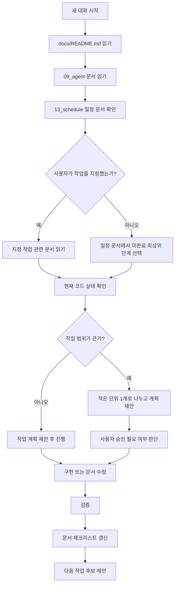

# 문서 기반 자동 진행 운영 가이드

## 1. 문서 목적

이 문서는 새로운 대화에서 코드 에이전트가 프로젝트 기준을 먼저 이해하고, 기준이 흔들리지 않게 다음 작업을 하나씩 진행하기 위한 운영 규칙이다.

사용자가 매번 긴 설명을 반복하지 않아도, 에이전트는 이 문서를 기준으로 다음 흐름을 수행한다.

```text
README 확인
  ↓
에이전트 기준 문서 확인
  ↓
현재 코드 상태 확인
  ↓
다음 작업 1개 선택
  ↓
작업 계획 제안
  ↓
구현 또는 문서 수정
  ↓
검증
  ↓
관련 체크리스트 갱신
  ↓
다음 작업 후보 제안
```

이 문서는 에이전트가 마음대로 전체 프로젝트를 자동 구현하라는 의미가 아니다.  
작업의 큰 방향은 문서 기준으로 고정하고, 실제 구현은 한 번에 하나의 작은 단위로 진행한다.

---

## 2. 에이전트가 가장 먼저 읽을 문서

새 대화에서 코드 작업을 시작할 때 에이전트는 아래 문서를 먼저 읽는다.

| 순서 | 문서 | 목적 |
|---:|---|---|
| 1 | `docs/README.md` | 전체 문서 위치와 프로젝트 기준 확인 |
| 2 | `docs/09_agent/05_문서기반_자동진행_운영가이드.md` | 새 대화 자동 진행 방식 확인 |
| 3 | `docs/09_agent/01_코드_에이전트_작업_가이드.md` | MVP, 백엔드, DB, API 기본 기준 확인 |
| 4 | `docs/09_agent/02_에이전트_프롬프트_및_코드작성_지침.md` | 코드 작성 스타일, 트랜잭션, 테스트, 보고 형식 확인 |
| 5 | `docs/09_agent/03_Codex_GitNexus_UTF8_작업_주의사항.md` | Windows, UTF-8, GitNexus, rg 주의사항 확인 |
| 6 | `docs/13_schedule/01_남은_일정_단계별_진행_계획.md` | 남은 일정과 단계별 진행 순서 확인 |
| 7 | `docs/13_schedule/02_전체_작업_체크리스트.md` | 전체 작업 현황과 완료 기준 확인 |
| 8 | `docs/11_implementation_log/00_브랜치_작업_기록_가이드.md` | 브랜치별 체크리스트, 구현 기록, PR 문서 작성 방식 확인 |

작업 성격에 따라 추가로 읽을 문서는 아래 기준으로 고른다.

| 작업 성격 | 추가로 읽을 문서 |
|---|---|
| 기획, 범위 판단 | `docs/01_planning/*` |
| 도메인 구조, 업무 흐름 | `docs/02_domain/*` |
| DB, 테이블, MyBatis | `docs/03_database/*`, `docs/10_backend_transition/04_DB_접근_방식_JPA_MyBatis_판단.md` |
| API 구현 | `docs/04_api/01_API_명세서.md`, `docs/05_frontend/02_UX_API_계약_우선순위.md` |
| 프론트엔드 구현 | `docs/05_frontend/*`, `docs/04_api/01_API_명세서.md` |
| 백엔드 전환, 샘플 정리 | `docs/10_backend_transition/*` |
| 포트폴리오 설명 | `docs/12_portfolio/01_포트폴리오_구현_스토리라인.md` |
| 배포, 운영 | 실행 설정, Docker Compose, README, 관련 배포 문서를 확인한다. 문서가 부족하면 먼저 배포/운영 문서를 보강한다. |

---

## 3. 프로젝트 고정 기준

에이전트는 아래 기준을 임의로 바꾸지 않는다.

| 항목 | 기준 |
|---|---|
| 프로젝트 | 보건소 스마트 예약·대기 및 혼잡도 분석 시스템 |
| 목적 | 포트폴리오용 MVP 구현 |
| Backend | eGovFrame Simple Backend Template 기반 REST API |
| Build Tool | Maven |
| DB | PostgreSQL 18 + pgvector Docker 이미지 |
| DB 접근 | MyBatis |
| Frontend | React |
| API 연결 | REST API |
| 배포 | Docker Compose 기준 |
| 신규 백엔드 패키지 | `egovframework.healthcenter` |
| Mapper XML | `src/main/resources/egovframework/mapper/healthcenter` |
| 공통 응답 | `success + data + error` |
| MVP 제외 | 의료정보, 검사 결과, 처방 정보, 실제 알림 연동, 키오스크 하드웨어, AI/pgvector 기능, MSA, Kubernetes |

특히 아래 사항은 새 대화에서도 반드시 유지한다.

1. Spring Initializr로 백엔드를 새로 만들지 않는다.
2. Gradle로 전환하지 않는다.
3. Maven과 Gradle을 혼용하지 않는다.
4. 전자정부프레임워크 핵심 설정은 임의로 삭제하지 않는다.
5. MVP에서는 JPA를 사용하지 않고 MyBatis를 사용한다.
6. pgvector 이미지는 사용하되, AI 기능과 vector 컬럼은 향후 확장으로 둔다.
7. 샘플 코드는 한 번에 전부 삭제하지 않고 기능 묶음 단위로 정리한다.
8. 실제 커밋은 사용자가 명시하기 전까지 하지 않는다.

---

## 4. 자동 진행 범위

에이전트가 사용자의 추가 설명 없이 진행해도 되는 범위와 멈춰야 하는 범위를 구분한다.

### 4.1 자동으로 진행 가능한 작업

| 작업 | 진행 방식 |
|---|---|
| 문서 읽기 | 필요한 문서를 UTF-8 기준으로 읽고 요약한다. |
| 코드 상태 확인 | `git status`, `rg`, 파일 구조 확인을 수행한다. |
| 작은 문서 보강 | 기존 문서의 오탈자, 읽기 순서, 체크리스트 보강은 진행 가능하다. |
| 작은 코드 수정 | 기존 기준에 명확히 맞는 1개 기능 단위 수정은 진행 가능하다. |
| 빌드/테스트 실행 | 환경이 준비되어 있으면 관련 명령을 실행한다. |
| 체크리스트 갱신 | 실제 확인한 항목만 체크하고, 미확인 항목은 남겨둔다. |
| 다음 작업 제안 | 현재 상태 기준으로 다음 후보를 1~3개 제안한다. |

### 4.2 사용자 확인이 필요한 작업

| 작업 | 확인이 필요한 이유 |
|---|---|
| 백엔드 구조 대규모 변경 | 전자정부프레임워크 기준이 흔들릴 수 있다. |
| 샘플 코드 대량 삭제 | 숨은 설정 의존성이 있을 수 있다. |
| DB 테이블 구조 변경 | API, 프론트, 테스트에 연쇄 영향이 생긴다. |
| 인증/권한 정책 변경 | 보안과 사용자 흐름에 영향이 크다. |
| 배포 구조 변경 | 로컬, 운영, 포트폴리오 시연 방식이 달라진다. |
| JPA 도입 | 현재 MVP 기준과 충돌한다. |
| AI 기능 도입 | MVP 제외 범위를 넘는다. |
| 실제 커밋, push, 배포 | 사용자의 명시 승인 필요 |

---

## 5. 다음 작업 선택 기준

에이전트는 새 대화에서 사용자가 구체적인 작업을 지정하지 않으면 아래 순서로 다음 작업을 고른다.



기본 우선순위는 다음과 같다.

| 우선순위 | 작업 |
|---:|---|
| 1 | 실행 기반 검증 |
| 2 | 샘플 코드 정리 |
| 3 | 공통 응답, 예외, 공통코드 안정화 |
| 4 | Office Context |
| 5 | Auth/Member Context |
| 6 | Reservation Context |
| 7 | Visit Context |
| 8 | Queue Context |
| 9 | Dashboard/Congestion Context |
| 10 | Frontend |
| 11 | Docker Compose, 배포, 운영 문서 |
| 12 | 테스트, 포트폴리오 정리 |

사용자가 “프론트 먼저”, “백엔드 먼저”, “배포 먼저”처럼 방향을 주면 그 지시를 우선한다.

---

## 6. 체크리스트 갱신 규칙

에이전트는 작업 후 관련 문서의 체크리스트를 갱신할 수 있다.

단, 체크 표시 기준은 엄격하게 적용한다.

| 표시 | 의미 |
|---|---|
| `[x]` | 실제 코드 수정, 빌드, 실행, 문서 확인 등으로 완료가 확인된 항목 |
| `[ ]` | 아직 완료되지 않았거나 확인하지 못한 항목 |
| `보류` | 환경, 정책 결정, 선행 작업 부족으로 지금 진행하지 않는 항목 |
| `위험` | 진행 가능하지만 구조, 보안, 데이터 정합성 위험이 있는 항목 |

에이전트는 아래 상황에서 체크하지 않는다.

1. 문서만 읽고 실제 검증하지 않은 경우
2. 빌드가 실패했는데 구현 완료라고 판단한 경우
3. API 명세만 작성하고 실제 API를 만들지 않은 경우
4. 화면만 만들고 API 연결 또는 mock 검증을 하지 않은 경우
5. 사용자의 승인이 필요한 변경을 임의로 완료 처리한 경우

### 6.1 전체 체크리스트와 브랜치 체크리스트

체크리스트는 2단계로 관리한다.

| 구분 | 위치 | 역할 |
|---|---|---|
| 전체 체크리스트 | `docs/13_schedule/02_전체_작업_체크리스트.md` | 프로젝트 전체에서 남은 큰 작업을 보는 현황판 |
| 브랜치별 체크리스트 | `docs/11_implementation_log/*` | 이번 브랜치에서 실제로 끝낼 작은 작업표 |

진행 흐름:

```text
전체 체크리스트에서 다음 큰 작업 선택
  ↓
브랜치별 체크리스트 작성
  ↓
커밋 단위로 구현
  ↓
사용자 코드 점검과 수정
  ↓
브랜치 구현 기록 작성
  ↓
PR 문서 작성
  ↓
전체 체크리스트 갱신
```

에이전트는 브랜치 작업을 시작할 때 `docs/11_implementation_log/00_브랜치_작업_기록_가이드.md`를 참고해 브랜치별 체크리스트 초안을 작성한다.

### 6.2 진행 중 추가 작업 기록

처음 작성한 체크리스트에 모든 작업이 들어가야 하는 것은 아니다.

작업 중 새로 발견한 일은 브랜치 기록 문서의 “진행 중 발견된 추가 작업” 표에 추가한다.  
브랜치가 끝날 때 전체 일정에 영향을 주는 항목만 `docs/13_schedule/02_전체_작업_체크리스트.md`에 반영한다.

---

## 7. 작업 보고 형식

작업이 끝나면 에이전트는 아래 형식으로 보고한다.

```text
작업 결과

1. 읽은 문서
- ...

2. 진행한 작업
- ...

3. 변경 파일
- ...

4. 확인 결과
- 빌드:
- 테스트:
- 실행:
- API:

5. 체크리스트 갱신
- 전체 체크리스트:
- 브랜치별 체크리스트:

6. 남은 위험
- ...

7. 다음 작업 추천
- 1순위:
- 2순위:

8. 커밋 메시지 초안
- ...
```

확인하지 못한 것은 “확인하지 못함”이라고 적는다.  
추정한 내용은 “추정”이라고 표시한다.

---

## 8. 새 대화에서 사용할 짧은 요청

사용자는 새 대화에서 아래처럼 짧게 요청해도 된다.

```text
docs/README.md를 읽고,
docs/09_agent/05_문서기반_자동진행_운영가이드.md 기준으로
현재 프로젝트 상태를 확인한 뒤 다음 작업을 하나 진행해줘.
작업 후 관련 체크리스트도 갱신해줘.
```

브랜치 작업까지 함께 관리하고 싶을 때는 아래처럼 요청한다.

```text
docs/README.md를 읽고,
docs/09_agent/05_문서기반_자동진행_운영가이드.md와
docs/11_implementation_log/00_브랜치_작업_기록_가이드.md 기준으로
다음 작업을 하나 진행해줘.

작업 후:
- 브랜치별 체크리스트 갱신
- 전체 체크리스트 갱신
- 구현 기록 정리
- PR 문서 초안 작성
```

구체적인 방향을 주고 싶을 때는 아래처럼 작성한다.

```text
docs/README.md를 읽고,
docs/09_agent/05_문서기반_자동진행_운영가이드.md 기준으로 진행해줘.

이번 방향:
- 백엔드 예약 기능부터 진행

작업 후:
- 관련 문서 체크리스트 갱신
- 다음 작업 후보 정리
```

---

## 9. 에이전트가 멈춰야 하는 조건

아래 상황에서는 에이전트가 임의로 계속 진행하지 않고 사용자에게 확인한다.

| 상황 | 이유 |
|---|---|
| 문서 기준끼리 충돌한다 | 잘못된 기준으로 구현될 수 있다. |
| 현재 코드가 문서와 크게 다르다 | 문서 갱신 또는 코드 수정 방향 결정이 필요하다. |
| 삭제 대상이 eGovFrame 핵심 설정과 연결되어 있다 | 실행 불능 위험이 있다. |
| DB 마이그레이션이 필요한데 기준이 없다 | 데이터 정합성 문제가 생긴다. |
| 보안 정책이 모호하다 | 인증/인가 취약점이 생길 수 있다. |
| 배포 대상 환경이 불명확하다 | Docker, 포트, 환경변수 기준이 달라진다. |
| 한 번에 10개 이상 파일을 크게 수정해야 한다 | 작업 단위를 나누는 것이 안전하다. |

---

## 10. 핵심 요약

이 프로젝트의 새 대화 운영 방식은 다음 한 문장으로 정리한다.

```text
에이전트는 README와 09_agent 문서로 기준을 고정하고, 13_schedule 문서에서 다음 작은 작업을 선택한 뒤, 구현과 검증 후 체크리스트를 갱신한다.
```

문서는 길게 읽되, 작업은 작게 한다.  
기준은 고정하되, 구현은 현재 코드 상태를 보고 조심스럽게 진행한다.
