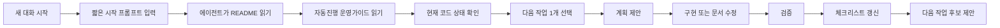

# 새 대화 시작 가이드

## 1. 문서 목적

이 문서는 사용자가 새로운 에이전트 대화를 시작할 때 어떻게 요청하면 좋은지 정리한 가이드이다.

목표는 매번 긴 설명을 반복하지 않고도 에이전트가 아래 내용을 이해하게 만드는 것이다.

1. 이 프로젝트가 무엇인지
2. 어떤 기술 기준을 따라야 하는지
3. 지금 어떤 단계인지
4. 다음 작업을 어떻게 고르면 되는지
5. 백엔드, 프론트엔드, 배포, 운영 작업을 어떤 순서로 풀어야 하는지

---

## 2. 가장 짧은 시작 프롬프트

새 대화를 시작할 때 가장 간단한 요청은 아래와 같다.

```text
docs/README.md를 먼저 읽고,
docs/09_agent/05_문서기반_자동진행_운영가이드.md 기준으로
현재 프로젝트 상태를 확인한 뒤 다음 작업을 하나 진행해줘.

작업 후에는 관련 체크리스트를 갱신하고,
확인한 것과 확인하지 못한 것을 구분해서 보고해줘.
```

이 프롬프트만으로도 에이전트는 다음 문서를 따라가야 한다.

```text
docs/README.md
  ↓
docs/09_agent/05_문서기반_자동진행_운영가이드.md
  ↓
docs/09_agent/01_코드_에이전트_작업_가이드.md
  ↓
docs/09_agent/02_에이전트_프롬프트_및_코드작성_지침.md
  ↓
docs/13_schedule/01_남은_일정_단계별_진행_계획.md
  ↓
docs/13_schedule/02_전체_작업_체크리스트.md
```

---

## 3. 새 대화 시작 흐름



사용자는 모든 세부 작업을 직접 지정하지 않아도 된다.  
대신 “이번 대화에서 어느 방향으로 진행할지”만 알려주면 충분하다.

---

## 4. 방향별 시작 프롬프트

### 4.0 브랜치 단위 작업 시작

새 브랜치에서 작업 계획, 코드 구현, 체크리스트 갱신, PR 문서까지 함께 관리하고 싶을 때 사용한다.

```text
docs/README.md를 읽고,
docs/09_agent/05_문서기반_자동진행_운영가이드.md와
docs/11_implementation_log/00_브랜치_작업_기록_가이드.md 기준으로 진행해줘.

이번 작업 방향:
- [백엔드/프론트엔드/배포/운영/문서 중 선택]

요청:
1. docs/13_schedule/02_전체_작업_체크리스트.md에서 관련 항목 확인
2. 이번 브랜치에서 할 작업 범위 제안
3. 브랜치별 체크리스트 초안 작성
4. 구현 또는 문서 수정 진행
5. 작업 후 브랜치 기록 갱신
6. 전체 체크리스트 갱신
7. PR 문서 초안 작성
```

### 4.1 전체 자동 진행

다음 작업을 에이전트가 고르게 하고 싶을 때 사용한다.

```text
docs/README.md를 읽고,
docs/09_agent/05_문서기반_자동진행_운영가이드.md 기준으로
현재 상태에서 가장 먼저 해야 할 작업을 하나 골라 진행해줘.

조건:
- 작업은 한 번에 하나만 진행
- 관련 문서 먼저 확인
- 코드 상태 확인 후 진행
- 완료 후 전체 체크리스트 갱신
- 다음 작업 후보 1~3개 제안
```

### 4.2 백엔드 작업 시작

예약, 대기, 인증, 대시보드 같은 서버 기능을 진행할 때 사용한다.

```text
docs/README.md를 읽고,
docs/09_agent/05_문서기반_자동진행_운영가이드.md 기준으로 진행해줘.

이번 방향:
- 백엔드 기능 구현

먼저 확인할 것:
- eGovFrame Simple Backend Template 구조 유지
- Maven 유지
- MyBatis 기준 유지
- 신규 도메인은 egovframework.healthcenter 하위에 작성
- Mapper XML은 egovframework/mapper/healthcenter 하위에 작성
- 공통 응답은 success + data + error 구조 유지

현재 상태를 확인한 뒤 다음 백엔드 작업 1개를 골라 진행해줘.
작업 후 빌드 또는 테스트 가능 여부를 확인하고 관련 체크리스트를 갱신해줘.
```

### 4.3 프론트엔드 작업 시작

화면, 사용자 흐름, API 연결을 진행할 때 사용한다.

```text
docs/README.md를 읽고,
docs/09_agent/05_문서기반_자동진행_운영가이드.md 기준으로 진행해줘.

이번 방향:
- 프론트엔드 화면 구현 또는 API 연결

먼저 확인할 것:
- 화면 설계 문서
- UX/API 계약 우선순위 문서
- API 명세서
- 현재 프론트엔드 코드 구조

진행 기준:
- 사용자가 이해하기 쉬운 흐름 우선
- 고령층도 사용할 수 있는 명확한 버튼과 문구
- 상태명과 업무 유형은 하드코딩하지 말고 API 또는 mock data로 분리
- 실제 API가 없으면 mock data로 먼저 구조를 만든 뒤 연결 지점을 표시

현재 상태를 확인한 뒤 다음 프론트엔드 작업 1개를 골라 진행해줘.
작업 후 화면 확인 방법과 남은 API 연결 지점을 정리해줘.
```

### 4.4 백엔드와 프론트엔드 연결 작업

API 계약을 맞추거나 화면과 서버를 연결할 때 사용한다.

```text
docs/README.md를 읽고,
docs/09_agent/05_문서기반_자동진행_운영가이드.md 기준으로 진행해줘.

이번 방향:
- 프론트엔드와 백엔드 API 연결

먼저 확인할 것:
- docs/04_api/01_API_명세서.md
- docs/05_frontend/02_UX_API_계약_우선순위.md
- 구현된 백엔드 API
- 현재 프론트엔드 API 클라이언트 구조

진행 기준:
- 화면에서 필요한 데이터 기준으로 API 응답을 점검
- 백엔드는 화면 요구를 반영하되 도메인 규칙을 지킨다
- 임시 mock data가 있으면 실제 API로 교체하거나 교체 계획을 남긴다
- API 응답 형식은 success + data + error를 유지한다

작업 후 연결된 화면, 호출 API, 남은 mock data를 정리해줘.
```

### 4.5 배포 작업 시작

Docker Compose, 환경변수, 실행 문서를 정리할 때 사용한다.

```text
docs/README.md를 읽고,
docs/09_agent/05_문서기반_자동진행_운영가이드.md 기준으로 진행해줘.

이번 방향:
- 배포와 실행 환경 정리

먼저 확인할 것:
- Docker Compose 설정
- backend 실행 설정
- frontend 실행 설정
- PostgreSQL 설정
- 환경변수 사용 여부
- README 실행 방법

진행 기준:
- 로컬에서 누구나 따라 할 수 있는 실행 절차 작성
- backend, frontend, postgres 실행 순서 명확화
- 포트, 계정, DB 이름, 환경변수 정리
- 운영용 비밀번호나 민감 정보는 문서에 직접 노출하지 않음
- 배포가 실제로 안 되면 확인하지 못한 부분을 명확히 표시

작업 후 실행 명령, 확인 URL, 남은 배포 위험을 정리해줘.
```

### 4.6 운영 준비 작업 시작

로그, 모니터링, 장애 대응, 운영 문서를 정리할 때 사용한다.

```text
docs/README.md를 읽고,
docs/09_agent/05_문서기반_자동진행_운영가이드.md 기준으로 진행해줘.

이번 방향:
- 운영 준비와 장애 대응 정리

먼저 확인할 것:
- 현재 로그 설정
- 예외 처리 구조
- 인증/권한 실패 응답
- Docker Compose 실행 구조
- 관리자 대시보드 기능

진행 기준:
- 장애 상황에서 어디를 확인해야 하는지 문서화
- 로그에 민감 정보가 남지 않게 점검
- API 실패 응답이 공통 형식인지 확인
- 운영자가 볼 수 있는 지표와 개발자가 볼 로그를 구분
- MVP 수준에서 가능한 운영 기준만 작성

작업 후 운영 체크리스트와 남은 보완 사항을 정리해줘.
```

---

## 5. 개념 설명

| 용어 | 쉬운 설명 |
|---|---|
| 에이전트 | 문서를 읽고 코드나 문서를 수정하는 AI 작업자 |
| 자동 진행 | 사용자가 세부 지시를 매번 주지 않아도 문서 기준으로 다음 작업을 고르는 방식 |
| 체크리스트 갱신 | 실제 완료한 항목을 문서에 표시하는 작업 |
| 전체 체크리스트 | 프로젝트 전체에서 남은 큰 작업을 보는 현황판 |
| 브랜치별 체크리스트 | 이번 브랜치에서 끝낼 작은 작업표 |
| MVP | 꼭 필요한 기능만 먼저 구현한 최소 제품 |
| API 계약 | 프론트엔드와 백엔드가 주고받을 주소, 요청값, 응답값 약속 |
| 백엔드 | 데이터 저장, 인증, 예약 처리 같은 서버 기능 |
| 프론트엔드 | 사용자가 보는 화면과 버튼, 입력 폼 |
| 배포 | 만든 프로그램을 실행 가능한 상태로 올리는 작업 |
| 운영 | 배포 후 로그, 장애, 계정, 데이터 상태를 관리하는 작업 |
| mock data | 실제 API가 없을 때 화면 확인용으로 쓰는 임시 데이터 |
| 회귀 | 원래 되던 기능이 새 변경 때문에 깨지는 문제 |

---

## 6. 상황별 추천 진행 방식

| 현재 상황 | 추천 요청 |
|---|---|
| 무엇부터 할지 모르겠다 | 전체 자동 진행 프롬프트 사용 |
| 새 브랜치에서 작업을 시작한다 | 브랜치 단위 작업 시작 프롬프트 사용 |
| 서버 기능이 부족하다 | 백엔드 작업 시작 프롬프트 사용 |
| 화면이 없어 결과가 잘 안 보인다 | 프론트엔드 작업 시작 프롬프트 사용 |
| 화면은 있는데 데이터가 안 붙었다 | 백엔드와 프론트엔드 연결 작업 프롬프트 사용 |
| 실행 방법이 복잡하다 | 배포 작업 시작 프롬프트 사용 |
| 포트폴리오 설명이 필요하다 | 포트폴리오 문서를 읽고 구현 이유 정리 요청 |
| 에러가 난다 | 에러 메시지, 실행 명령, 관련 파일을 주고 디버깅 요청 |
| 문서와 코드가 다르다 | 문서 기준과 코드 기준 중 무엇이 맞는지 비교 요청 |

---

## 7. 새 대화에서 피해야 할 요청

아래 요청은 결과가 흔들릴 가능성이 높다.

| 피할 요청 | 이유 | 대신 이렇게 요청 |
|---|---|---|
| 전체 다 만들어줘 | 범위가 너무 커서 품질 확인이 어렵다 | 다음 작업 1개를 골라 진행해줘 |
| 백엔드 갈아엎어줘 | eGovFrame 기준이 깨질 수 있다 | 기존 구조를 유지하고 필요한 부분만 수정해줘 |
| JPA로 바꿔줘 | 현재 MVP 기준과 충돌한다 | MyBatis 기준으로 구현해줘 |
| 샘플 코드 전부 삭제해줘 | 숨은 설정 의존성이 있을 수 있다 | 샘플 코드 제거 후보를 분석하고 1개 묶음만 정리해줘 |
| 프론트 예쁘게 만들어줘 | 기준이 모호하다 | 화면 설계서와 UX/API 계약 기준으로 구현해줘 |
| 배포까지 알아서 해줘 | 환경과 권한 확인이 필요하다 | Docker Compose 기준 실행 절차부터 점검해줘 |

---

## 8. 새 대화 시작 전 사용자가 확인하면 좋은 것

새 대화를 시작하기 전에 아래 중 1~2개만 정해도 충분하다.

| 질문 | 예시 답변 |
|---|---|
| 오늘은 어느 방향으로 진행할까? | 백엔드, 프론트엔드, 배포, 운영, 문서 |
| 한 번에 구현할 범위는? | API 1개, 화면 1개, 문서 1개 |
| 검증까지 할까? | 빌드만, 테스트까지, 실행까지 |
| 체크리스트를 갱신할까? | 갱신해줘, 이번에는 보고만 해줘 |
| 브랜치 기록과 PR 문서도 만들까? | 브랜치 기록과 PR 초안까지 작성해줘 |
| 포트폴리오 설명도 남길까? | 구현 이유까지 문서에 남겨줘 |

---

## 9. 권장 운영 리듬

이 프로젝트는 다음 리듬으로 진행하는 것이 좋다.

```text
1일차: 기준 확인 + 작은 기능 1개
2일차: 기능 보완 + 테스트 후보 정리
3일차: 화면 연결 또는 API 연결
4일차: 문서와 체크리스트 갱신
5일차: 포트폴리오 설명 정리
```

실제 일정은 개발 환경과 시간에 따라 달라질 수 있다.  
중요한 것은 “큰 기능을 한 번에 끝내기”가 아니라 “작게 끝내고 검증하기”이다.

---

## 10. 최종 추천

새로운 대화를 시작할 때는 아래 한 문장을 기본으로 사용한다.

```text
docs/README.md를 읽고, docs/09_agent/05_문서기반_자동진행_운영가이드.md 기준으로 현재 상태에서 다음 작업 하나를 진행해줘.
```

브랜치 단위로 작업을 시작할 때는 아래 문장을 기본으로 사용한다.

```text
docs/README.md를 읽고, docs/09_agent/05_문서기반_자동진행_운영가이드.md와 docs/11_implementation_log/00_브랜치_작업_기록_가이드.md 기준으로 이번 브랜치 작업을 진행해줘.
```

그리고 원하는 방향만 한 줄 더 붙인다.

```text
이번에는 백엔드 예약 기능 방향으로 진행해줘.
```

또는

```text
이번에는 프론트엔드 화면 구현 방향으로 진행해줘.
```

이 방식이면 사용자는 매번 긴 설명을 반복하지 않아도 되고, 에이전트는 프로젝트 기준을 먼저 읽은 뒤 흔들리지 않는 방향으로 작업을 이어갈 수 있다.
