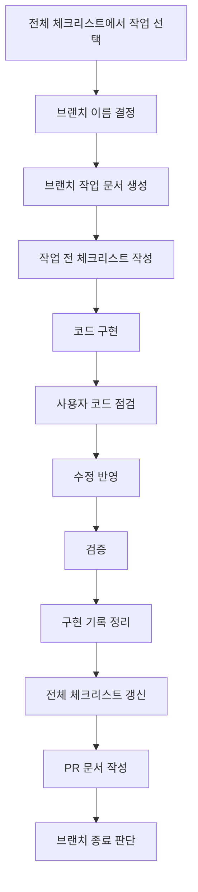

# 브랜치 작업 기록 가이드

## 1. 문서 목적

이 문서는 브랜치를 만들 때마다 어떤 문서를 작성하고, 어떤 체크리스트를 관리하고, 브랜치를 닫기 전에 무엇을 정리해야 하는지 안내한다.

전체 체크리스트는 `docs/13_schedule/02_전체_작업_체크리스트.md`에서 관리한다.  
이 문서는 브랜치 하나의 작업 기록을 관리한다.

```text
전체 체크리스트
  = 전체 프로젝트에서 남은 큰 작업

브랜치 작업 기록
  = 이번 브랜치에서 실제로 처리한 작은 작업
```

---

## 2. 브랜치 작업 기본 흐름



---

## 3. 브랜치 이름 규칙

브랜치 이름은 아래 형식으로 통일한다.

```text
type/topic-kebab-case
```

| type | 사용 시점 | 예시 |
|---|---|---|
| `feat` | 신규 기능 구현 | `feat/office-service-type-api` |
| `fix` | 오류 수정 | `fix/postgres-common-code-runtime-verification` |
| `refactor` | 기능 변경 없는 구조 정리 | `refactor/egov-sample-api-cleanup` |
| `docs` | 문서 중심 변경 | `docs/update-branch-workflow-guide` |
| `test` | 테스트 추가 또는 수정 | `test/reservation-policy-cases` |
| `chore` | 빌드, 설정, 의존성 등 기타 작업 | `chore/update-dependency-versions` |

규칙:

1. `/` 앞에는 작업 성격을 나타내는 type을 쓴다.
2. `/` 뒤에는 작업 대상을 영어 소문자 kebab-case로 쓴다.
3. 브랜치 이름에는 한글, 공백, 언더스코어를 쓰지 않는다.
4. 한 브랜치는 하나의 작은 작업 목표만 담는다.
5. 예외적으로 로컬 Git refs 문제로 `/` 형식 생성이 실패한 경우에는 이유를 브랜치 기록 문서에 남긴다.

권장 예시:

```text
refactor/egov-sample-api-cleanup
refactor/remove-sns-login-sample
feat/office-service-type-api
fix/postgres-common-code-runtime-verification
docs/update-agent-run-guide
```

---

## 4. 문서 생성 기준

브랜치마다 아래 2종류 문서를 작성하는 것을 권장한다.

| 문서 | 역할 | 예시 |
|---|---|---|
| 구현 기록 | 무엇을 왜 바꿨는지 설명 | `03_예약_API_구현_기록.md` |
| PR 작성안 | PR 제목, 본문, 검증, 후속 작업 정리 | `04_예약_API_PR_작성안.md` |

작업이 매우 작으면 구현 기록과 PR 작성안을 하나의 문서로 합칠 수 있다.  
하지만 포트폴리오에 설명할 만한 기능이면 분리하는 것이 좋다.

---

## 5. 브랜치별 체크리스트 템플릿

브랜치 작업 문서에는 아래 구조를 넣는다.

```markdown
# [브랜치 작업명] 구현 기록

## 1. 작업 목표

- 이번 브랜치에서 끝낼 목표를 1~3줄로 적는다.

## 2. 작업 범위

- [ ] 이번 브랜치에 포함할 작업
- [ ] 이번 브랜치에서 제외할 작업

## 3. 작업 전 체크리스트

- [ ] `docs/README.md` 확인
- [ ] `docs/09_agent/05_문서기반_자동진행_운영가이드.md` 확인
- [ ] 관련 설계 문서 확인
- [ ] 현재 브랜치와 작업 트리 확인
- [ ] 영향받는 파일 확인

## 4. 구현 체크리스트

- [ ] Controller 수정 또는 추가
- [ ] Service 수정 또는 추가
- [ ] Mapper 수정 또는 추가
- [ ] Mapper XML 수정 또는 추가
- [ ] DTO/VO 수정 또는 추가
- [ ] 예외 처리 확인
- [ ] 공통 응답 형식 확인

## 5. 검증 체크리스트

- [ ] 빌드 확인
- [ ] 테스트 확인
- [ ] API 수동 호출 방법과 기대 결과 작성
- [ ] Swagger 확인 URL과 확인 항목 작성
- [ ] 프론트엔드 연결 영향 확인

## 6. 사용자 코드 점검 결과

| 점검 시점 | 사용자 의견 | 반영 여부 |
|---|---|---|
|  |  |  |

## 7. 진행 중 발견된 추가 작업

| 발견 시점 | 추가 작업 | 이유 | 처리 |
|---|---|---|---|
|  |  |  |  |

## 8. 브랜치 종료 전 체크리스트

- [ ] 구현 기록 작성 완료
- [ ] 전체 체크리스트 갱신
- [ ] PR 문서 작성
- [ ] 남은 위험 기록
- [ ] 후속 작업 기록
- [ ] 커밋 메시지 정리
```

---

## 6. PR 문서 템플릿

PR 작성안 문서는 아래 구조를 따른다.

````markdown
# [작업명] Pull Request 작성안

## 브랜치 상태 확인

| 항목 | 확인 결과 |
|---|---|
| 현재 브랜치 |  |
| base 브랜치 |  |
| 작업 트리 |  |
| 주요 커밋 |  |
| 빌드 확인 |  |
| 테스트 확인 |  |
| 실행/API 확인 | 사용자가 직접 확인할 명령과 기대 결과 |

## PR 제목

```text
feat: 작업 내용을 한글로 명확히 작성
```

## PR 본문

```markdown
## 개요

이번 PR에서 해결한 문제를 설명합니다.

## 변경 내용

- 변경 1
- 변경 2

## 검증

- [ ] 빌드 확인
- [ ] 테스트 확인
- [ ] API 확인 방법 작성
- [ ] 화면 확인 방법 작성

## 미검증 사유

- 확인하지 못한 항목과 이유를 적습니다.

## 후속 작업

- 다음 브랜치에서 이어갈 작업을 적습니다.
```

## Merge 후 브랜치 정리 기준

- [ ] PR merge 완료
- [ ] main 최신화 확인
- [ ] 전체 체크리스트 반영
- [ ] 후속 브랜치 생성 또는 다음 작업 문서화
````

---

## 7. 체크리스트 운영 원칙

브랜치 체크리스트는 처음에 완벽하게 만들 필요가 없다.

권장 방식은 아래와 같다.

```text
처음에는 예상 작업 70% 작성
  ↓
진행하면서 발견한 작업 30% 추가
  ↓
브랜치 종료 전 전체 체크리스트에 반영
```

체크리스트를 너무 작게 쓰면 놓치는 일이 많아지고, 너무 크게 쓰면 관리가 어려워진다.  
따라서 브랜치별 체크리스트는 “이번 브랜치에서 실제로 끝낼 수 있는 일”만 적는다.

---

## 8. 사용자와 에이전트 역할

| 역할 | 담당 |
|---|---|
| 사용자 | 큰 방향 결정, 코드 점검, 브랜치 종료 판단 |
| 에이전트 | 문서 확인, 코드 구현, 검증, 체크리스트 갱신, PR 문서 초안 작성 |

에이전트의 직접 검증은 정적 확인과 Maven compile/test-compile까지를 기본으로 한다.
서버 기동, Docker 실행, API 런타임 호출, Swagger/브라우저 확인, 포트 점유 프로세스 종료는 사용자가 직접 수행할 수 있도록 명령과 기대 결과만 안내한다.

사용자가 매번 모든 세부 항목을 지시할 필요는 없다.  
대신 브랜치 시작 시 “이번 방향”과 “끝내야 할 범위”만 지정하면 된다.

---

## 9. 새 대화에서 브랜치 작업을 시작하는 프롬프트

```text
docs/README.md를 읽고,
docs/09_agent/05_문서기반_자동진행_운영가이드.md와
docs/11_implementation_log/00_브랜치_작업_기록_가이드.md 기준으로 진행해줘.

이번 작업 방향:
- [백엔드/프론트엔드/배포/운영/문서 중 선택]

요청:
1. 전체 체크리스트에서 관련 항목 확인
2. 이번 브랜치에서 할 작업 범위 제안
3. 브랜치별 체크리스트 초안 작성
4. 구현 또는 문서 수정 진행
5. 작업 후 전체 체크리스트와 브랜치 기록 갱신
6. PR 문서 초안 작성
```

---

## 10. 핵심 요약

브랜치 작업은 아래 순서로 진행한다.

```text
전체 체크리스트 선택
  ↓
브랜치별 체크리스트 작성
  ↓
커밋 단위 구현
  ↓
사용자 코드 점검
  ↓
수정
  ↓
구현 기록 작성
  ↓
PR 문서 작성
  ↓
전체 체크리스트 반영
```

이 방식이면 작업을 작게 나누면서도, 나중에 포트폴리오와 PR 설명에 쓸 근거가 자연스럽게 쌓인다.
