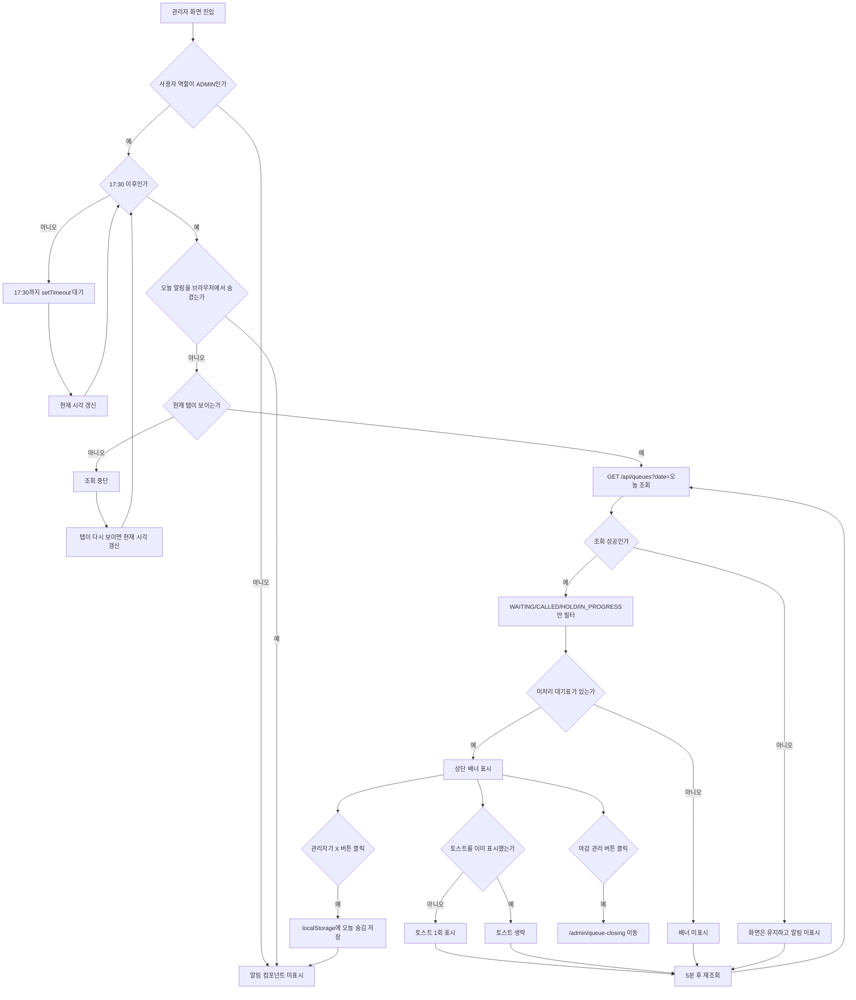

# 관리자 대기 마감 알림 UX 구현 기록

## 1. 작업 목표

- 관리자가 로그인 중인 상태에서 마감 시간 이후 미처리 대기표가 남아 있으면 화면 상단에서 바로 인지할 수 있게 한다.
- 기존 관리자 대기 마감 관리 화면으로 빠르게 이동할 수 있는 배너와 1회 토스트 알림을 제공한다.
- 백엔드 API는 새로 만들지 않고 기존 `GET /api/queues?date=YYYY-MM-DD`를 재사용한다.

## 2. 작업 범위

- [x] 관리자 레이아웃에서만 동작하는 마감 알림 컴포넌트 추가
- [x] 17:30 이후 오늘 미처리 대기표 조회
- [x] `WAITING`, `CALLED`, `HOLD`, `IN_PROGRESS` 상태만 알림 대상으로 집계
- [x] 5분 주기 재조회
- [x] 같은 날짜 알림 브라우저 단위 숨김 처리
- [x] 17:30 전에는 `setTimeout`으로 마감 시간까지 대기
- [x] 백그라운드 탭에서는 주기 조회 중단
- [x] 대기 마감 관리 화면 이동 버튼 추가
- [x] 문서와 체크리스트 갱신

제외한다.

- [ ] 백엔드 운영시간 설정 API
- [ ] 보건소별 운영시간/휴무일 기준
- [ ] 알림 읽음 상태 서버 저장
- [ ] WebSocket/SSE 실시간 알림
- [ ] 자동 `NO_SHOW` 배치

## 3. 작업 전 체크리스트

- [x] `docs/README.md` 확인
- [x] `docs/09_agent/05_문서기반_자동진행_운영가이드.md` 확인
- [x] `docs/11_implementation_log/00_브랜치_작업_기록_가이드.md` 확인
- [x] `docs/13_schedule/02_전체_작업_체크리스트.md` 확인
- [x] `docs/14_deferred_cleanup/01_보류_정리_목록.md`의 `DC-027` 확인
- [x] 현재 브랜치 `feat/admin-queue-closing-alert` 확인
- [x] 영향받는 파일 확인

## 4. 영향도 확인

GitNexus 인덱스가 stale 상태라 `gitnexus analyze`를 먼저 실행했지만, CLI가 현재 폴더를 Git 저장소로 인식하지 못해 실패했다.

```text
GitNexus Analyzer
Not inside a git repository.
```

보완으로 `git rev-parse --show-toplevel`, `rg`, 파일 직접 확인을 수행했고, 가능한 범위에서 GitNexus impact를 실행했다.

| 대상 | 결과 | 판단 |
|---|---|---|
| `AppLayout` | impactedCount 0, risk LOW | 관리자 전용 배너 삽입 지점으로 사용 |
| `AppSidebar` | impactedCount 0, risk LOW | 이번 브랜치에서는 수정하지 않음 |
| `getQueueEntries` | direct 2, processes 2, risk HIGH | 기존 직원 대기열/관리자 마감 화면 영향이 커서 함수 시그니처는 수정하지 않고 호출만 재사용 |

## 5. 구현 내용

| 파일 | 변경 내용 |
|---|---|
| `frontend/src/components/layout/admin-queue-closing-alert.tsx` | 관리자 마감 알림 배너, 1회 토스트, 5분 주기 조회, 세션 숨김 처리 추가 |
| `frontend/src/components/layout/app-layout.tsx` | `ADMIN` 사용자에게만 마감 알림 컴포넌트 표시 |
| `docs/13_schedule/02_전체_작업_체크리스트.md` | 이번 브랜치 후보와 완료 상태 반영 |
| `docs/14_deferred_cleanup/01_보류_정리_목록.md` | `DC-027` 상태를 정리 완료로 갱신 |

## 6. 동작 기준

| 항목 | 기준 |
|---|---|
| 알림 시작 시간 | 매일 17:30 이후 |
| 조회 API | `GET /api/queues?date=오늘` |
| 대상 상태 | `WAITING`, `CALLED`, `HOLD`, `IN_PROGRESS` |
| 반복 주기 | 5분 |
| 숨김 기준 | `localStorage`에 날짜별 숨김 값 저장 |
| 마감 전 대기 방식 | 17:30까지 남은 시간만큼 `setTimeout` 실행 |
| 백그라운드 탭 | 조회 중단, 다시 보이는 상태가 되면 즉시 현재 시각 갱신 후 필요 시 조회 |
| 이동 경로 | `/admin/queue-closing` |

## 7. 알림 기능 상세 설명

이번 기능은 "17:30이 되면 관리자에게 토스트를 한 번 띄운다"에서 끝나는 구조가 아니다.

정확한 동작은 아래 6가지를 함께 수행한다.

1. 17:30 전에는 서버 조회를 하지 않고 17:30까지 기다린다.
2. 17:30 이후에만 오늘 대기표를 확인한다.
3. 브라우저 탭이 백그라운드 상태이면 주기 조회를 멈춘다.
4. 미처리 대기표가 있으면 상단 배너를 표시한다.
5. 같은 조건이 처음 확인되었을 때 토스트를 1회 표시한다.
6. 이후에도 대기표 상태가 바뀔 수 있으므로 화면이 보이는 동안 5분마다 다시 조회한다.

### 7.1 왜 5분 주기 조회가 필요한가

관리자가 17:30 이후에도 화면을 계속 켜둔 상태라면 대기표 상태는 계속 바뀔 수 있다.

예를 들어 아래 상황이 생길 수 있다.

- 직원이 대기표를 `COMPLETED`로 처리한다.
- 관리자가 `/admin/queue-closing`에서 마감 처리를 실행한다.
- 다른 직원이 새 현장 접수를 추가한다.
- 호출 중이던 대기표가 `HOLD` 또는 `NO_SHOW`로 바뀐다.

그래서 알림 컴포넌트는 한 번만 조회하고 끝내지 않고, 5분마다 `GET /api/queues?date=오늘`을 다시 호출한다.

다만 토스트를 5분마다 반복해서 띄우면 관리자에게 방해가 되므로, 토스트는 최초 감지 때 1회만 표시한다.

상단 배너는 미처리 대기표가 남아 있는 동안 계속 보여주고, 재조회 결과 미처리 대기표가 없어지면 사라진다.

### 7.2 토스트와 배너의 역할 차이

| 구분 | 역할 | 반복 여부 |
|---|---|---|
| 토스트 | 관리자가 화면을 보고 있지 않아도 새 알림을 눈치챌 수 있게 하는 순간 알림 | 미처리 대기표 최초 감지 시 1회 |
| 상단 배너 | 현재 처리해야 할 마감 대상이 남아 있음을 계속 보여주는 상태 표시 | 조건이 유지되는 동안 표시 |
| 5분 재조회 | 알림 대상 건수가 바뀌었는지 확인 | 5분마다 반복 |
| 세션 숨김 | 관리자가 오늘 알림을 직접 숨겼을 때 같은 브라우저 세션에서 다시 보이지 않게 함 | 날짜별 1회 숨김 |

### 7.3 브라우저 단위 숨김 처리 의미

배너 오른쪽의 `X` 버튼을 누르면 아래 키가 브라우저 `localStorage`에 저장된다.

```text
queue-closing-alert-dismissed:YYYY-MM-DD = true
```

이 값은 "오늘 이 브라우저에서는 이 알림을 다시 보지 않겠다"는 뜻이다.

중요한 제한은 아래와 같다.

- 서버 DB에 저장하지 않는다.
- 같은 브라우저의 다른 탭에는 공유된다.
- 다른 브라우저나 다른 PC에는 공유되지 않는다.
- 브라우저를 닫았다가 다시 열어도 같은 날짜 숨김 값이 남을 수 있다.
- 다음 날짜가 되면 키가 달라지므로 다시 알림 대상이 된다.

따라서 이 기능은 운영 정책상 "읽음 처리"라기보다, 같은 브라우저에서 관리자 화면을 방해하지 않기 위한 날짜별 숨김에 가깝다.

진짜 읽음 처리나 관리자별 알림 이력은 후속 고도화 후보로 남긴다.

### 7.4 적용한 개선과 보류한 개선

| 개선 후보 | 적용 여부 | 이유 |
|---|---|---|
| 1분마다 시간 확인 대신 17:30까지 `setTimeout` | 적용 | 서버 요청은 아니지만 불필요한 상태 갱신을 줄일 수 있다. |
| 여러 탭 숨김 공유를 위해 `sessionStorage` 대신 `localStorage` | 적용 | 같은 브라우저에서 여러 관리자 탭을 열어도 오늘 숨김 상태를 공유할 수 있다. |
| 백그라운드 탭 주기 조회 중단 | 적용 | 보이지 않는 탭의 5분 주기 API 호출을 줄일 수 있다. |
| `/api/queues/pending-closing-count` 같은 count 전용 API | 보류 | 백엔드 API 계약 추가가 필요하므로 별도 브랜치에서 다루는 편이 안전하다. |
| `GET /api/queues?statuses=...` 다중 상태 필터 | 보류 | 현재 API는 단일 `status` 중심이므로 백엔드/프론트 계약을 함께 바꿔야 한다. |
| 조회 실패 시 작은 오류 배너 표시 | 보류 | 마감 알림이 부가 UX라서 전체 관리자 화면에 오류 노출을 늘리지 않는 쪽을 우선했다. |

### 7.5 Mermaid 흐름도



### 7.6 구현상 주의점

- `AppLayout`에서 `user.role === 'ADMIN'`일 때만 `AdminQueueClosingAlert`를 렌더링한다.
- 17:30 이전에 이미 로그인해 있어도 `setTimeout`으로 17:30 이후 자동 조회가 시작된다.
- 백그라운드 탭에서는 5분 주기 API 조회를 멈추고, 탭이 다시 보이면 현재 시각을 갱신해 필요한 경우 조회한다.
- `localStorage`의 `storage` 이벤트를 사용해 같은 브라우저의 다른 탭에서 숨김 상태가 바뀌어도 반영한다.
- `getQueueEntries` 함수는 직원 대기열과 관리자 마감 화면에서도 사용하므로 시그니처를 바꾸지 않았다.
- 조회 실패는 전체 관리자 화면 오류로 만들지 않고, 알림만 표시하지 않는 방식으로 처리한다.
- 현재 마감 시간 `17:30`은 프론트 상수다. 보건소별 운영시간 또는 서버 설정 기반 전환은 후속 작업이다.

## 8. 검증 체크리스트

- [x] `git diff --check`
- [x] `npm.cmd exec -- tsc --noEmit`
- [x] `npm.cmd run build`
- [ ] 브라우저에서 관리자 로그인 후 17:30 이후 배너 표시 확인
- [ ] 브라우저에서 `마감 관리` 버튼 클릭 시 `/admin/queue-closing` 이동 확인
- [ ] 브라우저에서 오늘 알림 숨김 버튼 클릭 후 같은 브라우저 탭들에서 배너 미표시 확인
- [ ] 브라우저 탭을 백그라운드로 둔 동안 주기 조회가 중단되는지 확인
- [ ] Swagger `GET /api/queues?date=YYYY-MM-DD` 런타임 확인

## 9. 사용자 확인 방법

관리자 계정으로 로그인한 뒤 17:30 이후 아래 흐름을 확인한다.

```text
1. 오늘 날짜에 WAITING/CALLED/HOLD/IN_PROGRESS 대기표를 준비한다.
2. 관리자 화면 아무 곳에 접속한다.
3. 상단 알림 배너와 토스트가 표시되는지 확인한다.
4. 마감 관리 버튼으로 /admin/queue-closing 이동을 확인한다.
5. 숨김 버튼을 누른 뒤 같은 브라우저의 다른 탭에서도 배너가 다시 뜨지 않는지 확인한다.
```

Swagger 대표 확인:

```text
GET /api/queues?date=2026-05-22
Authorization: Bearer {ADMIN_ACCESS_TOKEN}
```

기대 결과:

```json
{
  "success": true,
  "data": [
    {
      "queueTicketId": 1,
      "status": "WAITING",
      "ticketNumber": 1
    }
  ],
  "error": null
}
```

## 10. 추가 테스트 체크리스트

- [ ] Happy: 마감 시간 이후 미처리 대기표가 있으면 관리자 화면 상단에 알림이 표시된다.
- [ ] Happy: 알림의 마감 관리 버튼을 누르면 `/admin/queue-closing`으로 이동한다.
- [ ] Edge: 미처리 대기표가 없으면 알림이 표시되지 않는다.
- [ ] Edge: `COMPLETED`, `NO_SHOW`, `CANCELED`만 있으면 알림이 표시되지 않는다.
- [ ] Edge: 숨김 처리 후 같은 날짜, 같은 브라우저에서는 알림이 다시 표시되지 않는다.
- [ ] Edge: 백그라운드 탭에서는 주기 조회가 멈추고, 탭이 다시 보이면 필요한 경우 조회한다.
- [ ] Bad: 대기열 조회 API 실패 시 화면 렌더링은 유지되고 알림만 표시되지 않는다.

## 11. 진행 중 발견된 추가 작업

| 발견 시점 | 추가 작업 | 이유 | 처리 |
|---|---|---|---|
| 구현 중 | 알림 기준 시간 서버 설정화 | 현재는 17:30 프론트 상수라 보건소별 운영시간 반영이 어렵다. | 후속 고도화 후보로 유지 |
| 구현 중 | 알림 읽음 상태 서버 저장 | `localStorage` 숨김만으로는 사용자 계정 단위 이력이 남지 않는다. | 후속 고도화 후보로 유지 |
| 개선 검토 중 | 마감 대상 count 전용 API | 현재는 전체 대기표를 받은 뒤 프론트에서 상태 필터링하므로 데이터가 많아지면 비효율이 생길 수 있다. | 후속 백엔드/API 고도화 후보로 유지 |

## 12. 브랜치 종료 전 체크리스트

- [x] 구현 기록 작성 완료
- [x] 전체 체크리스트 갱신
- [x] 보류 정리 목록 갱신
- [x] PR 문서 작성
- [x] 남은 위험 기록
- [x] 후속 작업 기록
- [x] 커밋 메시지 정리
