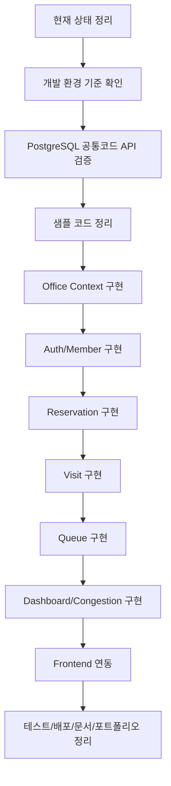
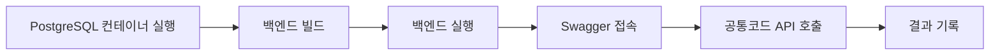
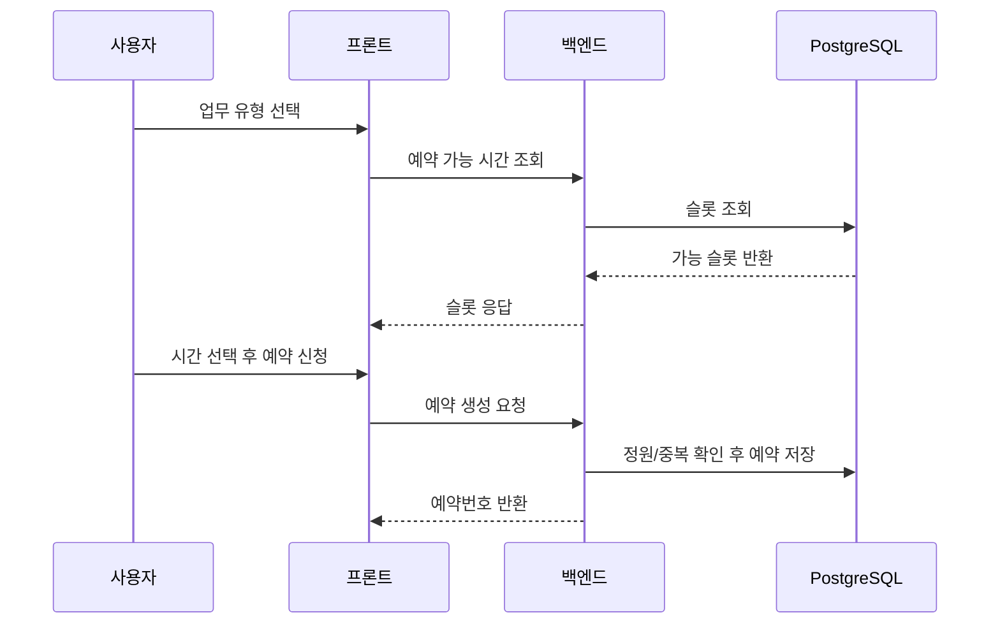
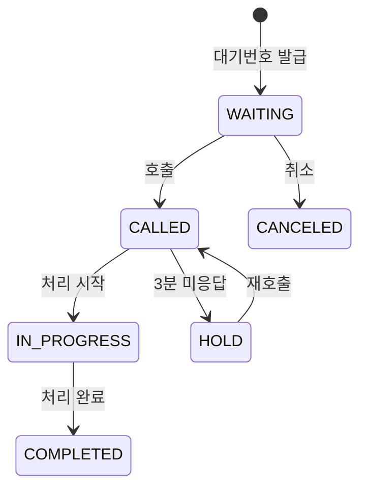
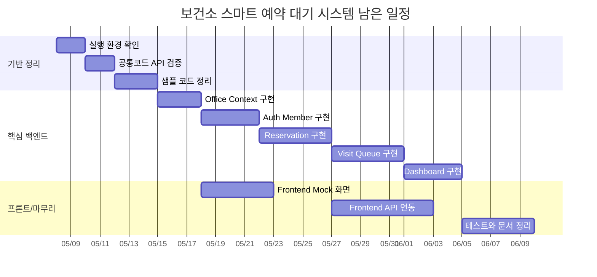

# 남은 일정 단계별 진행 계획

## 문서 목적

이 문서는 보건소 스마트 예약·대기 및 혼잡도 분석 시스템을 앞으로 어떻게 풀어나갈지 단계별로 정리한 실행 계획서이다.

단순히 “무엇을 만들 것인가”만 적지 않고, 현재 어디까지 왔는지, 앞으로 문제가 될 수 있는 부분은 무엇인지, 어떤 순서로 진행하면 덜 흔들리는지, 바이브 코딩으로 진행할 때 무엇을 반드시 포함해야 하는지까지 한눈에 볼 수 있도록 정리한다.

## 먼저 보는 요약

현재 프로젝트는 “설계 문서와 백엔드 전환 준비가 어느 정도 끝났고, 이제 실행 검증과 샘플 정리 후 실제 보건소 도메인 구현으로 넘어가야 하는 단계”이다.

가장 중요한 다음 순서는 아래와 같다.

```text
1. 개발 환경 기준 확인
2. PostgreSQL 공통코드 API 실행 검증
3. eGovFrame 샘플 코드 정리
4. UX/API 계약 기준으로 첫 기능 확정
5. Office Context: 업무 유형 조회 구현
6. Auth/Member Context: 로그인과 권한 구현
7. Reservation Context: 예약 가능 시간, 예약 신청, 조회, 취소 구현
8. Visit/Queue Context: 체크인, 현장 접수, 대기번호, 호출, 완료 구현
9. Dashboard/Congestion Context: 지표와 혼잡도 구현
10. Frontend 연동
11. 테스트, 배포, README, 포트폴리오 정리
```

## 현재 진행된 내용

| 구분 | 현재 상태 | 의미 |
|---|---|---|
| 기획/요구사항 | 작성됨 | 프로젝트 목표와 MVP 범위가 정리되어 있음 |
| Bounded Context | 작성됨 | Member, Office, Reservation, Visit, Queue, Dashboard, Common 책임이 나뉘어 있음 |
| ERD/API 문서 | 작성됨 | 주요 테이블과 API 목록이 정의되어 있음 |
| 화면 설계 | 작성됨 | 사용자, 직원, 관리자 화면 초안이 있음 |
| UX/API 계약 | 작성됨 | 화면에서 필요한 API 응답 필드가 일부 정리됨 |
| 백엔드 템플릿 | eGovFrame Simple Backend Template 기반 | 공공 SI 포트폴리오 방향과 맞음 |
| DB 방향 | PostgreSQL 기준으로 전환 준비 | `Globals.DbType=postgresql` 기준 |
| DB 접근 방식 | MyBatis로 결정 | JPA/QueryDSL은 샘플/테스트 성격으로 보고 정리 후보 |
| 공통코드 API | 일부 구현됨 | PostgreSQL 연결과 신규 mapper 검증 대상 |
| 샘플 코드 | 아직 많이 남아 있음 | 게시판, 일정, 회원, SNS 등 정리 필요 |
| 다음 프롬프트 | 작성됨 | `docs/09_agent/04_다음_작업_프롬프트.md` 참고 |

## 전체 흐름 그림



쉽게 말하면, 지금은 바로 예약 기능을 만들기보다 “기반 확인과 잡동사니 정리”가 먼저다. 기반이 흔들리면 나중에 예약, 대기, 대시보드가 모두 같이 흔들린다.

## 주요 용어 설명

| 용어 | 쉬운 의미 |
|---|---|
| MVP | 가장 먼저 완성해야 하는 최소 기능 묶음 |
| Context | 비슷한 책임을 가진 기능 묶음. 예: 예약, 대기, 대시보드 |
| Bounded Context | 각 기능 묶음의 책임 경계를 명확히 나누는 설계 방식 |
| MyBatis | SQL을 직접 작성해서 DB를 조회/수정하는 방식 |
| JPA | Java 객체와 DB 테이블을 연결해서 다루는 ORM 방식 |
| ORM | Object Relational Mapping. 객체와 DB를 연결하는 기술 |
| Mapper XML | MyBatis에서 SQL을 작성하는 XML 파일 |
| DTO | API 요청/응답에 사용하는 데이터 모양 |
| VO | DB 조회 결과를 담는 객체. 이 프로젝트에서는 Mapper 결과용으로 사용 |
| Policy | 예약 취소 가능 여부, 대기 호출 가능 여부 같은 규칙을 검사하는 클래스 |
| Swagger | API를 브라우저에서 확인하고 테스트할 수 있게 해주는 문서 UI |
| SQL init | 애플리케이션 실행 시 SQL 파일로 테이블/초기 데이터를 넣는 방식 |
| Flyway | DB 변경 이력을 버전별 파일로 관리하는 도구 |
| GitNexus | 코드 구조와 영향도를 파악하기 위한 도구 |
| rg | ripgrep. 코드와 문서를 빠르게 검색하는 도구 |
| 바이브 코딩 | 큰 방향과 검증 기준을 정한 뒤, 에이전트와 대화하며 빠르게 구현/수정하는 방식 |

## 앞으로 문제가 될 수 있는 부분

| 위험 요소 | 왜 문제가 되는가 | 대응 방법 |
|---|---|---|
| 샘플 코드가 많음 | 신규 API와 샘플 API가 Swagger, Security, Mapper에서 섞임 | 샘플 제거 대상을 기능 묶음 단위로 정리 |
| PostgreSQL mapper 부족 | 기존 샘플에는 `*_postgresql.xml`이 없음 | 샘플 API 정상 동작을 목표로 삼지 않고 신규 API 중심 검증 |
| JPA/MyBatis 혼선 | pom에는 JPA가 있지만 문서 기준은 MyBatis | `10_backend_transition/04_DB_접근_방식_JPA_MyBatis_판단.md` 기준 준수 |
| JWT Bearer 형식 불일치 | Swagger 안내와 실제 필터가 다르면 인증 테스트가 헷갈림 | Auth 단계에서 `Authorization: Bearer {token}`으로 통일 |
| 예약 동시성 | 마지막 1자리에 여러 사람이 동시에 예약할 수 있음 | 조건부 update 또는 DB lock 검토 |
| 상태 전이 오류 | 완료된 대기를 다시 호출하는 등 운영 데이터가 깨질 수 있음 | 상태 변경은 Policy에서 검증 |
| 대시보드 성능 | 통계 쿼리가 무거워질 수 있음 | MVP는 실시간 SQL, 이후 배치/집계 테이블 검토 |
| 프론트/백엔드 불일치 | 화면이 필요한 필드와 API 응답이 다를 수 있음 | UX/API 계약 문서를 기준으로 구현 |
| 문서 과다 | 문서가 많아 에이전트가 무엇을 읽어야 할지 헷갈림 | `docs/README.md`의 읽는 순서 준수 |

## 큰 단계별 일정

아래 표는 “전체를 어떻게 나눠서 진행할지”를 보여준다. 실제 날짜가 아니라 작업 순서 기준이다.

| 단계 | 이름 | 목표 | 완료 기준 |
|---:|---|---|---|
| 0 | 기준 문서 확인 | 에이전트가 읽을 문서 확정 | README 읽는 순서 정리 |
| 1 | 실행 기반 검증 | PostgreSQL 공통코드 API 확인 | 빌드, 실행, API 확인 |
| 2 | 샘플 정리 | 불필요한 템플릿 샘플 제거 | Swagger와 코드 구조 단순화 |
| 3 | Office 구현 | 업무 유형 조회 구현 | `GET /api/service-types` 동작 |
| 4 | Auth/Member 구현 | 로그인과 권한 구현 | 토큰 발급과 권한 제한 동작 |
| 5 | Reservation 구현 | 예약 흐름 구현 | 예약 신청/조회/취소 동작 |
| 6 | Visit 구현 | 체크인/현장 접수 구현 | 방문 생성과 대기번호 발급 |
| 7 | Queue 구현 | 대기 호출/처리 구현 | 호출, 시작, 완료 상태 전이 |
| 8 | Dashboard 구현 | 운영 지표 구현 | 요약 지표와 혼잡도 조회 |
| 9 | Frontend 구현 | 화면과 API 연동 | 사용자/직원/관리자 흐름 시연 |
| 10 | 품질 정리 | 테스트, 배포, 문서 | Docker Compose와 README 정리 |

## 0단계. 기준 문서 확인

### 목표

작업 전에 에이전트가 어떤 문서를 읽어야 하는지 정한다.

### 먼저 읽을 문서

| 문서 | 이유 |
|---|---|
| `docs/README.md` | 전체 문서 읽는 순서 |
| `docs/09_agent/01_코드_에이전트_작업_가이드.md` | 에이전트 작업 기본 기준 |
| `docs/09_agent/02_에이전트_프롬프트_및_코드작성_지침.md` | 코드 작성 세부 지침 |
| `docs/09_agent/03_Codex_GitNexus_UTF8_작업_주의사항.md` | UTF-8, rg, GitNexus 주의사항 |
| `docs/09_agent/04_다음_작업_프롬프트.md` | 바로 다음 작업 프롬프트 |

### 주의할 점

- 한글 문서는 UTF-8로 읽는다.
- GitNexus가 실패해도 작업을 중단하지 않고 `rg`로 대체한다.
- 문서 내용을 임의로 축약해서 판단하지 않는다.

## 1단계. 실행 기반 검증

### 목표

현재 추가된 PostgreSQL 공통코드 API가 실제로 동작하는지 확인한다.

### 작업 흐름



### 확인할 명령

```bash
docker compose up -d postgres
cd backend
mvn -q -DskipTests compile
mvn spring-boot:run
```

### 확인할 API

```text
GET /api/common-codes/RESERVATION_STATUS
GET /api/common-codes?groupCodes=RESERVATION_STATUS,QUEUE_STATUS
```

### 문제가 생길 수 있는 부분

| 문제 | 원인 후보 | 해결 방향 |
|---|---|---|
| DB 연결 실패 | Docker 미실행, 포트 충돌, 계정 불일치 | `docker-compose.yml`과 `application.properties` 비교 |
| SQL init 실패 | 이미 있는 데이터, 제약 충돌 | `IF NOT EXISTS`, `ON CONFLICT` 확인 |
| mapper 로딩 실패 | 파일명 접미사 또는 경로 문제 | `*_postgresql.xml` 이름 확인 |
| 샘플 API 실패 | 샘플에는 PostgreSQL mapper가 없음 | 샘플 API 정상 동작을 목표에서 제외 |

### 완료 기준

- 백엔드가 PostgreSQL 기준으로 실행된다.
- 공통코드 API가 DB 데이터를 읽어온다.
- 실패한 항목은 원인과 다음 조치가 기록된다.

## 2단계. 샘플 코드 정리

### 목표

신규 보건소 도메인과 무관한 eGovFrame 샘플 기능을 정리한다.

### 샘플 정리 순서

| 순서 | 대상 | 판단 |
|---:|---|---|
| 1 | SNS 로그인 샘플 | MVP 범위 밖 |
| 2 | 게시판 샘플 | 예약·대기 도메인과 무관 |
| 3 | 일정 샘플 | 예약 슬롯 모델과 혼동 가능 |
| 4 | 회원관리 샘플 | 보건소 Member 모델과 다름 |
| 5 | JPA/QueryDSL 테스트 | MVP는 MyBatis 기준 |
| 6 | Selenium 테스트 | REST API 검증 우선 |
| 7 | HSQL 샘플 DB | PostgreSQL 안정화 후 정리 |

### 절대 먼저 지우면 안 되는 것

| 항목 | 이유 |
|---|---|
| eGovFrame config | datasource, mapper, transaction 설정이 포함됨 |
| Security/JWT 골격 | Auth 구현 때 재사용 가능 |
| Swagger 설정 | API 확인에 필요 |
| 파일 공통 기능 | 나중에 첨부 기능으로 재사용 가능 |
| `egovframework.healthcenter` | 신규 도메인 코드 |

### 안전 절차

1. `rg`로 삭제 대상 참조 확인
2. Controller, Service, DAO, Mapper, Test 단위로 영향 확인
3. 한 묶음만 제거
4. 빌드 확인
5. Swagger 노출 확인
6. 다음 샘플로 이동

### 완료 기준

- 샘플 API가 줄어든다.
- 신규 도메인 구조가 더 잘 보인다.
- 공통코드 API는 계속 동작한다.

## 3단계. Office Context 구현

### 목표

예약의 기준이 되는 업무 유형을 구현한다.

### 왜 Office부터인가

예약은 업무 유형이 있어야 가능하다. 예를 들어 사용자가 “예방접종”을 선택해야 예약 가능한 시간대를 볼 수 있다.

```text
업무 유형 → 예약 슬롯 → 예약 신청
```

### 구현할 API

```text
GET /api/service-types
```

### 필요한 테이블

| 테이블 | 역할 |
|---|---|
| `health_centers` | 보건소 정보 |
| `service_types` | 예방접종, 건강검진/검사, 건강상담 |

### 응답 예시

```json
{
  "success": true,
  "data": [
    {
      "serviceTypeId": 1,
      "code": "VACCINATION",
      "name": "예방접종",
      "description": "예방접종 예약 업무",
      "defaultCapacity": 5
    }
  ],
  "error": null
}
```

### 완료 기준

- 업무 유형 seed 데이터가 들어간다.
- `GET /api/service-types`가 동작한다.
- 프론트 업무 선택 화면에서 바로 사용할 수 있는 응답이 나온다.

## 4단계. Auth/Member Context 구현

### 목표

로그인과 권한 분리를 구현한다.

### 필요한 역할

| 역할 | 의미 |
|---|---|
| CITIZEN | 일반 시민 |
| GUARDIAN | 보호자 |
| STAFF | 보건소 직원 |
| ADMIN | 관리자 |

### 구현할 API

```text
POST /api/auth/login
POST /api/auth/reissue
POST /api/auth/logout
```

### 문제가 될 수 있는 부분

| 문제 | 설명 | 대응 |
|---|---|---|
| 기존 로그인 샘플과 충돌 | eGovFrame 샘플 로그인 구조가 남아 있음 | 보건소 Member 모델 기준으로 재정리 |
| Bearer 불일치 | Swagger와 필터 구현 방식 차이 | `Authorization: Bearer {token}`으로 통일 |
| 권한 기준 혼란 | 직원/관리자/시민 API가 섞일 수 있음 | API별 권한 표 작성 |
| secret 노출 | JWT secret이 properties에 있음 | 운영 전 환경변수 분리 |

### 완료 기준

- 로그인 시 Access Token과 Refresh Token이 발급된다.
- 권한별 API 접근 제한이 동작한다.
- 직원 API는 STAFF/ADMIN만 접근 가능하다.

## 5단계. Reservation Context 구현

### 목표

사용자가 예약 가능 시간을 보고 예약을 신청, 조회, 취소할 수 있게 한다.

### 예약 흐름



### 구현할 API

```text
GET /api/reservation-slots
POST /api/reservations
GET /api/reservations/me
GET /api/reservations/{id}
DELETE /api/reservations/{id}
```

### 핵심 정책

| 정책 | 내용 |
|---|---|
| 예약 단위 | 30분 |
| 예약 가능 기간 | 오늘부터 14일 |
| 당일 예약 | 허용 |
| 기본 정원 | 업무별 5명 |
| 취소 가능 | 방문 1시간 전까지 |
| 중복 방지 | 동일 사용자 동일 시간대 제한 |
| 정원 초과 방지 | capacity 초과 불가 |

### 가장 중요한 위험

예약 동시성이다. 동시에 여러 명이 마지막 한 자리에 예약하면 정원이 초과될 수 있다.

대응:

- 예약 생성은 하나의 트랜잭션으로 묶는다.
- `reserved_count < capacity` 조건부 update를 검토한다.
- 실패 시 `RESERVATION_SLOT_FULL` 오류를 반환한다.

### 완료 기준

- 예약 가능 슬롯 조회 가능
- 예약 신청 가능
- 중복 예약 방지
- 정원 초과 방지
- 내 예약 조회 가능
- 예약 취소 가능

## 6단계. Visit Context 구현

### 목표

예약자가 보건소에 도착했을 때 체크인하고, 예약 없는 현장 방문자도 접수한다.

### 구현할 API

```text
POST /api/visits/check-in
POST /api/visits/walk-in
```

### 흐름

```text
예약자 도착 → 예약번호 확인 → 체크인 → 방문 이력 생성 → 대기번호 발급
현장 방문자 도착 → 직원 접수 → 방문 이력 생성 → 대기번호 발급
```

### 주의할 점

- 의료정보는 저장하지 않는다.
- 이미 체크인된 예약은 다시 체크인할 수 없다.
- 예약 시간보다 10분 초과 지각한 경우 일반 대기열로 이동할 수 있다.
- Visit 생성과 QueueTicket 생성은 하나의 트랜잭션으로 묶는다.

### 완료 기준

- 예약번호로 체크인 가능
- 현장 접수 가능
- 방문과 대기번호가 함께 생성됨

## 7단계. Queue Context 구현

### 목표

직원이 대기자를 호출하고 처리 완료까지 관리한다.

### 대기 상태 흐름



### 구현할 API

```text
GET /api/queues
POST /api/queues/{id}/call
POST /api/queues/{id}/start
POST /api/queues/{id}/complete
POST /api/queues/{id}/hold
```

### 중요한 정책

- 업무 유형별로 대기번호를 발급한다.
- 예약 시간대 안에서는 예약자를 우선 호출한다.
- 호출 후 3분 미응답 시 HOLD 처리한다.
- COMPLETED 상태는 다시 호출할 수 없다.

### 완료 기준

- 대기열 조회 가능
- 호출, 처리 시작, 완료 가능
- 잘못된 상태 전이는 막힘
- 처리 완료 데이터가 대시보드에 활용 가능

## 8단계. Dashboard/Congestion 구현

### 목표

예약, 방문, 대기 데이터를 관리자 지표와 사용자 혼잡도로 보여준다.

### 구현할 지표

| 지표 | 의미 |
|---|---|
| 오늘 방문자 수 | 오늘 체크인/현장 접수한 사람 수 |
| 현재 대기 인원 | WAITING 상태 대기자 수 |
| 평균 대기시간 | 체크인부터 호출까지 평균 시간 |
| 노쇼율 | 예약 후 오지 않은 비율 |
| 시간대별 방문자 수 | 몇 시에 방문자가 몰리는지 |
| 업무별 평균 대기시간 | 어떤 업무가 오래 걸리는지 |
| 예약/현장 비율 | 예약제 사용 정도 |
| 현재 혼잡도 | 여유, 보통, 혼잡 |

### 혼잡도 기준 예시

| 혼잡도 | 기준 예시 |
|---|---|
| LOW | 대기 5명 이하 또는 예상 10분 이하 |
| NORMAL | 대기 6~15명 또는 예상 11~30분 |
| HIGH | 대기 16명 이상 또는 예상 31분 이상 |

### 완료 기준

- 관리자 요약 지표 조회 가능
- 사용자 현재 혼잡도 조회 가능
- 차트에 쓰기 좋은 응답 구조 제공

## 9단계. Frontend 구현

### 목표

사용자, 직원, 관리자 화면을 API와 연결한다.

### 화면 우선순위

| 순서 | 화면 | 이유 |
|---:|---|---|
| 1 | 업무 유형 선택 | 예약 시작점 |
| 2 | 예약 가능 시간 조회 | 사용자 핵심 UX |
| 3 | 예약 신청/완료 | MVP 핵심 기능 |
| 4 | 내 예약 조회/취소 | 예약 후 관리 |
| 5 | 로그인 | 권한별 화면 진입 |
| 6 | 직원 체크인/현장 접수 | 현장 운영 |
| 7 | 직원 대기열 | 호출/처리 핵심 |
| 8 | 관리자 대시보드 | 포트폴리오 시각화 |
| 9 | 현재 혼잡도 | 사용자 방문 판단 |

### 바이브 코딩에서 프론트 작업 방법

```text
1. 화면 목적을 한 문장으로 설명
2. 필요한 mock data 제공
3. 어떤 API와 연결될지 명시
4. 클릭 후 상태 변화 설명
5. 오류 상황 설명
6. 완료 후 화면 캡처 또는 동작 확인
```

### 완료 기준

- mock data로 화면 흐름 확인
- 실제 API 연동
- 권한별 화면 접근 제어
- 오류 메시지 표시

## 10단계. 테스트, 배포, 문서 정리

### 목표

포트폴리오로 보여줄 수 있는 안정적인 실행 상태를 만든다.

### 해야 할 일

| 항목 | 내용 |
|---|---|
| 테스트 | 핵심 정책 테스트 추가 |
| Swagger | 주요 API 확인 가능 |
| Docker Compose | Frontend, Backend, PostgreSQL 실행 |
| README | 실행 방법, 계정, API 확인 방법 작성 |
| seed 데이터 | 시연 가능한 기본 데이터 준비 |
| 포트폴리오 | 문제, 해결, 설계, 기술, 결과 정리 |

### 테스트 우선순위

| 기능 | 테스트 |
|---|---|
| 예약 | 정원 초과, 중복 예약, 취소 시간 초과 |
| 체크인 | 예약 없음, 중복 체크인 |
| 대기 | 잘못된 상태 전이, 완료 후 재호출 방지 |
| 권한 | STAFF/ADMIN만 직원 API 접근 |
| 대시보드 | 지표 계산 정확성 |

## 바이브 코딩 운영 방식

## 바이브 코딩이란

바이브 코딩은 “큰 방향을 사람이 잡고, 에이전트와 대화하며 빠르게 구현하고 검증하는 방식”이다.

좋은 점:

- 빠르게 초안을 만들 수 있다.
- 반복 수정이 쉽다.
- 문서와 프롬프트가 좋으면 생산성이 높다.

위험한 점:

- 검증 없이 코드가 늘어날 수 있다.
- 프로젝트 기준과 다른 방식으로 구현될 수 있다.
- 문서가 부정확하면 잘못된 방향으로 빠르게 진행된다.

## 이 프로젝트에서 바이브 코딩을 할 때 반드시 포함할 것

| 포함 항목 | 이유 |
|---|---|
| 작업 목표 | 무엇을 끝낼지 분명해야 함 |
| 작업 제외 범위 | 에이전트가 너무 넓게 구현하지 않도록 제한 |
| 읽을 문서 | 프로젝트 기준을 유지하기 위함 |
| API 계약 | 프론트와 백엔드 불일치 방지 |
| DB 테이블 | Mapper와 SQL 작성 기준 |
| 정책 | 예약 정원, 취소 시간, 상태 전이 같은 핵심 규칙 |
| 오류 상황 | 해피 케이스만 구현하는 것을 방지 |
| 검증 명령 | 빌드, 테스트, API 확인 |
| 완료 기준 | 어디까지 하면 끝인지 명확히 함 |
| 커밋 메시지 초안 | 변경 이력 정리 |

## 좋은 프롬프트 구조

```text
역할:
당신은 공공 SI, eGovFrame, Spring Boot, MyBatis 경험이 있는 시니어 개발자입니다.

작업 목표:
무엇을 구현할지 한 문장으로 작성합니다.

배경:
이 프로젝트의 도메인과 현재 상태를 설명합니다.

읽을 문서:
관련 문서 경로를 나열합니다.

구현 범위:
Controller, Service, Mapper, DTO, SQL, 테스트 후보를 나눠 적습니다.

정책:
예약 정원, 취소 시간, 상태 전이 같은 규칙을 적습니다.

제한사항:
하지 말아야 할 일을 적습니다.

완료 기준:
빌드, API 호출, Swagger 확인, 테스트 후보를 적습니다.

보고 형식:
변경 파일, 확인 결과, 남은 위험, 다음 작업을 적게 합니다.
```

## 나쁜 프롬프트 예시

```text
예약 기능 만들어줘.
```

문제:

- 어떤 API인지 모른다.
- 어떤 테이블을 쓸지 모른다.
- 정책이 빠져 있다.
- 테스트 기준이 없다.
- 프론트에서 필요한 응답이 빠질 수 있다.

## 좋은 프롬프트 예시

```text
예약 가능 시간 조회 API를 구현해주세요.

작업 전 문서:
- docs/04_api/01_API_명세서.md
- docs/05_frontend/02_UX_API_계약_우선순위.md
- docs/03_database/01_ERD_및_테이블_명세서.md

구현 범위:
- ReservationSlotMapper
- ReservationSlotQueryService
- ReservationSlotController
- ReservationSlotResponse
- PostgreSQL mapper XML

정책:
- 오늘부터 14일 이내의 슬롯만 조회합니다.
- active=true인 슬롯만 조회합니다.
- availableCount = capacity - reservedCount로 계산합니다.
- available=false이면 프론트에서 선택할 수 없습니다.

제한사항:
- JPA Repository를 만들지 마세요.
- 기존 eGovFrame 핵심 설정은 수정하지 마세요.
- Mapper XML은 healthcenter 하위에 작성하세요.

완료 기준:
- mvn -q -DskipTests compile 성공
- Swagger에서 API 확인
- 예시 요청/응답 문서화
- 테스트 후보 제안
```

## 한눈에 보는 우선순위

| 지금부터 | 해야 할 일 | 하지 말아야 할 일 |
|---|---|---|
| 바로 다음 | 공통코드 API 검증 | 예약 전체 구현 |
| 그 다음 | 샘플 코드 정리 | 샘플 일괄 삭제 |
| 첫 신규 기능 | 업무 유형 조회 | 대시보드 먼저 구현 |
| 핵심 기능 | 예약 신청/취소 | 동시성 없이 예약 저장 |
| 현장 흐름 | 체크인/대기 호출 | 상태 전이 검증 생략 |
| 마무리 | 테스트/README/포트폴리오 | 실행 방법 없이 종료 |

## 최종 로드맵



위 일정은 실제 날짜 확정표가 아니라 작업 순서를 보기 위한 예시다. 개발 속도와 환경에 따라 조정한다.

## 완료 기준 체크리스트

| 영역 | 완료 기준 | 체크 |
|---|---|---|
| 환경 | JDK, Maven, Docker, PostgreSQL 실행 가능 |  |
| 공통 | 공통코드 API 동작 |  |
| 샘플 | 불필요한 샘플 API 정리 |  |
| Office | 업무 유형 조회 동작 |  |
| Auth | 로그인과 권한 동작 |  |
| Reservation | 예약 신청/조회/취소 동작 |  |
| Visit | 체크인/현장 접수 동작 |  |
| Queue | 대기 호출/처리 완료 동작 |  |
| Dashboard | 핵심 지표 조회 동작 |  |
| Frontend | 사용자/직원/관리자 화면 연동 |  |
| Test | 핵심 정책 테스트 작성 |  |
| Deploy | Docker Compose 실행 가능 |  |
| Docs | README와 포트폴리오 정리 |  |

## 문서 자체 점검

이 문서를 작성한 뒤 아래 기준으로 자체 점검한다.

| 점검 항목 | 결과 |
|---|---|
| 현재 진행된 내용이 포함되어 있는가 | 포함 |
| 앞으로 문제가 될 내용이 포함되어 있는가 | 포함 |
| 단계별 진행 순서가 있는가 | 포함 |
| 바이브 코딩 방식이 설명되어 있는가 | 포함 |
| 표가 포함되어 있는가 | 포함 |
| 흐름도가 포함되어 있는가 | 포함 |
| 용어 설명이 포함되어 있는가 | 포함 |
| 어려운 개념을 쉽게 풀어썼는가 | 포함 |
| 한글로 작성되었는가 | 포함 |
| 다음 작업을 바로 시작할 수 있는가 | 포함 |

## 마지막 결론

지금 가장 중요한 것은 속도가 아니라 순서다.

이 프로젝트는 기능이 많기 때문에 예약부터 바로 만들면 중간에 인증, 샘플 코드, DB 설정, 프론트 응답 구조 문제가 한꺼번에 터질 수 있다.

따라서 아래 순서를 지킨다.

```text
검증 → 정리 → 기준정보 → 인증 → 예약 → 방문 → 대기 → 대시보드 → 프론트 → 테스트/문서
```

이 순서대로 가면 기능을 하나씩 시연 가능한 형태로 쌓을 수 있고, 포트폴리오에서도 “왜 이렇게 만들었는지”를 설명하기 쉬워진다.
