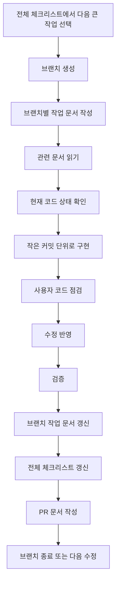

# 전체 작업 체크리스트

## 1. 문서 목적

이 문서는 프로젝트 전체에서 남은 작업을 한눈에 보기 위한 현황판이다.

상세 설명은 각 설계 문서에 두고, 이 문서에는 아래 3가지만 기록한다.

1. 큰 작업이 무엇인지
2. 완료 기준이 무엇인지
3. 어느 문서를 함께 봐야 하는지

이 문서는 브랜치별 작업 체크리스트를 대체하지 않는다.  
전체 체크리스트는 넓게 보고, 브랜치별 체크리스트는 좁고 구체적으로 작성한다.

```text
전체 체크리스트
  = 프로젝트 전체 지도

브랜치별 체크리스트
  = 이번 브랜치에서 끝낼 작업표
```

---

## 2. 체크 기준

| 표시 | 의미 |
|---|---|
| `[x]` | 실제 코드, 문서, 빌드, 실행, API 호출 등으로 완료가 확인된 항목 |
| `[ ]` | 아직 완료하지 않았거나 확인하지 못한 항목 |
| `보류` | 지금 하지 않기로 결정한 항목 |
| `위험` | 진행 가능하지만 구조, 데이터, 보안, 배포 위험이 있는 항목 |

체크할 때는 아래 기준을 지킨다.

1. 문서만 작성한 경우 구현 완료로 체크하지 않는다.
2. 코드만 작성하고 빌드하지 못한 경우 검증 완료로 체크하지 않는다.
3. API 명세만 만든 경우 API 구현 완료로 체크하지 않는다.
4. 화면 mock만 만든 경우 실제 API 연동 완료로 체크하지 않는다.
5. 브랜치별 작업이 끝나면 이 전체 체크리스트도 함께 갱신한다.

---

## 3. 전체 진행 흐름



---

## 4. 기준 문서와 운영 문서

- [x] `docs/README.md`가 최신 문서 읽기 순서를 안내한다.
  - 완료 기준: 새로 추가된 주요 문서가 README 읽기 순서에 포함되어 있다.
  - 참고 문서: `docs/README.md`

- [x] 새 대화 시작 방식이 문서화되어 있다.
  - 완료 기준: 에이전트에게 줄 짧은 시작 프롬프트가 정리되어 있다.
  - 참고 문서: `docs/09_agent/06_새대화_시작_가이드.md`

- [x] 문서 기반 자동 진행 규칙이 문서화되어 있다.
  - 완료 기준: 에이전트가 읽을 문서, 진행 범위, 멈춰야 할 조건이 정리되어 있다.
  - 참고 문서: `docs/09_agent/05_문서기반_자동진행_운영가이드.md`

- [x] 전체 체크리스트와 브랜치별 체크리스트의 역할이 분리되어 있다.
  - 완료 기준: 전체 현황판과 브랜치 작업표를 각각 어디에 작성할지 정리되어 있다.
  - 참고 문서: `docs/11_implementation_log/00_브랜치_작업_기록_가이드.md`

---

## 5. 백엔드 기반 작업

- [x] 실행 환경 기준 확인
  - 완료 기준: JDK, Maven, Docker, PostgreSQL 실행 가능 여부를 실제 환경에서 확인한다.
  - 검증 방법: `java -version`, `mvn -version`, `docker compose` 관련 명령 확인
  - 참고 문서: `docs/13_schedule/01_남은_일정_단계별_진행_계획.md`

- [ ] GitNexus와 `rg` 사용 기준 확인
  - 완료 기준: GitNexus 상태 확인 방법과 실패 시 대체 탐색 방식이 정리되어 있다.
  - 검증 방법: `npm.cmd exec -- gitnexus status`, `rg` 탐색
  - 참고 문서: `docs/09_agent/03_Codex_GitNexus_UTF8_작업_주의사항.md`

- [x] PostgreSQL 공통코드 API 검증
  - 완료 기준: 공통코드 API가 PostgreSQL 기준으로 조회된다.
  - 검증 방법: Swagger 또는 API 호출로 `GET /api/common-codes/RESERVATION_STATUS` 확인
  - 참고 문서: `docs/11_implementation_log/01_PostgreSQL_공통코드_API_변경_기록.md`

- [ ] 샘플 코드 정리 1차
  - 완료 기준: SNS 로그인 샘플 등 MVP 범위 밖 샘플을 기능 묶음 단위로 정리한다.
  - 검증 방법: 제거 후 빌드 확인, Swagger 노출 확인
  - 참고 문서: `docs/10_backend_transition/03_샘플_코드_정리_범위_및_안전_절차.md`

- [ ] 공통 응답/예외 구조 안정화
  - 완료 기준: 신규 보건소 API가 `success + data + error` 형식을 사용한다.
  - 검증 방법: 성공/실패 응답 JSON 확인
  - 참고 문서: `docs/09_agent/02_에이전트_프롬프트_및_코드작성_지침.md`

- [ ] Office Context 구현
  - 완료 기준: 업무 유형 조회 API가 동작한다.
  - 검증 방법: `GET /api/service-types` 호출
  - 참고 문서: `docs/02_domain/04_공통코드_관리_설계서.md`, `docs/04_api/01_API_명세서.md`

- [ ] Auth/Member Context 구현
  - 완료 기준: 로그인, 토큰 재발급, 권한 분리가 동작한다.
  - 검증 방법: 사용자 역할별 API 접근 확인
  - 참고 문서: `docs/09_agent/01_코드_에이전트_작업_가이드.md`

- [ ] Reservation Context 구현
  - 완료 기준: 예약 가능 시간 조회, 예약 신청, 내 예약 조회, 예약 취소가 동작한다.
  - 검증 방법: 정원 초과, 중복 예약, 취소 시간 제한 확인
  - 참고 문서: `docs/01_planning/06_기능_목록_및_고도화_포인트.md`, `docs/04_api/01_API_명세서.md`

- [ ] Visit Context 구현
  - 완료 기준: 예약자 체크인과 현장 접수가 동작한다.
  - 검증 방법: Visit 생성과 QueueTicket 생성 확인
  - 참고 문서: `docs/02_domain/02_업무_흐름도.md`

- [ ] Queue Context 구현
  - 완료 기준: 대기번호 조회, 호출, 처리 시작, 처리 완료가 동작한다.
  - 검증 방법: 상태 전이 `WAITING -> CALLED -> IN_PROGRESS -> COMPLETED` 확인
  - 참고 문서: `docs/02_domain/02_업무_흐름도.md`

- [ ] Dashboard/Congestion Context 구현
  - 완료 기준: 오늘 방문자 수, 현재 대기 인원, 평균 대기시간, 혼잡도 조회가 동작한다.
  - 검증 방법: 통계 API 호출 및 SQL 집계 확인
  - 참고 문서: `docs/06_dashboard/*`

---

## 6. 프론트엔드 작업

- [ ] 프론트엔드 코드 구조 확인
  - 완료 기준: 사용 중인 프레임워크, 라우팅, 상태 관리, API 클라이언트 구조를 확인한다.
  - 검증 방법: 프로젝트 파일 구조와 실행 명령 확인
  - 참고 문서: `docs/05_frontend/*`

- [ ] 사용자 예약 화면 구현
  - 완료 기준: 업무 선택, 날짜 선택, 시간 선택, 예약 신청 흐름이 화면에서 가능하다.
  - 검증 방법: mock data 또는 API로 화면 동작 확인
  - 참고 문서: `docs/05_frontend/01_화면_설계서_v0_프롬프트.md`

- [ ] 내 예약 화면 구현
  - 완료 기준: 내 예약 목록과 취소 버튼이 제공된다.
  - 검증 방법: 예약 상태별 표시와 취소 가능 조건 확인
  - 참고 문서: `docs/05_frontend/02_UX_API_계약_우선순위.md`

- [ ] 직원 접수/체크인 화면 구현
  - 완료 기준: 예약자 체크인과 현장 접수를 직원 화면에서 처리할 수 있다.
  - 검증 방법: 체크인 후 대기번호 생성 흐름 확인
  - 참고 문서: `docs/05_frontend/02_UX_API_계약_우선순위.md`

- [ ] 대기열 관리 화면 구현
  - 완료 기준: 직원이 대기자 목록을 보고 호출, 시작, 완료 처리할 수 있다.
  - 검증 방법: 상태 전이 버튼 동작 확인
  - 참고 문서: `docs/02_domain/02_업무_흐름도.md`

- [ ] 관리자 대시보드 화면 구현
  - 완료 기준: 핵심 지표와 혼잡도 표시가 가능하다.
  - 검증 방법: 대시보드 API 또는 mock data 연결 확인
  - 참고 문서: `docs/06_dashboard/*`

- [ ] 프론트엔드 API 연동
  - 완료 기준: mock data가 실제 API 호출로 교체된다.
  - 검증 방법: 브라우저에서 주요 사용자 흐름 확인
  - 참고 문서: `docs/04_api/01_API_명세서.md`

---

## 7. DB 작업

- [ ] PostgreSQL schema 정리
  - 완료 기준: MVP 테이블 생성 SQL이 실제 실행 가능하다.
  - 검증 방법: Docker PostgreSQL에서 schema 적용 확인
  - 참고 문서: `docs/03_database/01_ERD_및_테이블_명세서.md`

- [ ] Seed 데이터 정리
  - 완료 기준: 관리자, 직원, 사용자, 업무 유형, 공통코드 seed가 준비된다.
  - 검증 방법: 초기 실행 후 로그인/조회 가능 여부 확인
  - 참고 문서: `docs/09_agent/01_코드_에이전트_작업_가이드.md`

- [ ] MyBatis Mapper 정합성 확인
  - 완료 기준: Java Mapper와 XML statement id가 일치한다.
  - 검증 방법: 빌드와 API 호출 확인
  - 참고 문서: `docs/10_backend_transition/04_DB_접근_방식_JPA_MyBatis_판단.md`

---

## 8. 테스트 작업

- [ ] 핵심 정책 테스트 후보 정리
  - 완료 기준: 예약, 체크인, 대기 호출의 Happy/Edge/Bad 케이스가 정리된다.
  - 검증 방법: 테스트 후보 문서 또는 구현 기록에 기록
  - 참고 문서: `docs/09_agent/02_에이전트_프롬프트_및_코드작성_지침.md`

- [ ] 백엔드 빌드 검증
  - 완료 기준: 주요 브랜치 작업 후 `mvn -q -DskipTests compile`이 성공한다.
  - 검증 방법: 명령 실행 결과 기록
  - 참고 문서: 브랜치별 구현 기록

- [ ] API 수동 검증
  - 완료 기준: Swagger 또는 API 클라이언트로 주요 API를 호출한다.
  - 검증 방법: 성공/실패 응답 기록
  - 참고 문서: 브랜치별 구현 기록

- [ ] 프론트엔드 화면 검증
  - 완료 기준: 주요 화면에서 텍스트 겹침, 버튼 동작, API 호출 상태를 확인한다.
  - 검증 방법: 로컬 화면 또는 스크린샷 확인
  - 참고 문서: 프론트엔드 브랜치 기록

---

## 9. 배포와 운영 작업

- [ ] Docker Compose 실행 정리
  - 완료 기준: backend, frontend, postgres 실행 절차가 정리된다.
  - 검증 방법: 실행 명령과 확인 URL 기록
  - 참고 문서: `docs/08_deploy/*`

- [ ] 환경변수 정리
  - 완료 기준: DB 접속 정보, 토큰 secret, 프로파일 설정이 문서화된다.
  - 검증 방법: 민감 정보가 직접 노출되지 않았는지 확인
  - 참고 문서: `docs/08_deploy/*`

- [ ] 운영 체크리스트 작성
  - 완료 기준: 로그, 장애 대응, 계정, 데이터 초기화 기준이 정리된다.
  - 검증 방법: 운영자가 확인할 항목과 개발자가 확인할 항목 분리
  - 참고 문서: `docs/09_agent/06_새대화_시작_가이드.md`

---

## 10. 포트폴리오와 PR 작업

- [ ] 브랜치별 구현 기록 작성
  - 완료 기준: 브랜치에서 무엇을 왜 했는지 기록한다.
  - 검증 방법: `docs/11_implementation_log` 아래 구현 기록 문서 확인
  - 참고 문서: `docs/11_implementation_log/00_브랜치_작업_기록_가이드.md`

- [ ] 브랜치별 PR 문서 작성
  - 완료 기준: PR 제목, 개요, 변경 내용, 검증, 미검증 사유, 후속 작업이 정리된다.
  - 검증 방법: PR 작성안 문서 확인
  - 참고 문서: `docs/11_implementation_log/00_브랜치_작업_기록_가이드.md`

- [ ] 포트폴리오 스토리라인 갱신
  - 완료 기준: 기술 선택 이유, 문제 해결 과정, 검증 결과가 포트폴리오에 설명 가능하다.
  - 검증 방법: `docs/12_portfolio/01_포트폴리오_구현_스토리라인.md` 갱신
  - 참고 문서: 브랜치별 구현 기록

---

## 11. 진행 중 발견된 추가 작업

진행하면서 새로 발견한 일은 바로 이 표에 추가한다.  
처음부터 모든 일을 완벽히 예상하려고 하지 않는다.

| 발견 시점 | 추가 작업 | 이유 | 처리 상태 | 연결 문서 |
|---|---|---|---|---|
| 예시 | 예약 구현 중 동시성 검증 보강 | 정원 초과 경쟁 조건 방지 | 미진행 | Reservation 브랜치 기록 |

---

## 12. 브랜치 종료 전 확인

브랜치를 닫기 전에는 아래 항목을 확인한다.

- [ ] 브랜치별 작업 체크리스트가 최신 상태이다.
- [ ] 완료한 전체 항목이 이 문서에 반영되어 있다.
- [ ] 구현 기록 문서가 작성되어 있다.
- [ ] PR 문서가 작성되어 있다.
- [ ] 빌드/테스트/실행 중 확인한 것과 확인하지 못한 것이 구분되어 있다.
- [ ] 남은 위험과 후속 작업이 기록되어 있다.
- [ ] 사용자가 직접 코드 점검한 결과가 반영되어 있다.

---

## 13. 핵심 요약

이 문서는 프로젝트 전체의 현황판이다.

실제 작업은 브랜치별 문서에서 구체적으로 관리하고, 브랜치가 끝날 때 이 문서에 큰 진행 상태를 반영한다.

```text
전체 체크리스트에서 고른다.
브랜치 체크리스트에서 실행한다.
브랜치 종료 때 전체 체크리스트에 반영한다.
```
