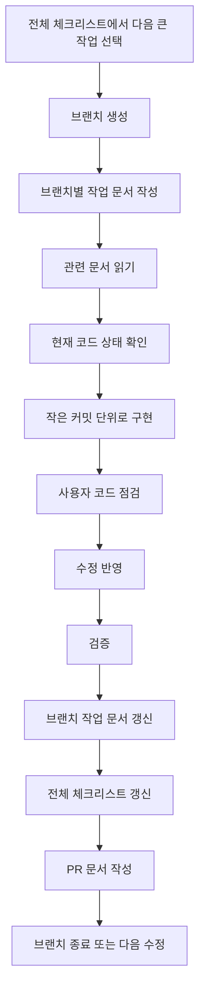

# 전체 작업 체크리스트

## 1. 문서 목적

이 문서는 프로젝트 전체에서 남은 작업을 한눈에 보기 위한 현황판이다.

상세 설명은 각 설계 문서에 두고, 이 문서에는 아래 3가지만 기록한다.

1. 큰 작업이 무엇인지
2. 완료 기준이 무엇인지
3. 어느 문서를 함께 봐야 하는지

이 문서는 브랜치별 작업 체크리스트를 대체하지 않는다.  
전체 체크리스트는 넓게 보고, 브랜치별 체크리스트는 좁고 구체적으로 작성한다.

```text
전체 체크리스트
  = 프로젝트 전체 지도

브랜치별 체크리스트
  = 이번 브랜치에서 끝낼 작업표
```

---

## 2. 체크 기준

| 표시 | 의미 |
|---|---|
| `[x]` | 실제 코드, 문서, 빌드, 실행, API 호출 등으로 완료가 확인된 항목 |
| `[ ]` | 아직 완료하지 않았거나 확인하지 못한 항목 |
| `보류` | 지금 하지 않기로 결정한 항목 |
| `위험` | 진행 가능하지만 구조, 데이터, 보안, 배포 위험이 있는 항목 |

체크할 때는 아래 기준을 지킨다.

1. 문서만 작성한 경우 구현 완료로 체크하지 않는다.
2. 코드만 작성하고 빌드하지 못한 경우 검증 완료로 체크하지 않는다.
3. API 명세만 만든 경우 API 구현 완료로 체크하지 않는다.
4. 화면 mock만 만든 경우 실제 API 연동 완료로 체크하지 않는다.
5. 브랜치별 작업이 끝나면 이 전체 체크리스트도 함께 갱신한다.

---

## 3. 전체 진행 흐름



---

## 4. 기준 문서와 운영 문서

- [x] `docs/README.md`가 최신 문서 읽기 순서를 안내한다.
  - 완료 기준: 새로 추가된 주요 문서가 README 읽기 순서에 포함되어 있다.
  - 참고 문서: `docs/README.md`

- [x] 새 대화 시작 방식이 문서화되어 있다.
  - 완료 기준: 에이전트에게 줄 짧은 시작 프롬프트가 정리되어 있다.
  - 참고 문서: `docs/09_agent/06_새대화_시작_가이드.md`

- [x] 문서 기반 자동 진행 규칙이 문서화되어 있다.
  - 완료 기준: 에이전트가 읽을 문서, 진행 범위, 멈춰야 할 조건이 정리되어 있다.
  - 참고 문서: `docs/09_agent/05_문서기반_자동진행_운영가이드.md`

- [x] 전체 체크리스트와 브랜치별 체크리스트의 역할이 분리되어 있다.
  - 완료 기준: 전체 현황판과 브랜치 작업표를 각각 어디에 작성할지 정리되어 있다.
  - 참고 문서: `docs/11_implementation_log/00_브랜치_작업_기록_가이드.md`

- [x] 애매한 정리 후보를 보류 목록으로 관리한다.
  - 완료 기준: 당장 삭제하지 않는 항목의 보류 사유와 나중에 확인할 조건을 기록하는 문서가 있다.
  - 참고 문서: `docs/14_deferred_cleanup/01_보류_정리_목록.md`

---

## 4.1 현재 구현 확인 요약

2026-05-15 기준으로 현재 코드와 문서를 다시 대조했다.

| 구분 | 확인 결과 | 이번 갱신 기준 |
|---|---|---|
| Backend API | Auth/Member, Office, Reservation, Visit, Queue, Dashboard/Congestion Controller와 MyBatis Mapper가 `egovframework.healthcenter` 하위에 존재 | 구현 및 정적 검증 완료 항목은 체크 |
| Frontend API 연동 | 로그인, 예약, 직원 접수/대기열, 관리자 대시보드/기준정보 API client와 화면 연결이 존재 | `npm.cmd run build` 통과 항목은 체크 |
| DB | PostgreSQL `schema.sql`, `data.sql`에 MVP 테이블, 기본 계정, 업무 유형, Swagger/대시보드 seed가 존재 | schema/seed 작성 완료 항목은 체크 |
| 검증 | `mvn.cmd -q -DskipTests compile`, `mvn.cmd -q test-compile`, `npm.cmd run build` 통과 | 정적 검증 완료로 기록 |
| 런타임 검증 | 서버 기동, Docker 실행, Swagger `Try it out`, 실제 API와 프론트 화면 확인 | 사용자 확인 완료 항목은 체크 |

2026-05-15 사용자 확인 결과, Swagger 대표 흐름과 실제 API/프론트 연동 테스트는 완료된 것으로 반영한다.

2026-05-17 현재 상태 재확인 결과, 작업 트리는 점검 전 기준으로 깨끗했고 루트 `docker-compose.yml`, `backend/Dockerfile`, `frontend/Dockerfile`, `infra/jenkins/Dockerfile`, `infra/jenkins/docker-compose.jenkins.yml`, `Jenkinsfile`, `.env.example`이 존재함을 확인했다. `git diff --check`, `mvn.cmd -q -DskipTests compile`, `mvn.cmd -q test-compile`, `npm.cmd run build`는 통과했다. GitNexus는 프로젝트 로컬 설치 CLI를 직접 실행하는 방식이 맞으며, `npm.cmd exec -- gitnexus ...` 실패는 실행 방식 차이로 정리했다. 현재 설치 버전에는 `detect-change` 계열 명령이 없어 변경 범위 확인은 `git status`, `git diff`, `rg`, Maven/Next build로 보완한다.

2026-05-17 사용자 최종 확인 결과, 외부 배포 환경에서 프론트엔드와 백엔드가 정상 동작하고 PostgreSQL 데이터 저장도 정상임을 확인했다. MVP 기능, Swagger/API 테스트, 브라우저 테스트, 배포 런타임 검증은 완료로 반영한다.

신규 MVP 기능은 종료 상태로 보고, 남은 항목은 포트폴리오 정리와 보안/운영성 고도화 후보로 관리한다.

---

## 5. 백엔드 기반 작업

- [x] 실행 환경 기준 확인
  - 완료 기준: JDK, Maven, Docker, PostgreSQL 실행 가능 여부를 실제 환경에서 확인한다.
  - 검증 방법: `java -version`, `mvn -version`, `docker compose` 관련 명령 확인
  - 참고 문서: `docs/13_schedule/01_남은_일정_단계별_진행_계획.md`

- [x] GitNexus와 `rg` 사용 기준 확인
  - 완료 기준: GitNexus 상태 확인 방법과 실패 시 대체 탐색 방식이 정리되어 있다.
  - 검증 방법: `gitnexus status`, 필요 시 `gitnexus analyze`, `rg` 탐색
  - 진행 상태: 사용자 로컬 환경 기준으로 프로젝트에 설치된 GitNexus CLI는 `gitnexus status`, `gitnexus analyze`, `gitnexus list`를 직접 실행한다. 현재 설치 버전에는 `detect-change` 계열 명령이 없으므로 변경 범위 확인은 `git status`, `git diff --stat`, `git diff --check`, `rg`, Maven/Next build로 보완한다.
  - 참고 문서: `docs/09_agent/03_Codex_GitNexus_UTF8_작업_주의사항.md`

- [x] PostgreSQL 공통코드 API 검증
  - 완료 기준: 공통코드 API가 PostgreSQL 기준으로 조회된다.
  - 검증 방법: Swagger 또는 API 호출로 `GET /api/common-codes/RESERVATION_STATUS` 확인
  - 참고 문서: `docs/11_implementation_log/01_PostgreSQL_공통코드_API_변경_기록.md`

- [x] 샘플 코드 정리 1차
  - 완료 기준: SNS 로그인 샘플 등 MVP 범위 밖 샘플을 기능 묶음 단위로 정리한다.
  - 검증 방법: 제거 후 빌드 확인, Swagger 노출 확인
  - 진행 상태: 레거시 로그인/SNS/관리자 샘플 API, Service, DAO, 테스트, SNS 설정 제거와 Maven compile/test-compile 확인 완료. Swagger/API/프론트 런타임 확인은 사용자 확인 완료. `JwtAuthenticationFilter`의 레거시 `LoginVO` fallback은 정리했고, `EgovJwtTokenUtil`/`LoginVO` 자체 정리는 후속 브랜치로 분리
  - 참고 문서: `docs/10_backend_transition/03_샘플_코드_정리_범위_및_안전_절차.md`, `docs/11_implementation_log/16_eGovFrame_레거시_인증_샘플_비노출_기록.md`, `docs/11_implementation_log/19_eGovFrame_레거시_인증_샘플_제거_기록.md`, `docs/11_implementation_log/94_Jwt_Filter_Legacy_LoginVO_Fallback_정리_기록.md`

- [x] 공통 응답/예외 구조 안정화
  - 완료 기준: 신규 보건소 API가 `success + data + error` 형식을 사용한다.
  - 검증 방법: 성공/실패 응답 JSON 확인
  - 진행 상태: `ApiResponse` 공통 응답과 주요 Controller의 성공/실패 응답 사용 확인. Swagger/API 런타임 확인은 사용자 확인 완료
  - 참고 문서: `docs/09_agent/02_에이전트_프롬프트_및_코드작성_지침.md`

- [x] Office Context 구현
  - 완료 기준: 업무 유형 조회 API가 동작한다.
  - 검증 방법: `GET /api/service-types` 호출
  - 진행 상태: 업무 유형 조회, 관리자 업무 유형 전체 조회/생성/수정/비활성화/재활성화, 직원 목록/생성/수정/비활성화, 창구 조회/생성/수정/비활성화/담당자 배정/업무 매핑 구현 및 Maven compile/test-compile 완료. Swagger/API/프론트 런타임 확인은 사용자 확인 완료
  - 참고 문서: `docs/02_domain/04_공통코드_관리_설계서.md`, `docs/04_api/01_API_명세서.md`

- [x] Auth/Member Context 구현
  - 완료 기준: 로그인, 토큰 재발급, 권한 분리가 동작한다.
  - 검증 방법: 사용자 역할별 API 접근 확인
  - 진행 상태: 로그인, 현재 사용자 조회, 토큰 재발급, 로그아웃, URL 기반 역할별 접근 규칙 구현 및 Maven compile/test-compile 완료. Swagger/API/프론트 런타임 확인은 사용자 확인 완료. 객체 권한 정책은 남은 작업
  - 참고 문서: `docs/09_agent/01_코드_에이전트_작업_가이드.md`, `docs/11_implementation_log/08_Auth_Member_Context_범위_확정_및_브랜치_체크리스트.md`, `docs/11_implementation_log/10_Auth_Member_로그인_기반_구현_기록.md`, `docs/11_implementation_log/12_Auth_Member_토큰_재발급_로그아웃_구현_기록.md`, `docs/11_implementation_log/14_Auth_Member_역할별_접근_규칙_구현_기록.md`

- [x] Reservation Context 구현
  - 완료 기준: 예약 가능 시간 조회, 예약 신청, 내 예약 조회, 예약 취소가 동작한다.
  - 검증 방법: 정원 초과, 중복 예약, 취소 시간 제한 확인
  - 진행 상태: 예약 슬롯 테이블, Swagger 테스트용 예약 seed, `GET /api/reservation-slots`, `POST /api/admin/reservation-slots`, `PUT /api/admin/reservation-slots/{id}`, `PATCH /api/admin/reservation-slots/{id}/deactivate`, `POST /api/reservations`, `GET /api/reservations/me`, `GET /api/reservations/{id}`, `DELETE /api/reservations/{id}` 구현 및 Maven compile/test-compile 완료. Swagger/API/프론트 런타임 확인은 사용자 확인 완료
  - 참고 문서: `docs/01_planning/06_기능_목록_및_고도화_포인트.md`, `docs/04_api/01_API_명세서.md`

- [x] Visit Context 구현
  - 완료 기준: 예약자 체크인과 현장 접수가 동작한다.
  - 검증 방법: Visit 생성과 QueueTicket 생성 확인
  - 진행 상태: `POST /api/visits/check-in`, `POST /api/visits/walk-in` 구현 및 Maven compile/test-compile 완료. Swagger/API/프론트 런타임 확인은 사용자 확인 완료
  - 참고 문서: `docs/02_domain/02_업무_흐름도.md`

- [x] Queue Context 구현
  - 완료 기준: 대기번호 조회, 호출, 처리 시작, 처리 완료가 동작한다.
  - 검증 방법: 상태 전이 `WAITING -> CALLED -> IN_PROGRESS -> COMPLETED`, `CALLED -> HOLD -> NO_SHOW`, `WAITING/CALLED/HOLD -> CANCELED` 확인
  - 진행 상태: `GET /api/queues`, `POST /api/queues/{id}/call`, `POST /api/queues/{id}/start`, `POST /api/queues/{id}/complete`, `POST /api/queues/{id}/hold`, `POST /api/queues/{id}/no-show`, `POST /api/queues/{id}/cancel` 구현 및 Maven compile/test-compile 완료. 대기번호 발급 동시성 보강을 위해 채번 테이블, 원자적 upsert 발급 SQL, 당일 대기번호 유니크 인덱스 추가
  - 참고 문서: `docs/02_domain/02_업무_흐름도.md`

- [x] Dashboard/Congestion Context 구현
  - 완료 기준: 오늘 방문자 수, 현재 대기 인원, 평균 대기시간, 혼잡도 조회가 동작한다.
  - 검증 방법: 통계 API 호출 및 SQL 집계 확인
  - 진행 상태: `GET /api/dashboard/summary`, `GET /api/congestion/current`, `GET /api/dashboard/hourly-visits`, `GET /api/dashboard/service-wait-times`, `GET /api/dashboard/visit-type-ratio`, `GET /api/dashboard/no-show-rate` 구현 및 Maven compile/test-compile 완료. 2026-05-18 접수 시간이 관리자 대시보드에 다른 시간대로 집계되는 문제를 줄이기 위해 backend JVM과 PostgreSQL 세션 시간대를 `Asia/Seoul` 기본값으로 정렬했다. Swagger/API/프론트 런타임 확인은 사용자 직접 확인 필요
  - 참고 문서: `docs/06_dashboard/*`

---

## 6. 프론트엔드 작업

- [x] 프론트엔드 코드 구조 확인
  - 완료 기준: 사용 중인 프레임워크, 라우팅, 상태 관리, API 클라이언트 구조를 확인한다.
  - 검증 방법: 프로젝트 파일 구조와 실행 명령 확인
  - 진행 상태: Next.js App Router, TypeScript, Tailwind CSS, shadcn/ui, 역할별 라우트, 공통 컴포넌트, `NEXT_PUBLIC_API_BASE_URL` 기반 실제 API client 구조를 확인했다. 주요 화면은 실제 백엔드 API와 연동되어 있고 사용자 최종 테스트도 완료했다.
  - 참고 문서: `docs/05_frontend/*`

- [x] 공통 인증 보조 화면 구현
  - 완료 기준: 로그인 화면에서 회원가입, 소셜 로그인, 아이디 찾기, 비밀번호 찾기 화면으로 이동할 수 있고 정적 빌드가 통과한다.
  - 검증 방법: `npm.cmd exec -- tsc --noEmit`, `npm.cmd run build`, 브라우저 화면 확인
  - 진행 상태: `/register`, `/reset-password`, `/find-id` 보조 페이지와 `/login/social/callback` 소셜 로그인 콜백 화면, `/login/social/complete` 추가 정보 입력 화면 추가 완료. 기존 `/social-login` mock 페이지는 제거하고 로그인 화면에 카카오/네이버/구글 버튼을 직접 배치했다. 자동 로그인/아이디 기억 체크박스, 자동 로그인 선택 시 localStorage 토큰 저장, 초기 인증 확인 중 로딩 화면 표시 반영. TypeScript/Next build 통과, 브라우저 확인은 사용자 직접 확인 필요
  - 참고 문서: `docs/05_frontend/01_화면_설계서_v0_프롬프트.md`, `docs/11_implementation_log/52_Frontend_Auth_Aux_Pages_구현_기록.md`, `docs/11_implementation_log/88_Frontend_Login_Auto_Remember_구현_기록.md`, `docs/11_implementation_log/90_Social_Login_OAuth_구현_기록.md`

- [x] 사용자 예약 화면 구현
  - 완료 기준: 업무 선택, 날짜 선택, 시간 선택, 예약 신청 흐름이 화면에서 가능하다.
  - 검증 방법: mock data 또는 API로 화면 동작 확인
  - 진행 상태: 업무 유형 조회, 예약 슬롯 조회, 예약 신청을 실제 API로 연결하고 TypeScript/Next build 확인 완료. 브라우저/API 런타임 확인은 사용자 확인 완료
  - 참고 문서: `docs/05_frontend/01_화면_설계서_v0_프롬프트.md`

- [x] 내 예약 화면 구현
  - 완료 기준: 내 예약 목록과 취소 버튼이 제공된다.
  - 검증 방법: 예약 상태별 표시와 취소 가능 조건 확인
  - 진행 상태: 내 예약 조회와 예약 취소를 실제 API로 연결하고 TypeScript/Next build 확인 완료. 브라우저/API 런타임 확인은 사용자 확인 완료
  - 참고 문서: `docs/05_frontend/02_UX_API_계약_우선순위.md`

- [x] 직원 접수/체크인 화면 구현
  - 완료 기준: 예약자 체크인과 현장 접수를 직원 화면에서 처리할 수 있다.
  - 검증 방법: 체크인 후 대기번호 생성 흐름 확인
  - 진행 상태: 예약자 체크인과 현장 접수를 실제 API로 연결하고 TypeScript/Next build 확인 완료. 2026-05-18 접수 저장 시각은 backend/DataSource/DB 세션 시간대 `Asia/Seoul` 기준으로 보정했다. 브라우저/API 런타임 확인은 사용자 직접 확인 필요
  - 참고 문서: `docs/05_frontend/02_UX_API_계약_우선순위.md`

- [x] 대기열 관리 화면 구현
  - 완료 기준: 직원이 대기자 목록을 보고 호출, 시작, 완료 처리할 수 있다.
  - 검증 방법: 상태 전이 버튼 동작 확인
  - 진행 상태: 대기열 조회와 호출/시작/완료/보류/미응답/취소 상태 변경을 실제 API로 연결하고 TypeScript/Next build 확인 완료. 브라우저/API 런타임 확인은 사용자 확인 완료
  - 참고 문서: `docs/02_domain/02_업무_흐름도.md`

- [x] 관리자 대시보드 화면 구현
  - 완료 기준: 핵심 지표와 혼잡도 표시가 가능하다.
  - 검증 방법: 대시보드 API 또는 mock data 연결 확인
  - 진행 상태: 관리자 대시보드 요약, 시간대별 방문자, 업무별 평균 대기시간, 예약/현장 비율, 노쇼율 API를 실제 프론트 화면에 연결하고 TypeScript/Next build 확인 완료. 차트 색상 적용 오류를 보정하고 현재 날짜 기준 Dashboard 예시 데이터를 추가함. 2026-05-18 시간대별 방문자 수 표시 보정을 위해 Dashboard SQL 시간 컬럼 별칭을 명확화하고 프론트 시간 라벨을 `HH시`로 정규화함. 브라우저/API 런타임 확인은 사용자 직접 확인 필요
  - 참고 문서: `docs/06_dashboard/*`

- [x] 프론트엔드 API 연동
  - 완료 기준: mock data가 실제 API 호출로 교체된다.
  - 검증 방법: 브라우저에서 주요 사용자 흐름 확인
  - 진행 상태: mock type/data를 백엔드 API 계약에 맞게 1차 정렬하고, `NEXT_PUBLIC_API_BASE_URL` 기반 공통 API client를 추가함. 로그인, 현재 사용자 조회, 로그아웃 API 1차 연동 및 TypeScript/Next build 확인 완료. 시민 예약 신청/내 예약/취소 API 연동 및 TypeScript/Next build 확인 완료. 직원 체크인/현장 접수/대기열 API 연동 및 TypeScript/Next build 확인 완료. 역할별 route guard와 권한 없음 화면, API 403 이동 처리 구현 및 TypeScript/Next build 확인 완료. 관리자 대시보드 지표 API 연동 및 TypeScript/Next build 확인 완료. 관리자 기준정보 화면의 업무 유형/예약 슬롯/직원/창구 조회 및 예약 슬롯 수정/비활성화, 직원 생성/수정/비활성화, 창구 생성/수정/비활성화/담당자 배정 API 연동, 업무 유형 활성/비활성 탭과 재활성화 UX 반영, TypeScript/Next build 확인 완료. 2026-05-18 로그인 화면에서 카카오/네이버/구글 OAuth 시작 버튼, 소셜 로그인 콜백 토큰 저장 흐름, 이메일 미제공 시 추가 정보 입력 완료 흐름을 추가했다. 브라우저/API 런타임 확인은 사용자 직접 확인 필요
  - 참고 문서: `docs/04_api/01_API_명세서.md`, `docs/11_implementation_log/88_Frontend_Login_Auto_Remember_구현_기록.md`, `docs/11_implementation_log/90_Social_Login_OAuth_구현_기록.md`

- [x] 프론트엔드 전화번호 입력 UX 개선
  - 완료 기준: 사용자가 하이픈을 직접 입력하지 않아도 전화번호가 기존 API/DB 형식인 `010-1234-5678` 형태로 전송된다.
  - 검증 방법: `git diff --check`, `npm.cmd run build`, 브라우저 입력 확인
  - 진행 상태: 예약 신청, 현장 접수, 관리자 직원 관리, 회원가입/아이디 찾기/비밀번호 찾기 화면의 전화번호 입력에 자동 하이픈 정규화를 적용했다. 백엔드 요청 필드명과 저장 형식은 변경하지 않았다. `git diff --check`와 `npm.cmd run build` 통과. 브라우저 런타임 확인은 사용자 직접 확인 필요
  - 참고 문서: `docs/11_implementation_log/92_Frontend_Phone_Number_Input_UX_구현_기록.md`, `docs/11_implementation_log/93_Frontend_Phone_Number_Input_UX_PR_작성안.md`

---

## 7. DB 작업

- [x] PostgreSQL schema 정리
  - 완료 기준: MVP 테이블 생성 SQL이 실제 실행 가능하다.
  - 검증 방법: Docker PostgreSQL에서 schema 적용 확인
  - 진행 상태: 공통코드, 회원, 업무 유형, 예약 슬롯/예약, 방문, 대기표/채번, 창구/창구 업무 매핑, Refresh Token 테이블 SQL 작성 및 Maven compile/test-compile 완료. Docker PostgreSQL 실제 적용과 API 런타임 확인은 사용자 확인 완료
  - 참고 문서: `docs/03_database/01_ERD_및_테이블_명세서.md`

- [x] Seed 데이터 정리
  - 완료 기준: 관리자, 직원, 사용자, 업무 유형, 공통코드 seed와 Swagger 대표 예시용 seed/mock 데이터가 준비된다.
  - 검증 방법: 초기 실행 후 로그인/조회 가능 여부 확인
  - 진행 상태: 공통코드, 기본 보건소, 기본 회원, 업무 유형, 창구, 창구 담당자 배정, 창구 업무 매핑, 예약 상세/취소/체크인 Swagger 테스트용 예약 seed, 대기열 라이프사이클 Swagger 테스트용 대기표 seed 작성 완료. 대기표 seed 삽입 후 채번 테이블 동기화 추가. 현재 날짜 기준 Dashboard 시각화 확인용 예약/방문/대기표 seed 추가
  - 참고 문서: `docs/09_agent/01_코드_에이전트_작업_가이드.md`

- [x] MyBatis Mapper 정합성 확인
  - 완료 기준: Java Mapper와 XML statement id가 일치한다.
  - 검증 방법: 빌드와 API 호출 확인
  - 진행 상태: `src/main/resources/egovframework/mapper/healthcenter` 하위 PostgreSQL Mapper XML과 Java Mapper 기반 Maven compile/test-compile 완료. API 런타임 호출 확인은 사용자 확인 완료
  - 참고 문서: `docs/10_backend_transition/04_DB_접근_방식_JPA_MyBatis_판단.md`

---

## 8. 테스트 작업

- [x] 핵심 정책 테스트 후보 정리
  - 완료 기준: 예약, 체크인, 대기 호출의 Happy/Edge/Bad 케이스가 정리된다.
  - 검증 방법: 테스트 후보 문서 또는 구현 기록에 기록
  - 진행 상태: 브랜치별 PR 문서의 추가 테스트 체크리스트와 2026-05-15 사용자 Swagger/API/프론트 확인 결과 기준으로 완료 반영
  - 참고 문서: `docs/09_agent/02_에이전트_프롬프트_및_코드작성_지침.md`

- [x] 백엔드 빌드 검증
  - 완료 기준: 주요 브랜치 작업 후 `mvn -q -DskipTests compile`이 성공한다.
  - 검증 방법: 명령 실행 결과 기록
  - 진행 상태: 2026-05-15 현재 `mvn.cmd -q -DskipTests compile`, `mvn.cmd -q test-compile` 통과
  - 참고 문서: 브랜치별 구현 기록

- [x] API 수동 검증
  - 완료 기준: Swagger에서 대표 예시 1개로 주요 API 정상 흐름을 확인하고, PR 문서 체크리스트로 추가 실패/경계 케이스 완료 여부를 기록한다.
  - 검증 방법: Swagger `Try it out` 성공/실패 응답 기록
  - 진행 상태: 2026-05-15 사용자 확인 결과, Swagger 대표 흐름과 실제 API 테스트 완료
  - 참고 문서: 브랜치별 구현 기록

- [x] 프론트엔드 화면 검증
  - 완료 기준: 주요 화면에서 텍스트 겹침, 버튼 동작, API 호출 상태를 확인한다.
  - 검증 방법: 로컬 화면 또는 스크린샷 확인
  - 진행 상태: 2026-05-15 사용자 확인 결과, 실제 API와 프론트 화면을 함께 확인 완료
  - 참고 문서: 프론트엔드 브랜치 기록

---

## 9. 배포와 운영 작업

- [x] Docker Compose 실행 정리
  - 완료 기준: backend, frontend, postgres 실행 절차가 정리된다.
  - 검증 방법: 실행 명령과 확인 URL 기록
  - 진행 상태: Ubuntu VM + Jenkins + Docker Compose 배포 계획서 작성 완료. 현재 루트 `docker-compose.yml`은 PostgreSQL, backend, frontend 서비스를 포함하며 주요 실행 값은 `.env` 기반으로 전환했다. 2026-05-17 사용자 확인 결과, 외부 배포 환경에서 정상 동작하고 데이터 저장도 정상임을 확인했다. 루트 `README.md`에 실행 명령과 주요 확인 URL을 정리했다.
  - 참고 문서: `docs/08_deploy/*`

- [x] 환경변수 정리
  - 완료 기준: DB 접속 정보, 토큰 secret, 프로파일 설정이 문서화된다.
  - 검증 방법: 민감 정보가 직접 노출되지 않았는지 확인
  - 진행 상태: 루트 `.env.example` 작성, 로컬 `.env` 생성, `.gitignore`의 `.env` 제외 확인, backend DB/JWT/CORS placeholder 적용, PostgreSQL/backend/frontend Compose 환경변수화, Maven compile/test-compile, Next build 완료. `README.md`에 로컬/VM/Cloudflare Tunnel 기준 환경변수 설정을 정리했다.
  - 참고 문서: `docs/08_deploy/*`

- [x] 운영 체크리스트 작성
  - 완료 기준: 로그, 장애 대응, 계정, 데이터 초기화 기준이 정리된다.
  - 검증 방법: 운영자가 확인할 항목과 개발자가 확인할 항목 분리
  - 진행 상태: 운영 관측성 고도화 후보로 요청/응답 로깅, Actuator/Micrometer, Prometheus/Grafana, Loki, k6, OpenTelemetry 도입 순서를 보류 목록에 정리. `traceId` 기반 요청 완료 로그와 예약/방문/대기 상태 변경 로그 1차 구현. Jenkins 컨테이너 구성과 main 브랜치 전용 배포 Pipeline 파일 작성 완료. Jenkins 실행 위치와 Docker socket 대상 기준은 `docs/08_deploy/04_Jenkins_VM_배포_운영_가이드.md`에 분리해 정리했으며, 2026-05-17 사용자 확인 결과 외부 배포와 데이터 저장이 정상임을 확인했다.
  - 참고 문서: `docs/09_agent/06_새대화_시작_가이드.md`, `docs/14_deferred_cleanup/01_보류_정리_목록.md`

- [x] 외부 시연 접속 작업 리스트 작성
  - 완료 기준: 외부 사용자가 접속할 수 있게 만들기 위한 공개 방식 후보, 권장 순서, 보안 체크리스트, 검증 시나리오가 문서화된다.
  - 검증 방법: 문서 경로와 체크리스트 확인
  - 진행 상태: Cloudflare Tunnel, ngrok, VPS/클라우드, 공유기 직접 공개 방식의 차이와 1차 추천 방식, frontend/backend 공개 URL 기준, Jenkins/PostgreSQL 비공개 기준을 `docs/08_deploy/05_외부_시연_접속_작업_리스트.md`에 정리했다. 사용자가 선택한 가비아 1년 도메인 + Cloudflare Tunnel + 집 Ubuntu VM 공개 흐름은 `docs/08_deploy/06_가비아_도메인_Cloudflare_Tunnel_외부공개_가이드.md`에 별도 정리했다. 2026-05-17 사용자 확인 결과 외부 배포 정상 동작을 확인했다.
  - 참고 문서: `docs/08_deploy/05_외부_시연_접속_작업_리스트.md`, `docs/08_deploy/06_가비아_도메인_Cloudflare_Tunnel_외부공개_가이드.md`

- [x] 가비아 도메인 Cloudflare Tunnel 외부 공개 가이드 작성
  - 완료 기준: 가비아 도메인 구매, Cloudflare nameserver 변경, cloudflared 설치, public hostname 연결, `.env`/Jenkins Credentials 갱신, 외부 검증과 종료 절차가 문서화된다.
  - 검증 방법: 문서 경로와 체크리스트 확인
  - 진행 상태: 포트폴리오용 1년 도메인 구매 전 확인 항목, `demo.<domain>`/`api.<domain>` 구조, Cloudflare Tunnel 라우팅, Jenkins/PostgreSQL 비공개 원칙, 시연 종료와 도메인 만료 관리 기준을 정리했다. 2026-05-17 사용자 확인 결과 외부 배포와 데이터 저장 정상 동작을 확인했다.
  - 참고 문서: `docs/08_deploy/06_가비아_도메인_Cloudflare_Tunnel_외부공개_가이드.md`

---

## 10. 포트폴리오와 PR 작업

- [x] 브랜치별 구현 기록 작성
  - 완료 기준: 브랜치에서 무엇을 왜 했는지 기록한다.
  - 검증 방법: `docs/11_implementation_log` 아래 구현 기록 문서 확인
  - 진행 상태: MVP 종료 정리 브랜치의 구현 기록까지 작성 완료
  - 참고 문서: `docs/11_implementation_log/00_브랜치_작업_기록_가이드.md`

- [x] 브랜치별 PR 문서 작성
  - 완료 기준: PR 제목, 개요, 변경 내용, 검증, 미검증 사유, 후속 작업이 정리된다.
  - 검증 방법: PR 작성안 문서 확인
  - 진행 상태: MVP 종료 정리 PR 작성안까지 작성 완료
  - 참고 문서: `docs/11_implementation_log/00_브랜치_작업_기록_가이드.md`

- [x] 포트폴리오 스토리라인 갱신
  - 완료 기준: 기술 선택 이유, 문제 해결 과정, 검증 결과가 포트폴리오에 설명 가능하다.
  - 검증 방법: `docs/12_portfolio/01_포트폴리오_구현_스토리라인.md` 갱신
  - 진행 상태: MVP 구현, 외부 배포, 데이터 저장 확인 결과를 포트폴리오 스토리라인에 반영
  - 참고 문서: 브랜치별 구현 기록

---

## 11. 진행 중 발견된 추가 작업

진행하면서 새로 발견한 일은 바로 이 표에 추가한다.  
처음부터 모든 일을 완벽히 예상하려고 하지 않는다.

| 발견 시점 | 추가 작업 | 이유 | 처리 상태 | 연결 문서 |
|---|---|---|---|---|
| 예시 | 예약 구현 중 동시성 검증 보강 | 정원 초과 경쟁 조건 방지 | 미진행 | Reservation 브랜치 기록 |
| 샘플 코드 정리 착수 전 | eGovFrame 샘플 API 제거 후보 선정 | 샘플 코드를 바로 삭제하지 않고 유지/삭제/보류 대상을 먼저 구분하기 위함 | 문서화 완료 | `docs/11_implementation_log/06_eGovFrame_샘플_API_정리_계획_및_후보_목록.md` |
| 샘플 코드 정리 진행 중 | 게시판/게시판 이용정보/회원관리 샘플 제거 | 보건소 MVP와 무관한 eGovFrame 예시 API를 줄이고 신규 Auth/Member 도메인 작성 여지를 만들기 위함 | 코드 제거 및 Maven compile/test-compile/API 확인 완료 | `docs/11_implementation_log/06_eGovFrame_샘플_API_정리_계획_및_후보_목록.md` |
| 샘플 코드 정리 진행 중 | HSQL 내장 DB 및 미사용 DB 드라이버 제거 | PostgreSQL 기준 실행으로 전환된 상태에서 사용하지 않는 HSQL/MySQL 샘플 실행 자원을 줄이기 위함 | 코드 제거 및 Maven compile/test-compile/API 확인 완료 | `docs/11_implementation_log/06_eGovFrame_샘플_API_정리_계획_및_후보_목록.md` |
| 샘플 코드 정리 진행 중 | 잔여 벤더별 Mapper 제거 | PostgreSQL 기준에서 로딩되지 않는 eGovFrame 템플릿 DB별 Mapper XML을 정리하기 위함 | Mapper 제거 및 Maven compile/test-compile/API 확인 완료 | `docs/11_implementation_log/06_eGovFrame_샘플_API_정리_계획_및_후보_목록.md` |
| 샘플 코드 정리 진행 중 | JSP 태그 핸들러와 Jasper 의존성 제거 | REST API 서버 기준으로 사용하지 않는 JSP 실행 자원과 중복 의존성을 줄이기 위함 | 코드 제거 및 Maven compile/test-compile 확인 완료, 서버 자동 실행 API 확인 미완료 | `docs/11_implementation_log/06_eGovFrame_샘플_API_정리_계획_및_후보_목록.md` |
| 샘플 코드 정리 진행 중 | 파일/이미지 DB 기반 샘플 API 제거 | 파일 Mapper 제거 후 런타임 실패 가능성이 있는 업로드/다운로드/이미지 샘플 API를 정리하기 위함 | 코드 제거 및 Maven compile/test-compile 확인 완료, 런타임 API 확인은 PR 전 재확인 | `docs/11_implementation_log/06_eGovFrame_샘플_API_정리_계획_및_후보_목록.md` |
| Auth/Member 범위 확정 | 기존 로그인/SNS/관리자 샘플 전환 기준 정리 | 보건소 Member 모델과 기존 eGovFrame 인증 샘플을 그대로 섞지 않고 신규 Auth 구현 범위를 먼저 고정하기 위함 | 문서화 완료, 실제 API 구현은 후속 브랜치에서 진행 | `docs/11_implementation_log/08_Auth_Member_Context_범위_확정_및_브랜치_체크리스트.md` |
| Auth/Member 구현 중 | 로그인과 현재 사용자 조회 기반 구현 | 예약/방문/대기 기능에서 사용할 사용자 식별과 권한 principal 기반을 먼저 만들기 위함 | Maven compile/test-compile/API 확인 완료, Swagger/역할별 접근 검증 미완료 | `docs/11_implementation_log/10_Auth_Member_로그인_기반_구현_기록.md` |
| Auth/Member 구현 중 | 토큰 재발급과 로그아웃 구현 | 로그인 세션 유지와 명시적 로그아웃 흐름을 갖추기 위함 | Maven compile/test-compile 확인 완료, API 런타임은 사용자 직접 확인 | `docs/11_implementation_log/12_Auth_Member_토큰_재발급_로그아웃_구현_기록.md` |
| Auth/Member 구현 중 | 역할별 접근 규칙 구현 | API 명세의 권한 표를 Spring Security 1차 게이트로 반영하기 위함 | Maven compile/test-compile 확인 완료, 객체 권한 정책과 런타임 검증은 후속 확인 | `docs/11_implementation_log/14_Auth_Member_역할별_접근_규칙_구현_기록.md` |
| Auth/Member 구현 중 | 레거시 인증 샘플 비노출 | 신규 Auth API와 eGovFrame 샘플 로그인/SNS/관리자 API가 Swagger와 공개 경로에서 혼재되지 않게 하기 위함 | Maven compile/test-compile 확인 완료, Swagger 런타임 확인은 사용자 직접 수행 | `docs/11_implementation_log/16_eGovFrame_레거시_인증_샘플_비노출_기록.md` |
| 샘플 코드 정리 진행 중 | 레거시 인증 샘플 제거 | 신규 Auth/Member 구현 후 보건소 MVP와 무관한 eGovFrame 로그인/SNS/관리자 샘플 기능을 줄이기 위함 | Maven compile/test-compile 확인 완료, 런타임 확인은 사용자 직접 수행 | `docs/11_implementation_log/19_eGovFrame_레거시_인증_샘플_제거_기록.md` |
| 보류 정리 기준 추가 | 레거시 JWT fallback과 eGov 보안 유틸 재점검 항목 이관 | 샘플 기능 제거와 eGovFrame 공통 보안 골격 정리를 분리하기 위함 | 보류 정리 목록 작성 완료 | `docs/14_deferred_cleanup/01_보류_정리_목록.md` |
| 보류 정리 진행 중 | `JwtAuthenticationFilter` 레거시 `LoginVO` fallback 제거 | 보건소 Auth/Member 토큰과 레거시 eGovFrame 토큰 인증 경로가 섞이지 않게 하기 위함 | 코드 정리와 정적 확인 완료. 이번 요청 기준상 Maven 빌드/테스트와 Swagger 런타임 확인은 사용자 직접 수행 | `docs/11_implementation_log/94_Jwt_Filter_Legacy_LoginVO_Fallback_정리_기록.md` |
| Office Context 구현 중 | 업무 유형 기준정보 API 구현 | 예약 슬롯, 예약 신청, 방문/대기 흐름이 참조할 기준정보를 먼저 고정하기 위함 | Maven compile/test-compile 완료, 런타임 API 확인은 사용자 직접 수행 | `docs/11_implementation_log/21_Office_Context_기준정보_API_구현_기록.md` |
| Reservation Context 구현 중 | 예약 슬롯 조회/생성 API 구현 | 예약 신청 전 사용자가 선택할 날짜별 시간대와 정원을 먼저 고정하기 위함 | Maven compile/test-compile 완료, 런타임 API 확인은 사용자 직접 수행 | `docs/11_implementation_log/22_ReservationSlot_API_구현_기록.md` |
| Reservation Context 구현 중 | 예약 신청 API 구현 | 사용자 예약 흐름의 첫 쓰기 기능을 만들고 정원 초과와 중복 예약을 서버에서 방지하기 위함 | Maven compile/test-compile 완료, 런타임 API 확인은 사용자 직접 수행 | `docs/11_implementation_log/24_Reservation_Create_API_구현_기록.md` |
| Reservation Context 구현 중 | 내 예약 및 예약 상세 조회 API 구현 | 예약 신청 후 사용자가 예약 내용을 확인하고 직원/관리자가 상세를 확인할 수 있게 하기 위함 | Maven compile/test-compile 완료, 런타임 API 확인은 사용자 직접 수행 | `docs/11_implementation_log/26_My_Reservation_Detail_API_구현_기록.md` |
| Reservation Context 구현 중 | 예약 취소 및 슬롯 예약 수 복구 구현 | 예약자가 예약을 취소하면 예약 상태를 변경하고 슬롯 잔여 수를 복구해야 하기 위함 | Maven compile/test-compile 완료, 런타임 API 확인은 사용자 직접 수행 | `docs/11_implementation_log/28_Reservation_Cancel_API_구현_기록.md` |
| Visit Context 구현 중 | 예약자 체크인 API 구현 | 체크인 이후 예약 취소를 막고 방문/대기 흐름으로 넘기기 위함 | Maven compile/test-compile 완료, 런타임 검증은 사용자가 Docker PostgreSQL, VS Code Spring Boot Dashboard, Swagger 대표 예시로 직접 수행 | `docs/11_implementation_log/30_Reservation_Check_In_API_구현_기록.md` |
| Visit Context 구현 중 | 현장 접수 API 구현 | 예약 없이 방문한 시민도 접수하고 대기번호를 발급해야 하기 때문 | Maven compile/test-compile 완료, 런타임 검증은 사용자가 Docker PostgreSQL, VS Code Spring Boot Dashboard, Swagger 대표 예시로 직접 수행 | `docs/11_implementation_log/32_Visit_Walk_In_API_구현_기록.md` |
| Queue Context 구현 중 | 대기열 조회와 상태 전이 API 구현 | 체크인/현장 접수 후 직원이 대기자를 호출하고 처리 완료할 수 있어야 하기 때문 | Maven compile/test-compile 완료, 런타임 검증은 사용자가 Docker PostgreSQL, VS Code Spring Boot Dashboard, Swagger 대표 순서로 직접 수행 | `docs/11_implementation_log/34_Waiting_Queue_Lifecycle_API_구현_기록.md` |
| Queue Context 구현 중 | 대기표 보류 처리 API 구현 | 호출 후 미응답 대기자를 보류하고 재호출할 수 있어야 하기 때문 | Maven compile/test-compile 완료, 런타임 검증은 사용자가 Docker PostgreSQL, VS Code Spring Boot Dashboard, Swagger 대표 순서로 직접 수행 | `docs/11_implementation_log/36_Waiting_Queue_Hold_API_구현_기록.md` |
| Queue Context 구현 중 | 대기표 최종 미응답 및 방문/대기 취소 API 구현 | 보류 후 최종 미응답과 접수 이후 이탈/취소 상태를 서버에서 명확히 종료하기 위함 | 코드 구현 및 정적 확인 완료 | `docs/11_implementation_log/38_Waiting_Queue_No_Show_Cancel_API_구현_기록.md` |
| Queue Context 구현 중 | 대기번호 발급 동시성 보강 | `MAX(ticket_number) + 1` 방식의 동시 접수 중복 발급 위험을 줄이기 위함 | 채번 테이블, 원자적 upsert 발급 SQL, 유니크 인덱스 구현 및 정적 확인 완료 | `docs/11_implementation_log/40_Queue_Ticket_Number_Concurrency_구현_기록.md` |
| Dashboard/Congestion Context 구현 중 | 대시보드 요약 및 현재 혼잡도 API 구현 | 예약/방문/대기 데이터를 관리자 요약 지표와 사용자 혼잡도 지표로 조회하기 위함 | 코드 구현 및 정적 확인 진행 | `docs/11_implementation_log/42_Dashboard_Congestion_Summary_API_구현_기록.md` |
| Dashboard/Congestion Context 구현 중 | 대시보드 세부 지표 API 구현 | 시간대별 방문자 수, 업무별 평균 대기시간, 예약/현장 비율, 노쇼율을 별도 지표로 조회하기 위함 | 코드 구현 및 정적 확인 진행 | `docs/11_implementation_log/44_Dashboard_Detail_Metrics_API_구현_기록.md` |
| 운영 고도화 검토 | 로깅, 모니터링, 부하 테스트 도구 후보 정리 | API 성능, 오류율, 로그 추적, 동시 요청 부하 테스트를 나중에 체계적으로 진행하기 위함 | 보류/고도화 목록에 도구별 후보와 권장 구현 순서 정리 | `docs/14_deferred_cleanup/01_보류_정리_목록.md` |
| 운영 고도화 진행 중 | 요청/응답 로깅과 상태 변경 추적 로그 1차 구현 | API 요청 단위 traceId와 핵심 command 상태 변경 로그를 남겨 운영 추적성과 장애 분석 기반을 만들기 위함 | 코드 구현 및 정적 확인 완료, Maven 명령은 현재 쉘에서 미인식 | `docs/11_implementation_log/46_Request_Logging_Audit_Trace_구현_기록.md` |
| Frontend 진행 중 | v0 생성 프론트엔드 구조 점검 | API 연동 전 v0 결과물이 화면 설계와 UX/API 계약에 맞는지 확인하고 상태 코드/필드명 차이를 정리하기 위함 | 문서화 완료, 코드 수정/브라우저 검증/API 연동은 후속 | `docs/11_implementation_log/48_v0_MVP_프론트엔드_생성_결과_점검_기록.md` |
| Frontend 진행 중 | API 연동 기반 추가 | 실제 API 교체 전에 mock 계약을 백엔드 응답 필드에 맞추고 공통 API client를 준비하기 위함 | mock 계약 정렬, API client 추가, TypeScript/Next build 확인 완료. 실제 API 연동은 후속 | `docs/11_implementation_log/50_Frontend_API_Integration_Base_구현_기록.md` |
| Frontend 진행 중 | 인증 보조 페이지 추가 | v0 로그인 화면에 빠져 있던 회원가입, 소셜 로그인, 아이디 찾기, 비밀번호 찾기 진입 흐름을 보강하기 위함 | mock 페이지 추가 및 TypeScript/Next build 확인 완료. 브라우저 확인과 실제 API 연동은 후속 | `docs/11_implementation_log/52_Frontend_Auth_Aux_Pages_구현_기록.md` |
| Frontend API 연동 중 | 로그인과 현재 사용자 API 실제 연동 | mock 로그인에서 백엔드 Auth API 기반 인증 상태로 전환하기 위함 | `POST /api/auth/login`, `GET /api/members/me`, `POST /api/auth/logout` 프론트 연동 및 TypeScript/Next build 확인 완료. Swagger/브라우저 런타임 확인은 사용자 직접 수행 필요 | `docs/11_implementation_log/54_Frontend_Real_API_Integration_구현_기록.md` |
| Frontend API 연동 중 | 시민 예약 API 실제 연동 | 예약 신청과 내 예약 관리 화면을 백엔드 예약 API로 전환하기 위함 | `GET /api/service-types`, `GET /api/reservation-slots`, `POST /api/reservations`, `GET /api/reservations/me`, `DELETE /api/reservations/{id}` 프론트 연동 및 TypeScript/Next build 확인 완료. Swagger/브라우저 런타임 확인은 사용자 직접 수행 필요 | `docs/11_implementation_log/56_Frontend_Reservation_API_Integration_구현_기록.md` |
| Frontend API 연동 중 | 직원 대기열 API 실제 연동 | 직원 체크인, 현장 접수, 대기열 관리 화면을 백엔드 방문/대기열 API로 전환하기 위함 | `POST /api/visits/check-in`, `POST /api/visits/walk-in`, `GET /api/queues`, `POST /api/queues/{id}/{action}` 프론트 연동 및 TypeScript/Next build 확인 완료. Swagger/브라우저 런타임 확인은 사용자 직접 수행 필요 | `docs/11_implementation_log/58_Frontend_Staff_Queue_API_Integration_구현_기록.md` |
| Frontend API 연동 중 | route guard와 권한 없음 화면 추가 | 로그인 이후 시민/직원/관리자 화면 직접 URL 접근을 역할별로 제한하고 403 UX를 정리하기 위함 | `AppLayout` 역할 guard, `/access-denied` 화면, API 403 이동 처리 구현 및 TypeScript/Next build 확인 완료. 브라우저 확인은 사용자 직접 수행 필요 | `docs/11_implementation_log/60_Frontend_Route_Guard_Access_Denied_구현_기록.md` |
| Frontend API 연동 중 | 관리자 대시보드 API 실제 연동 | 관리자 대시보드의 KPI와 차트를 백엔드 Dashboard API로 전환하기 위함 | `GET /api/dashboard/summary`, `GET /api/dashboard/hourly-visits`, `GET /api/dashboard/service-wait-times`, `GET /api/dashboard/visit-type-ratio`, `GET /api/dashboard/no-show-rate` 프론트 연동 및 TypeScript/Next build 확인 완료. 2026-05-18 시간대별 방문자 수 표시 보정 완료. Swagger/브라우저 런타임 확인은 사용자 직접 수행 필요 | `docs/11_implementation_log/62_Frontend_Admin_Dashboard_API_Integration_구현_기록.md`, `docs/11_implementation_log/84_Admin_Dashboard_Hourly_Visits_Fix_구현_기록.md` |
| Frontend API 연동 중 | 관리자 대시보드 시각화 UX와 예시 데이터 보강 | 차트 색상이 검게 보이고 현재 날짜 데이터가 없어 시연성이 낮았음 | 차트 색상 값 보정, 업무별 막대 색상 분리, 현재 날짜 Dashboard seed 추가 및 TypeScript/Next build/Maven compile/test-compile 확인 완료. 브라우저 런타임 확인은 사용자 직접 수행 필요 | `docs/11_implementation_log/62_Frontend_Admin_Dashboard_API_Integration_구현_기록.md` |
| Frontend API 연동 중 | 관리자 대시보드 시간대별 방문자 수 표시 보정 | 방문 처리 후 `checked_in_at` 기준 시간대 집계가 관리자 화면에서 모두 `00시`처럼 보이는 문제를 줄이기 위함 | Dashboard SQL 시간 컬럼 별칭 `visit_hour` 적용, 프론트 시간 라벨 `HH시` 정규화, TypeScript/Next build 통과. Maven은 현재 세션에서 실행 파일 미탐지로 미수행. Swagger/브라우저 런타임 확인은 사용자 직접 수행 필요 | `docs/11_implementation_log/84_Admin_Dashboard_Hourly_Visits_Fix_구현_기록.md` |
| Dashboard/운영 보정 중 | 접수 시간 한국시간 저장 기준 보정 | `CURRENT_TIMESTAMP` 저장과 Dashboard 시간대 집계가 실행 환경 timezone에 따라 어긋날 수 있어 한국시간 기준을 명시하기 위함 | DataSource 연결 초기화 시 PostgreSQL 세션 timezone 설정, backend JVM/Docker Compose 시간대 기본값 `Asia/Seoul` 정렬, Maven compile/test-compile 및 `git diff --check` 통과. Swagger/브라우저 런타임 확인은 사용자 직접 수행 필요 | `docs/11_implementation_log/86_Admin_Dashboard_Localtime_구현_기록.md` |
| Frontend API 연동 중 | 관리자 기준정보 화면 API 실제 연동 | 관리자 업무 유형, 예약 슬롯, 직원, 창구 화면의 mock 조회를 실제 기준정보 API로 전환하기 위함 | `GET /api/service-types`, `POST/PUT/PATCH /api/admin/service-types`, `GET/POST /api/reservation-slots`, `GET /api/admin/staff`, `GET /api/admin/service-windows` 프론트 연동 및 TypeScript/Next build 확인 완료. 직원/창구 쓰기 API는 후속 백엔드 작업 필요. Swagger/브라우저 런타임 확인은 사용자 직접 수행 필요 | `docs/11_implementation_log/64_Frontend_Admin_Master_Data_API_Integration_구현_기록.md` |
| Office/Frontend API 연동 중 | 관리자 업무 유형 전체 조회와 재활성화 | 비활성화된 업무 유형을 관리자 화면에서 확인하고 실수 시 되돌릴 수 있어야 함 | `GET /api/admin/service-types`, `PATCH /api/admin/service-types/{id}/activate` 구현 및 관리자 업무 유형 화면 활성/비활성 탭 UX 반영. Maven compile/test-compile, TypeScript/Next build 확인 완료. Swagger/브라우저 런타임 확인은 사용자 직접 수행 필요 | `docs/11_implementation_log/66_Admin_Task_Type_List_API_구현_기록.md` |
| Office/Reservation/Frontend API 연동 중 | 관리자 리소스 관리 API 구현 | 관리자 기준정보 화면에서 예약 슬롯, 직원, 창구를 실제 API로 생성/수정/비활성화하고 창구 담당자를 배정할 수 있어야 함 | 예약 슬롯 수정/비활성화, 직원 생성/수정/비활성화, 창구 생성/수정/비활성화/담당자 배정 API와 프론트 연동 구현. Maven compile/test-compile, TypeScript/Next build 확인 완료. Swagger/브라우저 런타임 확인은 사용자 직접 수행 필요 | `docs/11_implementation_log/68_Admin_Resource_Management_API_구현_기록.md` |
| 문서 현황판 정리 중 | 전체 체크리스트 현재 구현 상태 재점검 | 이미 구현/빌드 확인된 항목과 실제 남은 런타임/운영/테스트 작업을 구분하기 위함 | 문서 갱신 완료, Git diff/Maven/Next build 확인 완료. 이후 사용자 확인으로 Swagger/API/프론트 런타임 테스트 완료 반영 | `docs/11_implementation_log/70_Checklist_Current_State_Update_기록.md` |
| 운영/배포 문서 진행 중 | CI/CD 배포 가이드 PR 문서 정리 | Ubuntu VM + Jenkins + Docker Compose 배포 계획서를 PR로 리뷰할 수 있게 브랜치 범위, 구현 기록, PR 작성안을 먼저 정리하기 위함 | 문서 기준 정리 진행. 실제 Dockerfile, 전체 Compose, Jenkinsfile 구현과 Docker/Jenkins 런타임 검증은 후속 브랜치에서 진행 | `docs/11_implementation_log/72_CICD_Deploy_Guide_PR_문서_기록.md` |
| 운영/배포 구현 진행 중 | 백엔드 환경변수와 Dockerfile 정리 | Docker Compose/Jenkins 배포 전에 backend DB/JWT/CORS 값을 `.env`에서 주입하고 Maven jar를 컨테이너 이미지로 만들 수 있어야 함 | `.env.example`, 로컬 `.env`, backend placeholder, CORS Origin 환경변수화, PostgreSQL/backend Compose 환경변수화, PostgreSQL 18 volume 경로 보정, `backend/Dockerfile`, `backend/.dockerignore` 작성 및 Maven compile/test-compile 완료. Docker build/runtime 검증은 사용자 직접 수행 | `docs/11_implementation_log/74_Backend_Env_Dockerfile_구현_기록.md` |
| 운영/배포 구현 진행 중 | 프론트엔드 Dockerfile과 Compose 서비스 추가 | Next.js frontend를 Docker image로 빌드하고 backend/postgresql과 같은 Compose 네트워크에서 실행할 수 있어야 함 | `frontend/Dockerfile`, `frontend/.dockerignore`, `FRONTEND_PORT`, frontend Compose build 서비스 추가 및 `npm.cmd run build` 완료. Docker build/runtime 검증은 사용자 직접 수행 | `docs/11_implementation_log/76_Frontend_Dockerfile_Compose_구현_기록.md` |
| 운영/배포 구현 진행 중 | Jenkins 배포 파이프라인 구성 | main 브랜치 변경 기준으로 backend/frontend 빌드와 Docker Compose 배포를 수행할 수 있어야 함 | Jenkins 커스텀 Dockerfile, Jenkins Compose, Jenkinsfile 작성 완료. Jenkins image build, Credentials 등록, Pipeline 실행은 사용자 직접 수행 | `docs/11_implementation_log/78_Jenkins_Pipeline_Compose_구현_기록.md` |
| 운영/배포 문서 보강 중 | Jenkins VM 배포 기준 정리 | 로컬 Jenkins와 VM Jenkins의 Docker socket 대상이 달라 배포 위치가 달라지는 점을 명확히 해야 함 | VM 내부 Jenkins 실행, Credentials/Job 재설정, 배포 대상 확인 명령을 별도 운영 가이드와 배포 전 체크리스트에 반영 | `docs/08_deploy/04_Jenkins_VM_배포_운영_가이드.md` |
| MVP 이후 고도화 진행 중 | 공통 예외/오류 응답 일관화 | Controller별 반복 `try/catch`와 문자열 기반 오류 응답 생성을 줄이고 실패 응답에 `traceId`를 포함하기 위함 | `ErrorCode`, `BusinessException`, `GlobalExceptionHandler`, 인증 principal helper 추가, Controller 반복 오류 응답 제거, Maven compile/test-compile과 Next build 확인 완료. Swagger 대표 오류 응답 확인은 사용자 직접 수행 | `docs/11_implementation_log/82_Common_Error_Response_Refactor_기록.md` |

---

## 12. 현재 남은 작업 리스트

아래 목록은 현재 코드와 문서를 확인한 뒤, 구현 완료 항목과 분리해서 남긴 후속 작업이다.

### 12.1 런타임 검증

- [x] Docker PostgreSQL 실행 후 `schema.sql`, `data.sql` 초기화 확인
- [x] 백엔드 서버를 사용자가 직접 실행하고 Swagger 접속 확인
- [x] Auth 대표 흐름 Swagger 확인: `POST /api/auth/login`
- [x] Reservation 대표 흐름 Swagger 확인: 예약 슬롯 조회, 예약 신청, 내 예약 조회, 예약 취소
- [x] Visit/Queue 대표 흐름 Swagger 확인: 예약자 체크인 또는 현장 접수 후 대기 호출, 시작, 완료
- [x] Dashboard/Congestion 대표 흐름 Swagger 확인: 대시보드 요약과 현재 혼잡도 조회
- [x] 관리자 기준정보 대표 흐름 Swagger 확인: 업무 유형, 예약 슬롯, 직원, 창구 생성/수정/비활성화

### 12.2 브라우저 검증

- [x] 로그인 후 역할별 화면 진입 확인
- [x] 시민 예약 신청 화면 확인
- [x] 시민 내 예약/취소 화면 확인
- [x] 직원 체크인/현장 접수 화면 확인
- [x] 직원 대기열 호출/시작/완료/보류/미응답/취소 화면 확인
- [x] 관리자 대시보드 차트와 지표 화면 확인
- [x] 관리자 업무 유형/예약 슬롯/직원/창구 기준정보 화면 확인
- [x] 권한 없음 화면과 API 403 이동 처리 확인

### 12.3 테스트 확인

- [x] 예약 정원 초과 방지 테스트
- [x] 동일 사용자 동일 시간대 중복 예약 방지 테스트
- [x] 예약 취소 가능 시간 정책 테스트
- [x] 예약자 체크인 중복 방지 테스트
- [x] 현장 접수 대기번호 발급 테스트
- [x] Queue 상태 전이 정책 테스트
- [x] STAFF/ADMIN/CITIZEN 권한별 접근 테스트
- [x] Dashboard SQL 집계 정확성 테스트

2026-05-15 사용자 확인 결과, Swagger 테스트와 실제 API/프론트 연동 테스트는 완료로 반영한다.

### 12.4 운영/배포 문서

- [x] Docker Compose 실행 절차 문서화
- [x] Backend/Frontend/PostgreSQL 환경변수 문서화
- [x] Swagger 검증 순서와 기본 계정 문서화
- [x] dev to main 배포 전 확인 체크리스트 작성
- [x] Jenkins VM 배포 운영 가이드 작성
- [x] 외부 시연 접속 작업 리스트 작성
- [x] 가비아 도메인 Cloudflare Tunnel 외부 공개 가이드 작성
- [x] 로컬 실행 README 보강
- [x] 운영 로그/장애 대응/데이터 초기화 기준 문서화

2026-05-17 기준, Ubuntu VM + Jenkins + Docker Compose 배포 계획서, PR 진행용 문서, 루트 `.env.example`, 로컬 `.env`, backend 환경변수 placeholder, CORS Origin 환경변수화, PostgreSQL/backend/frontend Compose 환경변수화, `backend/Dockerfile`, `frontend/Dockerfile`, Jenkins 커스텀 이미지, Jenkins Compose, Jenkinsfile, dev to main 배포 전 확인 체크리스트, Jenkins VM 배포 운영 가이드, 외부 시연 접속 작업 리스트, 가비아 도메인 Cloudflare Tunnel 외부 공개 가이드는 작성했다. 같은 날 `git diff --check`, backend Maven compile/test-compile, frontend Next build도 통과했다. 이후 사용자 최종 확인으로 외부 배포, 주요 MVP 흐름, 데이터 저장까지 정상 동작함을 확인했고, 루트 `README.md`에 실행/Swagger/기본 계정/다음 단계 기준을 보강했다.

2026-05-18 기준, 접수/체크인 저장 시각과 관리자 대시보드 시간대별 방문자 수 집계가 한국시간 기준으로 맞도록 `APP_TIME_ZONE`, `DB_TIME_ZONE`, backend DataSource 연결 초기화 SQL, Docker Compose 시간대 기본값을 보강했다. Maven compile/test-compile과 `git diff --check`는 통과했으며, Docker/Swagger/브라우저 런타임 확인은 사용자 직접 수행 항목으로 남긴다.

### 12.5 MVP 이후 고도화 후보

- [ ] 객체 단위 권한 정책 보강 여부 결정
- [ ] 창구 비활성화 시 진행 중 대기표 처리 정책 결정
- [ ] 직원 비활성화 시 기존 창구 담당자 해제 정책 결정
- [ ] 예약자가 있는 슬롯의 시간/업무 변경 제한 또는 알림 정책 결정
- [ ] 잔여 eGovFrame 샘플/보류 항목 재점검
  - [x] `JwtAuthenticationFilter` 레거시 `LoginVO` fallback 제거
  - [ ] `EgovJwtTokenUtil` 유지/삭제 여부 결정
  - [ ] `LoginVO`와 eGovFrame 사용자 인증 유틸 유지/정리 범위 결정
- [x] 공통 예외/오류 응답 일관화
- [ ] Actuator/Micrometer/Prometheus/Grafana/Loki/k6 운영성 고도화

위 항목은 MVP 완료를 막는 잔여 작업이 아니라 후속 고도화 후보로 관리한다.

---

## 13. 브랜치 종료 전 확인

브랜치를 닫기 전에는 아래 항목을 확인한다.

- [x] 브랜치별 작업 체크리스트가 최신 상태이다.
- [x] 완료한 전체 항목이 이 문서에 반영되어 있다.
- [x] 구현 기록 문서가 작성되어 있다.
- [x] PR 문서가 작성되어 있다.
- [x] 빌드/테스트/실행 중 확인한 것과 확인하지 못한 것이 구분되어 있다.
- [x] 남은 위험과 후속 작업이 기록되어 있다.
- [x] 사용자가 직접 코드 점검한 결과가 반영되어 있다.

---

## 14. 핵심 요약

이 문서는 프로젝트 전체의 현황판이다.

실제 작업은 브랜치별 문서에서 구체적으로 관리하고, 브랜치가 끝날 때 이 문서에 큰 진행 상태를 반영한다.

```text
전체 체크리스트에서 고른다.
브랜치 체크리스트에서 실행한다.
브랜치 종료 때 전체 체크리스트에 반영한다.
```
